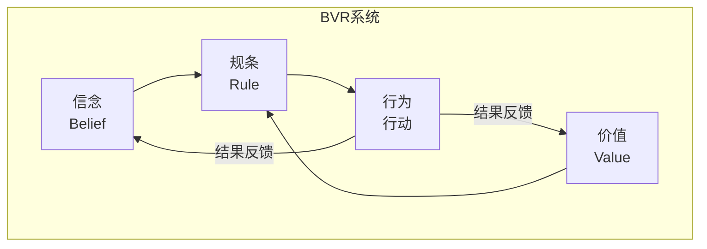
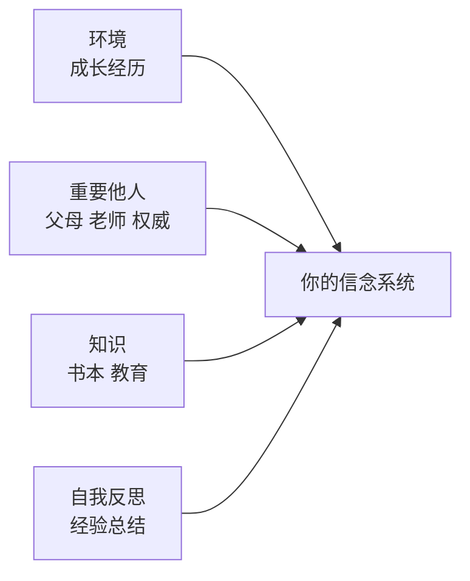
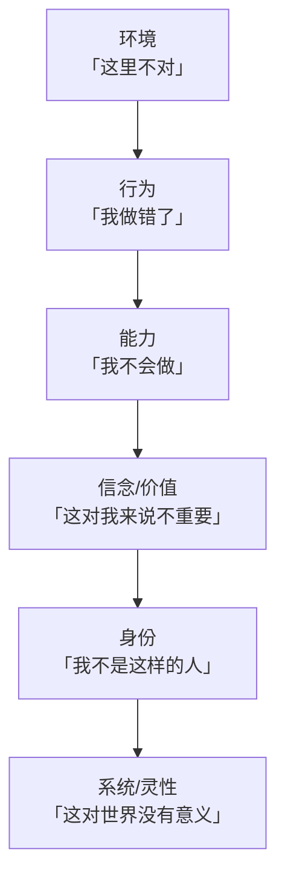

# 信念系统（BVR）

> [!QUOTE] 李中莹
> 信念系统（BVR）是维持你生存的**内在法则**。它是你人生中无形的操作系统，操控你每一个想法、每一个决定、每一个行为。

## 什么是信念系统？

**BVR**由三部分组成：

| 组成     | 英文     | 定义           | 回答的问题    |
| ------ | ------ | ------------ | -------- |
| **信念** | Belief | 主观认为"世界是怎样的" | 是什么？为什么？ |
| **价值** | Value  | 对"什么重要"的判断   | 有什么好处？   |
| **规条** | Rule   | 行为准则         | 应该怎么做？   |

### 一个例子说明BVR的运作

> 一个人认为"我必须在所有人面前表现完美"——

- **信念**（B）："我不完美就会被人看不起"
- **价值**（V）：被认可、被尊重（对他很重要）
- **规条**（R）："所以我必须做到最好，不能出任何错"

→ 行为：过度准备、逃避挑战、不敢尝试新事物

## 信念的来源

信念从何而来？李中莹老师指出，信念主要来自四个渠道：

### 1. 环境（成长经历）
- 从小在什么环境中长大，会形成相应的"生存信念"
- 比如：在一个总说"没钱"的家庭长大，会形成"钱不够"的信念

### 2. 重要他人（父母、老师、权威）
- 父母不经意的一句话，可能成为你一生的信念
- "你怎么这么笨" → "我不够聪明"
- "要听话才是好孩子" → "我必须讨好别人才能被爱"

### 3. 知识（书本、教育、课程）
- 你接受的教育和阅读塑造了你的认知框架

### 4. 自我反思（经验总结）
- 从自己的经历中总结出的信念，这是最牢固的信念

## 限制性信念

> [!WARNING] 什么是限制性信念
> 限制性信念是那些**阻碍你成长、让你无法发挥全部潜力的信念**。它们的特点是：
> - 让你**维持现状**（不敢尝试新事物）
> - 让你**找借口**（"我做不到，因为……"）
> - 让你**无力**（"我就是这样的人"）

### 三种常见的限制性信念

| 类型 | 例子 | 内在逻辑 |
|------|------|---------|
| **无力** | "我做不到" | 我缺乏能力/资源 |
| **无望** | "不可能成功" | 做了也没用 |
| **无价值** | "我不配拥有" | 我不值得更好的生活 |

### 限制性信念的外在表现（第15课）

当一个人被限制性信念操控时，表现为：

> [!EXAMPLE] 李中莹的观察
> 很多人说"我要成功"，但他们的行为却在**证明自己不能成功**。十几年来一直很辛苦地在做，却从来没成功过——也许他真正的目的不是"成功"，而是"向人证明我很辛苦"。

- 用忙碌代替有效
- 用坚持代替改变
- 用"我努力了"代替"我做到了"

## 改变信念

### 改变人生的一个步骤（第16课）

> [!QUOTE] 改变的核心
> 改变人生不需要复杂的流程，只需要一个步骤：
> **把"我不能"改成"我暂时还没能"。**

| 旧信念        | 新信念             | 效果        |
| ---------- | --------------- | --------- |
| 我不能在公众场合说话 | 我暂时还不能在公众场合说得很好 | 打开可能性     |
| 我就是不会管理时间  | 我还没学会如何管理时间     | 从身份转向技能   |
| 我做不到       | 我暂时还没找到方法       | 开启解决问题的模式 |

### 信念改变的层次

越往下的层次，改变越困难但也越彻底。NLP的工作重点在**信念/价值层和身份层**。

## 信念的松动技术

### 1. 反问法
当你有一个限制性信念时，问自己：
- "这个信念对我有什么帮助？"
- "如果放下这个信念，最坏会发生什么？"
- "有没有一个例外？"
- "我相信这个信念的证据是什么？"

### 2. 换框法
- **意义换框**：这个负面事件/信念，换一个角度看有什么正面意义？
- **环境换框**：这个特质在什么环境下其实是优势？

### 3. 正面意图连接
每个限制性信念背后，都有一个正面的动机：
- "我必须完美" → 动机是想要做好（正面）
- "我做不到" → 动机是保护自己不被伤害（正面）
- "我不能相信别人" → 动机是自我保护和尊重（正面）

## 反思与自测

> [!QUESTION] 信念检查
> 1. 找出你目前生活中最困扰你的一个问题，背后是什么信念？
> 2. 这个信念的BVR三要素是什么？它是谁的价值观？
> 3. 这个信念是从哪里来的？（环境？重要他人？知识？经验？）
> 4. 如果把这个信念从"我不能"改为"我暂时还没能"，你的感受有什么不同？

练习：限制性信念清单

1. 写下5个"我不能……"或"我就是……"的句子
2. 对每个句子问：这是事实，还是我的信念？
3. 把每个句子改写为"我暂时还没能……"
4. 选一个改写后的句子，问自己：我第一次做什么可以靠近这个目标？

## 下一步

[[0017-ni-de-li-zhi-pian-le-ni|第17课：你的理智骗了你——另外一套价值观 →]]
