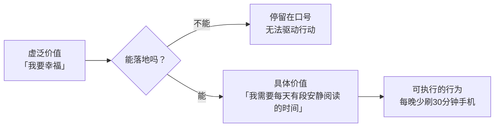
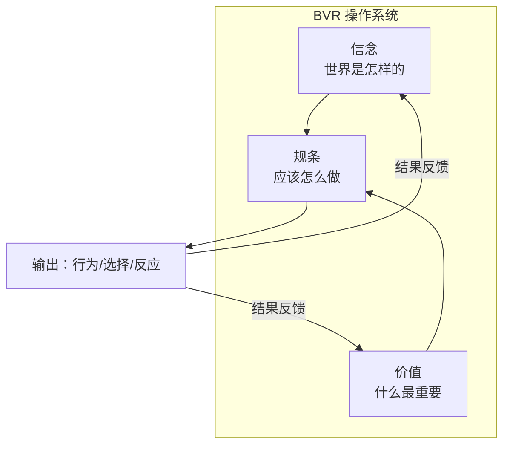

# 你的理智骗了你——走出虚泛价值观的牢笼

> [!QUOTE] 李中莹
> 你以为你很清楚自己要什么？你的理智骗了你。你有一套连你自己都不知道的、真正的价值观在背后操控你的人生。

## 两种价值观

李中莹老师区分了两种价值观：

| 类型 | 定义 | 特点 |
|------|------|------|
| **理性价值观** | 嘴上说的、头脑认可的 | 听起来很"对"，但推动不了行动 |
| **实际价值观** | 行为中体现的 | 真正驱动你日常行为的 |

> 嘴上说"健康很重要" → 理性价值观
> 行为上天天熬夜不运动 → 实际价值观是"工作/娱乐更重要"

## 虚泛价值观

### 什么是虚泛价值？

虚泛价值是那些**听起来高大上但无法落地**的价值词：

> 快乐、幸福、成功、安宁、和谐、尊重、爱、自由、成就

这些词的问题是：
1. 太抽象——每个人定义不同
2. 太模糊——无法指导具体行动
3. 太难衡量——不知道做到了没有

### 如何走出虚泛价值观的牢笼（第18课）

> [!TIP] 把"虚泛"变为"具体"
> 每一个虚泛价值背后，都有**更具体的需求**。找到了具体需求，你才知道怎么做。

**转化方法**：问"这能给我带来什么？"（上堆）或者"具体来说是什么？"（下切）

**例子**：
> "我要成功"（虚泛）
> ↓ 具体是指什么？
> "我要年收入100万"（具体）
> ↓ 这能给你带来什么？
> "让我有选择的自由"（深入一层）
> ↓ 有选择的自由具体是怎样的？
> "我可以选择不做我不想做的事"（可落地）

### 虚泛价值观与12条前提假设

虚泛价值观的问题在于——你无法用 "效果比道理更重要" 来检验它，因为根本没有具体的"效果"标准。

**关键转变**：

## 价值观排序

你的生活中可能存在**价值观冲突**——比如"安全"和"自由"、"家庭"和"事业"。这不是价值观本身的问题，而是**优先级**的问题。

### 价值观排序法

1. 列出对你最重要的5-10个价值（诚实、健康、自由、家庭、成长……）
2. 两两比较："如果A和B只能选一个，我选哪个？"
3. 反复比较，排出最终顺序
4. 检查：**我的日常行为是否符合这个排序？**

> [!WARNING] 如果你发现你的实际行为和你"认为"的排序不一致——
> 那是正常的。你不是在"欺骗自己"，你只是发现了真正的排序。**以行为为准。**

## 信念系统的整合

信念、价值观、规条（BVR）三者合力，构成了你的**内在操作系统**：

### 如何升级你的BVR

1. **觉察**——识别你的限制性信念和虚泛价值观
2. **质疑**——这个信念/价值观是真的吗？它为我服务吗？
3. **替换**——寻找更有支持力的信念
4. **巩固**——用新信念指导行动，让行动验证新信念

## 反思与自测

> [!QUESTION] 价值观探索
> 1. 写下你认为最重要的5个价值。然后问自己：过去一周我的行为体现的是这些价值吗？
> 2. 找出你常用的"虚泛价值词"（如"我要更好"、"我要开心"），把它们转化成具体可行动的描述。
> 3. 你的价值观是否存在冲突（比如既想要"自由"又想要"安全"）？你怎么处理这个冲突？

练习：行为揭示的价值观

不看你的"答案"，而是看你的**行为记录**：
1. 过去一周，你把最多时间花在哪里？
2. 过去一周，你把最多钱花在哪里？
3. 当你空闲时，你自然而然会做什么？

答案就是你**真实的价值观排序**。如果你对这个排序不满意，可以有意识地开始调整行为。

## 下一步

进入沟通模块：[[0019-gou-tong-wu-qu|第19课：走出沟通误区 →]]
