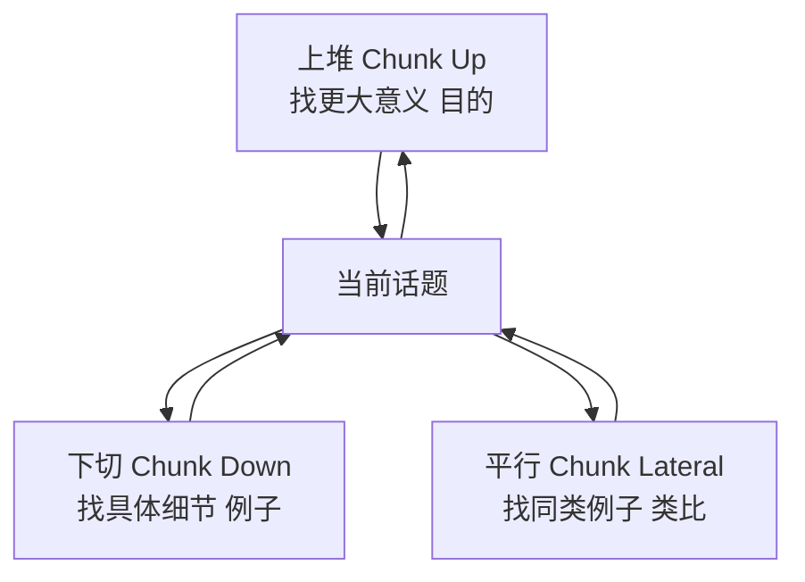
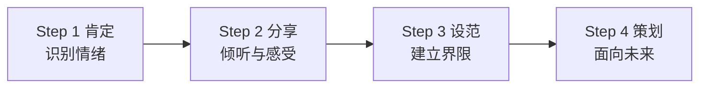
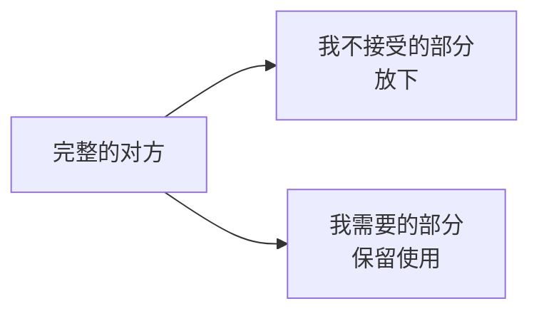

# 沟通与人际关系技巧

> [!QUOTE] 李中莹
> 沟通的意义在于**对方的回应**，而不是你说了什么。

## 沟通的基本理念

### 沟通的四大原则

1. **沟通的效果在于对方的回应**——如果你说了对方听不懂，你的沟通无效
2. **你说的话自己要先接受**——自己不信的话，对方不会信
3. **没有失败的沟通，只有回应的反馈**——对方的反应告诉你需要调整
4. **重复旧的方法只会得到旧的结果**——换一种方式沟通

### 沟通的三不原则

> [!TIP] "三不"原则
> - **不否定**——不否定对方的感受
> - **不批判**——不批判对方的行为
> - **不建议**——不急于给建议（尤其是对方没有要求时）

## 核心沟通技巧

### 1. 复述（Paraphrasing）

**做法**：用你自己的话重复对方刚刚说的核心内容。

> 对方："我觉得工作压力太大了，每天加班到很晚，但是领导还是不满意。"
> 你："听起来你目前的挑战是，付出了很多但感觉没有得到相应的认可，是吗？"

**效果**：
- 让对方感到被听见
- 确认你的理解是否正确
- 给机会让对方修正不准确的地方

### 2. 感性回应（Empathetic Response）

**做法**：在复述之后，表达对对方情绪的理解。

> "听起来你付出了很多努力却得不到认同，**这确实让人感到沮丧**。"

**效果**：
- 建立了情感连接
- 对方感到被理解，防御下降
- 为理性沟通建立信任基础

### 3. 上堆下切（Chunking）

这是NLP中极重要的语言模式，用于引导对话方向。

**三种方向**：

| 方向 | 问法 | 适用场景 |
|------|------|---------|
| **上堆**（向上） | "这能带给你什么？"、"为什么这很重要？" | 探索价值观、目标意义 |
| **下切**（向下） | "具体来说是什么？"、"举个例子？" | 理清问题、落地执行 |
| **平行**（横向） | "还有类似的吗？"、"其他方面怎么样？" | 扩展思路、找更多可能性 |

> [!EXAMPLE] 上堆下切应用实例
> 员工说："我想辞职。"
> - **下切**："具体发生了什么让你有这个想法？"
> - **上堆**："一份理想的工作对你来说最重要的是什么？"
> - **平行**："除了辞职，还有什么方式可以改善目前的状况？"

## 处理他人情绪：EQ型四步法（第22-25课）

> [!NOTE] EQ型处理他人情绪
> 这是李中莹老师课程中非常强调的一套处理他人情绪的方法。它不是"告诉对方别难过"，而是**真正有效率地帮助对方渡过情绪期**。

### 四步法

#### 第一步：肯定（Acknowledge）
> "我看到你很不开心。" / "我知道你很生气。"

- **不要**说："别难过了"、"没什么大不了的"
- **要**做：不批判地承认对方的情绪存在

#### 第二步：分享（Share）
> "愿意说说发生了什么吗？" / "你想跟我说说吗？"

- 倾听，不打断
- 用复述确认理解
- 用感性回应建立连接

#### 第三步：设范（Set Boundaries）
> "虽然他那样说你确实很委屈，但要解决问题我们需要先冷静一下。"

- 在共情之后，温柔地建立边界
- 从"我理解你的感受"过渡到"我们看看怎么办"
- 这一步需要时机——必须在对方感到被充分听见之后

#### 第四步：策划（Plan）
> "我们来看看接下来可以怎么做？你有什么想法？"

- 面向未来的行动
- 引导对方自己找到解决方案
- 给出支持，但不代替

## 人际关系提升技巧

### 一分为二法（第26课个案）

**用途**：当你遇到一个让你完全不能接受的人（比如讨厌的同事、难缠的客户）。

**原理**：
> 一个人的某些行为你不接受，但他的其他特质可能有价值。你把**不能接受的部分**和**有用的部分**分开——

### 接受批评法（第28课个案）

**用途**：当别人批评你时，不被情绪卷入。

**步骤**：
1. 先深呼吸，保持平静
2. 把批评的内容和"自我"分开
3. 问自己："他说的有没有1%是真实的？"
4. 如果有——接受那部分，用来改进
5. 如果没有——把批评还给对方，不带走

> [!TIP] 关键心态
> **批评是关于行为的，不是关于你这个人。**
> 对方只是在表达对某件事的看法，不是在对你的整个人做审判。

## 反思与自测

> [!QUESTION] 沟通检查
> 1. 今天你沟通时，最常用哪个技巧？（复述/感性回应/上堆下切？）
> 2. 回想一次你"好心给建议却让人不爽"的经历。如果用"三不"原则重新来，你会怎么做？
> 3. 明天有意识地练习一次"先复述再回应"——不直接答话，先重复对方的核心内容。
> 4. 有没有一个人你完全不想接触？试着一分为二——你能从他身上接受什么有用的部分？

练习：EQ型处理他人情绪

找一个机会，当身边的人有情绪时，尝试四步法：
1. "我看你好像有点不开心……"（肯定）
2. "愿意跟我说说吗？"（分享——然后认真听）
3. "我明白你的感受。同时……"（设范）
4. "你觉得接下来怎么做会好一点？"（策划）

## 下一步

[[0029-shang-dui-xia-qie|第29课：上堆下切 →]]
