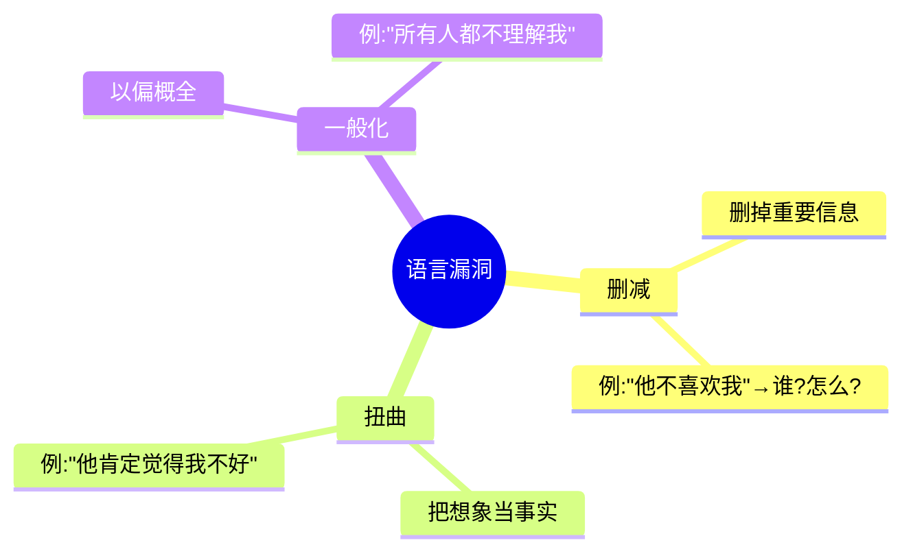
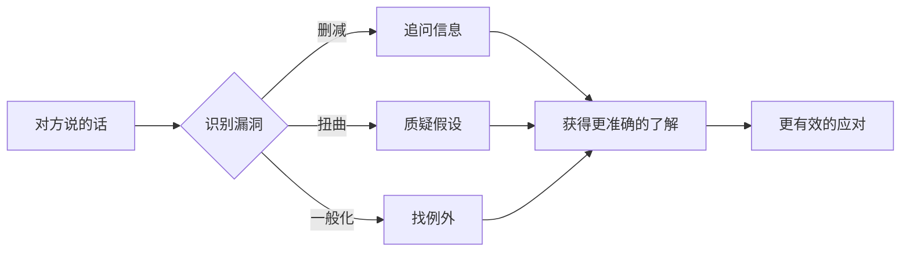

# 上堆下切与检定语言模式

> [!QUOTE] 李中莹
> 语言习惯暴露了你的思维模式。当你学会"听语言背后的语言"，你就能看到对方真实的世界。

## 上堆下切（第29课）

### 回顾三种方向

| 方向 | 功能 | 关键问句 |
|------|------|---------|
| **上堆（↑）** | 找意义、目的、价值 | "这能带给你什么？" |
| **下切（↓）** | 找细节、例子、证据 | "具体来说是什么？" |
| **平行（→）** | 找类比、其他可能 | "还有别的吗？" |

### 上堆下切的应用场景

#### 1. 销售/谈判
- 客户说"太贵了" → **下切**："您说的贵，是相对于什么？"
- 客户说"我再想想" → **上堆**："一个好的决定对您来说最重要的是什么？"

#### 2. 教练/辅导
- 对方说"我做不到" → **下切**："具体是哪一步有困难？"
- 对方说"我做不到" → **上堆**："如果做到了，对你意味着什么？"

#### 3. 自我思考
- 困惑时 → **上堆**："这件事对我最重要的意义是什么？"
- 迷茫时 → **下切**："我现在可以做的第一步是什么？"

## 检定语言模式——Meta Model（第30课）

### 语言的三个"漏洞"

NLP发现，人们在表达时，语言会自动出现三种"漏洞"：

### 删减（Distortion）

**定义**：句子中缺少重要信息，导致无法准确理解。

**常见类型及破解**：

| 类型 | 例子 | 破解问句 |
|------|------|---------|
| 简单删减 | "我很失望" | 对谁/什么事失望？ |
| 比较删减 | "他更差" | 比什么差？以什么为标准？ |
| 主词不明 | "人们觉得这样不行" | 谁觉得？ |
| 动词不明 | "他伤害了我" | 具体做了什么？ |

### 扭曲（Generalization）

**定义**：用想象代替事实，把可能性当成必然。

| 类型 | 例子 | 破解问句 |
|------|------|---------|
| 因果 | "他让我生气" | 他做了什么，而你如何解读为让你生气？ |
| 等价 | "他不回消息就是不在乎我" | 不回消息和不在乎是等价的吗？ |
| 假设 | "如果你真的在乎我，你就会知道" | 你怎么知道对方应该知道？ |
| 虚拟 | "如果当初我……就好了" | 你现在能做些什么？ |

### 一般化（Deletion）

**定义**：把个别情况推广到所有情况。

| 类型 | 例子 | 破解问句 |
|------|------|---------|
| 全称化 | "所有人都针对我" | 真的所有人吗？有没有例外？ |
| 可能式 | "我做不到" | 如果暂时假设能做到，第一步会是什么？ |
| 必须式 | "我应该……" | 如果不这样，最坏会发生什么？ |
| 不可能式 | "这不可能" | 是什么让你觉得这不可能？ |

> [!TIP] 使用原则
> 检定语言模式的目的是**理解对方**，而不是"拆穿"对方。使用时保持好奇而非审判的态度。对方感到你在帮助他理清思路，而不是在和他抬杠。

### 沟通中的应用

### 自我运用

你还可以用检定语言模式**检查自己的思维**：

- 当你说"我没办法"时 → 真的没办法还是"没想到办法"？
- 当你说"应该这样做"时 → 应该的标准是谁定的？
- 当你说"所有人都这样"时 → 所有人？有没有例外？

## 反思与自测

> [!QUESTION] 语言觉察练习
> 1. 今天注意你说话中用到的"应该"、"必须"、"总是"、"从不"等词，它们背后是什么信念？
> 2. 当别人说"你总是……"时，你怎么回应？尝试用检定语言模式反问："总是？有没有例外？"
> 3. 找一个你对自己说的"我做不到"，问自己三个问题：
>    - 具体哪一步做不到？（下切）
>    - 如果做到了能给我什么？（上堆）
>    - 还有什么方法？（平行）

练习：语言观察日记

用一天时间，做"语言侦探"：
1. 记录3句别人说的"有漏洞"的话
2. 识别是删减、扭曲还是一般化
3. 想一句可以澄清的问句
4. （如果你真的问出口了，观察对方的反应）

## 下一步

[[0033-mu-biao-guan-li|第33课：目标管理 →]]
