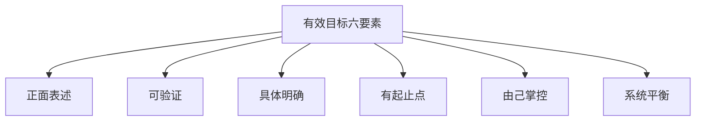
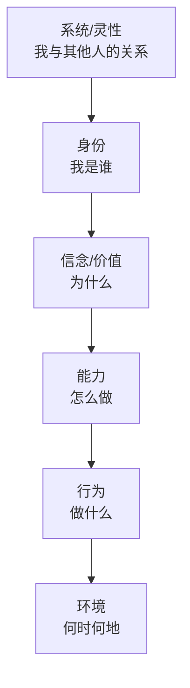

# 目标管理与有效人生的策划

> [!QUOTE] 李中莹
> 目标不是一个"结果"，它是一个**方向**。正确的目标管理不是"如何达到"，而是"如何让你走在正确的方向上"。

## 目标管理（第33-34课）

### 有效目标的六要素

NLP对"好目标"有明确的标准：



#### 1. 正面表述
- ❌ "我不想再这么穷了"（负面——焦点在"穷"）
- ✅ "我要年收入达到50万"（正面——焦点在目标）

#### 2. 可验证
- ❌ "我要更成功"（无法验证）
- ✅ "我要在年底前获得部门最佳业绩奖"（有明确标准）

#### 3. 具体明确
- ❌ "我要学好NLP"（太模糊）
- ✅ "我要学完12天课程，能独立运用逐步抽离法处理自己的情绪"

#### 4. 有起止点
- ❌ "总有一天我会做到的"
- ✅ "从今天开始，到2026年12月31日之前"

#### 5. 由己掌控
- ❌ "我要让老板给我加薪"（老板的事）
- ✅ "我要提升我的工作能力，达到加薪的标准"（自己的事）

#### 6. 系统平衡（Ecology Check）
- ❌ "我要每天工作16小时"（健康、家庭怎么办？）
- ✅ "我要在保持健康和家庭关系的前提下，提升工作效率"

> [!WARNING] 系统平衡是最常被忽视的一条
> 一个目标如果伤害了你其他重要的方面（健康、关系、兴趣），最终你也不会快乐。好的目标应当是**三赢**的。

### 目标设定的NLP流程

```
明确目标 → 建立证据 → 盘点资源 → 制定步骤 → 系统检查 → 开始行动
```

1. **明确**：用六要素写清你的目标
2. **证据**：你怎么知道目标达成了？（看到什么、听到什么、感觉到什么？）
3. **资源**：你现在已经有什么？（能力、人脉、经验）
4. **步骤**：从今天开始的第一步是什么？
5. **检查**：这个目标三赢吗？有没有副作用？
6. **行动**：马上做第一步

## 有效人生的策划技巧（第35-37课）

### 理解层次

理解层次（Logical Levels）是NLP非常重要的模型，由罗伯特·迪尔茨发展出来：



**六个层次**：

| 层次 | 核心问题 | 例子 |
|------|---------|------|
| **系统** | 我为了谁？我属于哪里？ | 我为家人、为社会 |
| **身份** | 我是谁？ | 我是一个帮助者 |
| **信念/价值** | 为什么这很重要？ | 帮助他人让我有价值 |
| **能力** | 我如何做？ | 学习沟通技巧 |
| **行为** | 我做什么？ | 每天阅读、练习 |
| **环境** | 何时何地？ | 每晚9点在书房 |

### 理解层次的应用

**越上层的问题，需要从上层解决。**

> 如果你在"行为层"遇到问题（比如戒烟失败）：
> - 在"行为层"逼自己忍住 → 很难持久
> - 升级到"身份层"问自己：**"我是一个爱惜自己身体的人"** → 戒烟自然发生

#### 向上走——找到真正的驱动力
当你迷茫时，从"环境"一路问上去：
- 这个目标在什么环境做？（环境）
- 你每天做什么？（行为）
- 你用什么能力做？（能力）
- 为什么这很重要？（信念/价值）
- 这证明了你是怎样的人？（身份）
- 这样做为了谁？（系统）

#### 向下走——落地执行
当你有了方向，从"系统"一路走下来：
- 你的使命/愿景（系统）
- 你是什么角色？（身份）
- 你为什么做？（信念/价值）
- 你需要什么能力？（能力）
- 你每天做什么？（行为）
- 什么时候开始？（环境）

### 人生策划的顶层设计

> [!TIP] 李中莹的建议
> 有效的人生策划不是"我明年要做什么"，而是：
> 1. **我的身份是什么？**（我想成为什么样的人）
> 2. **我的信念是什么？**（什么对我来说最重要）
> 3. **我的人生方向是什么？**（大方向而不是具体目标）
> 4. **我现在可以做什么？**（把大方向分解为当前步骤）

## 反思与自测

> [!QUESTION] 目标检查
> 1. 你目前最重要的一个目标是什么？用六个要素逐一检查
> 2. 如果把这个目标放在"理解层次"中，你现在主要在哪一层谈论它？
> 3. 你的目标有没有"系统不平衡"的问题？（比如追事业伤健康、赚钱不顾关系）
> 4. 如果今天是你生命的最后一天，你后悔没做什么？这个答案告诉你的"身份层"什么信息？

<details>
<summary>练习：理解层次的人生策划</summary>

选一个你目前想改善的领域（工作/关系/健康/成长）：

1. **环境层**：我现在在哪里？有什么资源？
2. **行为层**：我每天在做什么？
3. **能力层**：我能做什么？还需要什么能力？
4. **信念/价值层**：为什么这对我重要？
5. **身份层**：这反映了我是怎样的人？
6. **系统层**：我这样做对谁有影响？

从上层到下层串起来看看：你的"身份"决定了你的"信念"，你的"信念"驱动你的"行为"……
</details>

## 下一阶段

完成了NLP执行师课程的全部主要模块。欢迎随时返回复习任意课程，或在 [[reference/001-nlp-techniques-quick-ref|NLP技巧速查]] 中快速查看所学技巧。
