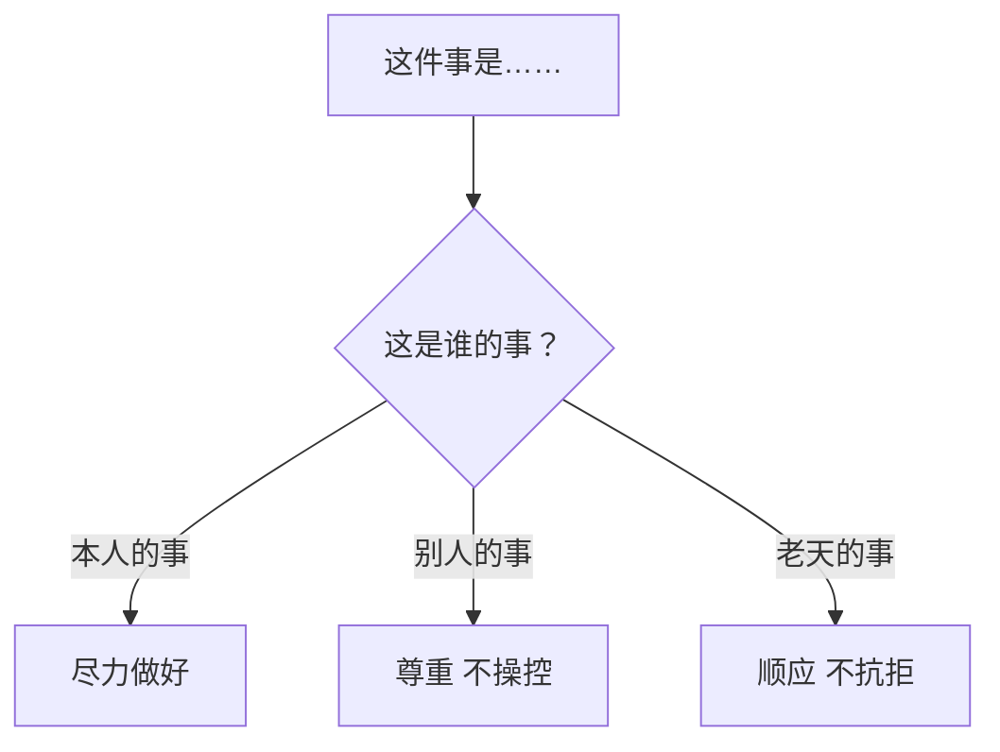
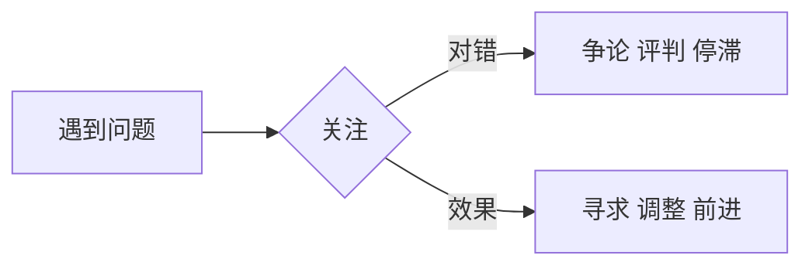

# 12条前提假设速查

> 12条前提假设不是绝对真理，而是"假设其为真会有用"的实用信念。

## 速查表

| # | 前提假设 | 一句话提醒 | 应用领域 |
|---|---------|-----------|---------|
| 1 | **没有两个人是一样的** | 尊重差异，别以为他跟你一样 | 管理、教育、沟通 |
| 2 | **一个人不能改变另外一个人** | 只影响，不操控 | 亲子、管理、亲密关系 |
| 3 | **人生只有三件事** | 管好自己的事 | 情绪管理、界限设立 |
| 4 | **凡事照顾三赢** | 我好你好系统好 | 决策、伦理、团队管理 |
| 5 | **效果比道理更重要** | 追求效果，不争对错 | 沟通、解决问题 |
| 6 | **主观认知塑造世界** | 我看到的是我的主观 | 心理成长、自我觉察 |
| 7 | **凡事至少三个解决方法** | 一定有第三选择 | 问题解决、创新 |
| 8 | **每个人都做了当下他能做的最好** | 接纳过去 | 自我原谅、关系修复 |
| 9 | **动机和情绪不会错，只是行为没效果** | 接受动机，调整行为 | 教育、辅导、管理 |
| 10 | **没有学到，失败只是失败** | 从失败中学习 | 成长心态 |
| 11 | **每人有让自己成功快乐的权利** | 你可以过得好 | 自我价值 |
| 12 | **每人有让自己成功快乐的责任** | 自己负责 | 人生责任 |

## 三件事分类图



## 效果 vs 对错



## 12条应用检视法

当遇到困扰时，逐一对照12条：

```
这件困扰我的事：
1. 我是否以为对方会跟我一样想？（#1）
2. 我是否想改变他？（#2）
3. 这是谁的事？（#3）
4. 这个决定三赢了吗？（#4）
5. 我是在坚持对错还是追求效果？（#5）
6. 我的认知是不是把事情看坏了？（#6）
7. 我只想到一个或两个方法？（#7）
8. 我是否在评判过去的自己或他？（#8）
9. 我是否否定对方的动机？（#9）
10. 从中学到了什么？（#10）
11-12. 我为自己的成功快乐负责了吗？
```

## 第一条详解：没有两个人是一样的

```
即使在"黄色是什么颜色"这样简单的问题上，
每个人的"黄色"可能都是不同的。
```

**应用**：
- 管理：不要以为团队都同意你，每个人心中的"同意"不同
- 沟通：别用一招对所有人
- 教育：每个孩子都不同，需要不同的引导方式

## 第二条详解：一个人不能改变另外一个人

```
操控 = 减少选择 → 招致反抗
影响 = 增加选择 → 自愿跟随
帮助 = 提供支持 → 增强能力
```

**应用**：
- 行为改变发生在当事人自己愿意的情况下
- 你能改变的只有自己
- 改变自己，别人会因你的改变而改变

## 第七条详解：凡事至少三个解决方法

```
1个方法 → 被困住
2个方法 → 两难
≥3个方法 → 真正有选择
```

**应用**：任何时候说"没办法"，逼自己再找第三个。第三个出现后，第四、五、六个会自然出现。
