# 课程学习路径图

```mermaid
flowchart LR
  subgraph M1["🧭 模块一：准备就绪"]
    L01[第01课<br/>明确而艰巨的目标]
    L02[第02课<br/>大局与细节思维]
    L03[第03课<br/>自我决定论]
    L04[第04课<br/>能力信念]
  end

  subgraph M2["🎯 模块二：预备开始"]
    L05[第05课<br/>展示才华 vs 谋求进步]
    L06[第06课<br/>进取型 vs 防御型]
    L07[第07课<br/>追求幸福的目标]
    L08[第08课<br/>选择适合的目标]
    L09[第09课<br/>帮助他人设定目标]
  end

  subgraph M3["⚡ 模块三：行动中"]
    L10[第10课<br/>扫除障碍]
    L11[第11课<br/>制定计划]
    L12[第12课<br/>增强自制力]
    L13[第13课<br/>切合实际的乐观]
    L14[第14课<br/>坚持与放弃]
  end

  subgraph M4["🔄 模块四：进阶"]
    L15[第15课<br/>给予反馈]
    L16[第16课<br/>成功人士9种做法]
  end

  L01 --> L02 --> L03 --> L04
  L04 --> L05 --> L06 --> L07
  L07 --> L08
  L06 --> L09
  L08 --> L10 --> L11 --> L12 --> L13 --> L14
  L14 --> L15 --> L16

  style L01 fill:#e3f2fd,stroke:#1565c0
  style L05 fill:#fff3e0,stroke:#ef6c00
  style L10 fill:#fce4ec,stroke:#c62828
  style L16 fill:#e8f5e9,stroke:#2e7d32
```

## 学习路径说明

### 🔵 模块一：准备就绪（第1-4课）
**基础认知层** — 这是所有后续内容的基础，务必按顺序学习。

| 顺序 | 课 | 为什么这个顺序？ |
|------|----|----------------|
| 1 | [[0001-ming-que-er-jian-ju-de-mu-biao\|第01课]] | 掌握最基本的"如何设定一个好目标" |
| 2 | [[0002-wei-shi-yao-yu-shi-shi-ya\|第02课]] | 学会在不同时空调用不同的思维方式 |
| 3 | [[0003-zi-wo-jue-ding-lun\|第03课]] | 理解动机的本质——内在 vs 外在 |
| 4 | [[0004-neng-li-xin-nian\|第04课]] | 了解信念如何塑造你的目标选择 |

### 🟠 模块二：预备开始（第5-9课）
**目标类型层** — 认识不同类型的目标及其适用场景。

> **第5课 → 第6课 → 第7课** 是目标分类的三部曲，需要依次理解。
> **第8课** 是选择框架，依赖前3课的分类知识。
> **第9课** 是进阶内容（应用于他人），可以与第8课并行学习。

### 🔴 模块三：行动中（第10-14课）
**执行方法层** — 一旦会设目标了，这里教你如何真正做到。

> **第10课 → 第11课 → 第12课 → 第13课 → 第14课** 必须按顺序学，因为每一课的方法都建立在前一课的基础上。

### 🟢 模块四：进阶（第15-16课）
**升华应用层** — 第15课（反馈）是对前几课的综合应用，第16课是全书的精华清单。

## 学习节奏建议

| 节奏 | 适合人群 | 建议 |
|------|---------|------|
| **沉浸式** | 有整块时间 | 每天2课，8天学完 |
| **标准** | 上班族 | 每周3课，5-6周学完 |
| **轻松** | 时间零散 | 每周2课，8周学完 |

> [!tip] 复习建议
> 学完第16课后，回到[[reference/mu-biao-gu-zhang-zhen-duan\|目标故障诊断指南]]，用它来诊断你当前遇到的真实问题。这是最好的巩固方式。