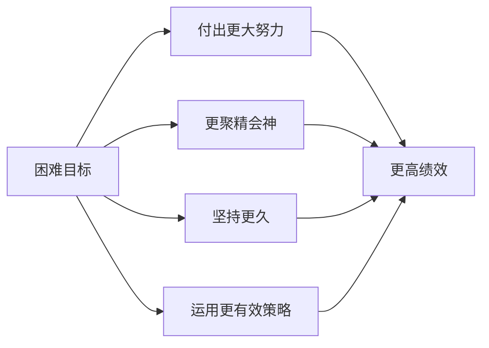

# 第01课：设定明确而艰巨的目标

想象一下：你的员工鲍勃要去调查一个重要商机，你对他说："在这件事上，你要竭尽全力做到最好。"鲍勃点点头，转身离开。你们俩心里都有一个同样的疑问——**"最好"到底是什么意思？**

## 为什么"做到最好"是最糟糕的目标

"做到最好"的出发点是好的，但心理学家埃德温·洛克和加里·莱瑟姆用几十年研究发现：**明确而困难的目标比模糊或过于简单的目标更能激发优异的表现。**

"做到最好"糟在三点：
- **太模糊**——没有人知道"最好"的标准是什么
- **缺乏判断**——达成了吗？无法判断
- **容易被妥协**——累了就告诉自己"这已经够好了"

### 伐木场的启示

20世纪70年代，莱瑟姆发现伐木工的平均负重只有法定上限的60%。他给工人定下 **94%** 的明确目标。9个月后，平均负重达到了90%以上，为公司省下数百万美元。

> [!NOTE] 核心发现
> 人们通常把事情做到被要求的程度，但很少大幅度超过这个程度。**明确目标排除了"够好了"的心理空间。**

## 为什么困难目标反而更好？

直觉上，设定高目标似乎"邀请失败"，但研究显示困难目标让你：

> [!WARNING] 注意
> "困难"不等于"不可能"。**艰巨但可能实现**才是关键。

### 高绩效循环

在德国的一项研究中，只有觉得工作**富有挑战性**的员工，在满意度、幸福感和成就感上呈现长期上升趋势。

## 两种积极思考：天壤之别

| 类型 | 内容 | 效果 |
|------|------|------|
| ✅ 积极的期望 | "我有能力达成" | 提高成功概率 |
| ❌ 低估困难 | "做到很容易" | 导致准备不足 |

> [!DANGER] 厄廷根研究
> - 相信自己能成功的人 **多减了26磅**
> - 认为减肥很容易的人 **反而少减了24磅**
>
> **相信成功之路充满艰险的人，做了更多准备。**

## 心理对照法：设定目标的最佳方式

将积极思考与现实评估结合的方法叫**心理对照法**（Mental Contrasting）：

1. **写下愿望**——想实现的目标
2. **想象美好结局**——成功后的情景
3. **识别当前障碍**——有哪些阻碍？
4. **制定行动计划**——如何跨越障碍？

> [!TIP] WOOP方法
> 此方法由厄廷根发展为WOOP（Wish, Outcome, Obstacle, Plan），将在第11课详细讲解。

> [!QUESTION] 练习：用心理对照法设定一个工作目标
> **W（愿望）**：你内心最想实现的目标是？
>
> **O（图景）**：实现后的最佳结果？
>
> **O（障碍）**：最大的障碍是？
>
> **P（计划）**：如果遇到障碍，你打算怎么做？
>
> 

> 
示例：争取晋升

> W：年底前获得高级经理晋升
> O：带更大团队、做更有影响力的项目、收入提升
> O：缺少跨部门协作经验，老板不了解我的潜力
> P：主动申请跨部门项目，每月与老板做职业发展对话
> 

## 要点回顾

- ✅ 用**明确而困难的目标**替代"做到最好"
- ✅ 相信能成功，但**不要低估困难**
- ✅ 用**心理对照法**设定目标——同时看到成功和障碍

## 下节课

[[0002-wei-shi-yao-yu-shi-shi-ya|第02课：大局思维与细节思维]]——学会什么时候该"想大"、什么时候该"想小"。

> **推荐阅读**：本书第1章"你明白自己去往哪里吗"