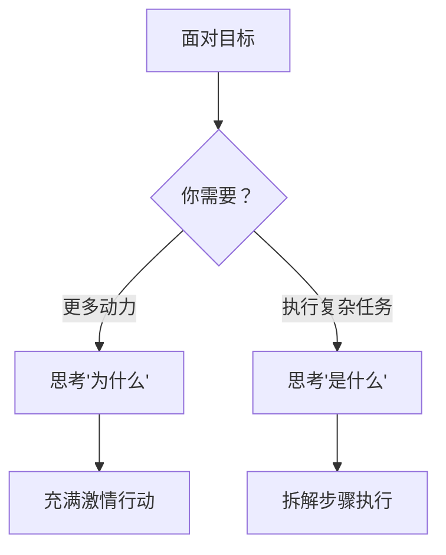

# 第02课：大局思维与细节思维

你是那种"看森林"的人，还是"看树木"的人？其实，成功的关键在于**知道什么时候该看森林，什么时候该看树木**。

## 同一个行为，两种描述

拿用吸尘器来说，你可以说"我在打扫卫生"（**为什么**），也可以说"我在用吸尘器清理地板"（**是什么**）。两种都对，但效果完全不同：

| 思维方式 | 聚焦 | 激发 | 风险 |
|---------|------|------|------|
| **为什么**（抽象） | 更大意义和目的 | 充满激情、提升自制力 | 容易忽视操作细节 |
| **是什么**（具体） | 具体操作步骤 | 防止拖延、聚焦细节 | 容易"只见树木不见森林" |

### 什么时候用什么思维



> [!EXAMPLE] 职场场景
> - **想激励团队**："为什么"（我们的产品将改变行业）
> - **做复杂报表**："是什么"（先整理数据，再写公式，最后排版）

## 时间如何扭曲我们的思维

心理学家雅各夫·特罗普和尼拉·利伯曼发现：**考虑越久远的事，越容易用"为什么"思考；考虑眼前的事，越容易用"是什么"思考。**

```mermaid
flowchart LR
    A[未来任务] -->|"为什么思维"| B[看重合意度<br/>"这个目标值得做吗？"]
    C[近期任务] -->|"是什么思维"| D[看重可行度<br/>"这事真的能做成吗？"]
```

### 两个常见的陷阱

| 场景 | 陷阱 | 典型例子 |
|------|------|---------|
| 计划未来 | 过于看重理想回报，忽视可行性 | "我要三个月学会Python"——没考虑每天只有30分钟 |
| 面对当下 | 过于纠结麻烦，放弃宝贵机会 | 拒绝免费旅行因为"来不及打疫苗换护照" |

> [!WARNING] 拖延的根源
> 研究表明：用"是什么"思考的学生，比用"为什么"思考的学生**平均早10天**完成任务。过度思考"为什么"会导致拖延。

## 如何正确决策：同时考虑合意度与可行度

| 维度 | 含义 | 典型问题 |
|------|------|---------|
| **合意度**（Desirability） | 这件事值不值得做 | 能带来什么好处？有多大价值？ |
| **可行度**（Feasibility） | 这件事能不能做成 | 有多大把握？有什么障碍？ |

**最佳决策 = 合意度 + 可行度的平衡**

> [!QUESTION] 练习：用双维度评估一个目标
> 回想你最近设定的一个工作目标，分别回答：
> 1. **合意度**：实现这个目标的长期价值有多大？
> 2. **可行度**：以现有资源和能力，成功概率有多高？
> 3. 你在设定目标时偏向哪个维度？这导致了什么问题？
>
> <details>
> <summary>示例：竞标新项目</summary>
> 合意度：拿下项目能带来500万营收，提升团队行业影响力
> 可行度：竞品很强，我们方案还需要打磨，成功概率50%
> 我的偏向：只想了合意度就答应了，忽略了团队目前人手不足
> </details>

## 要点回顾

- ✅ **"为什么"思维**激发动力，"**是什么"思维**推动执行
- ✅ 做困难/新任务用"是什么"思维；需要动力时切到"为什么"
- ✅ 长期计划要审视**可行性**，短期计划要看到**价值**
- ✅ 适时切换思维模式是成功的关键能力

## 下节课

[[0003-zi-wo-jue-ding-lun|第03课：自我决定论与内在动机]]——你的动机是来自内心还是外界？这决定了你的幸福感。

> **推荐阅读**：本书第1章"大局与细节"及"现在与将来"