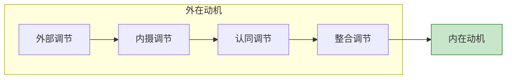
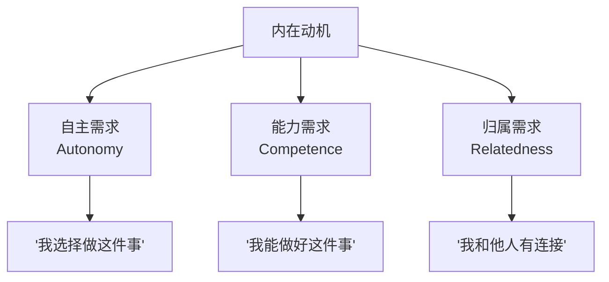

# 第03课：自我决定论与内在动机

你的新年计划是"加入一家名声赫赫的大公司"还是"学会编程"？这两种目标背后的动力来源不同，决定了你能走多远。

## 动机光谱：从外部控制到内在驱动

心理学家将动机分为**外在动机**和**内在动机**。外在动机又分为四个层次：

### 五种动机状态

| 动机类型 | 行为驱动力 | 自我决定程度 | 典型表达 |
|---------|-----------|------------|---------|
| **外部调节** | 奖赏和惩罚 | 最低 | "多做工作因为多发工资" |
| **内摄调节** | 内疚和羞愧 | 较低 | "我应该努力工作，不然会被看不起" |
| **认同调节** | 个人价值观 | 中等 | "这份工作能帮我积累能力" |
| **整合调节** | 与自我完全一致 | 较高 | "这就是我想成为的人" |
| **内在动机** | 兴趣和乐趣 | 最高 | "我热爱这个工作本身" |

> [!WARNING] 奖赏会伤人
> 一旦习惯外部奖赏，当奖赏消失时，你也会失去做事的动力。**钱和名，多多益善？其实未必。**

## 三种基本心理需求

为什么内在动机如此重要？因为它满足人类的三种基本需求：

> [!TIP] 职场应用
> 作为管理者，想提升团队内在动机，就要：
> - 给员工**选择权**（自主）
> - 提供**成长机会**（能力）
> - 营造**团队归属感**（归属）

## 如何从外在动机转变为内在动机

这个过程叫做**内化**——将外部规则转化为自己的价值观：

1. **理解"为什么"**：明白这个目标对自己真正的价值
2. **创造选择感**：即使不能选择"做不做"，也可以选择"怎么做"
3. **寻找意义**：将任务与自己的核心价值观连接
4. **构建能力感**：获得反馈和进步的证据

> [!QUESTION] 反思练习
> 想一个你目前"不得不做"的工作任务：
> 1. 当前驱动你的是哪种动机？
> 2. 如果能向上内化一个层次，那会是什么？
> 3. 怎么做才能让这个任务更加接近内在动机？
>
> 

> 
示例：每周报表

> 1. 当前：外部调节——老板要的，不做会被批评
> 2. 内化方向：认同调节——这份报表能帮我系统性理解业务
> 3. 做法：主动在报表中加入自己的分析见解，让它成为展示能力的平台
> 

## 要点回顾

- ✅ 动机从**外部调节**到**内在动机**是一个光谱
- ✅ 奖赏会削弱内在动机——**真正的动力来自内心**
- ✅ 满足**自主、能力、归属**三种需求能提升内在动机
- ✅ 通过**内化**可以将外部目标转化为自己的目标

## 下节课

[[0004-neng-li-xin-nian|第04课：能力信念的力量]]——你相信智力可以改变吗？这个信念深刻地影响着你的目标选择。

> **推荐阅读**：本书第2章"你知道目标来自哪里吗"