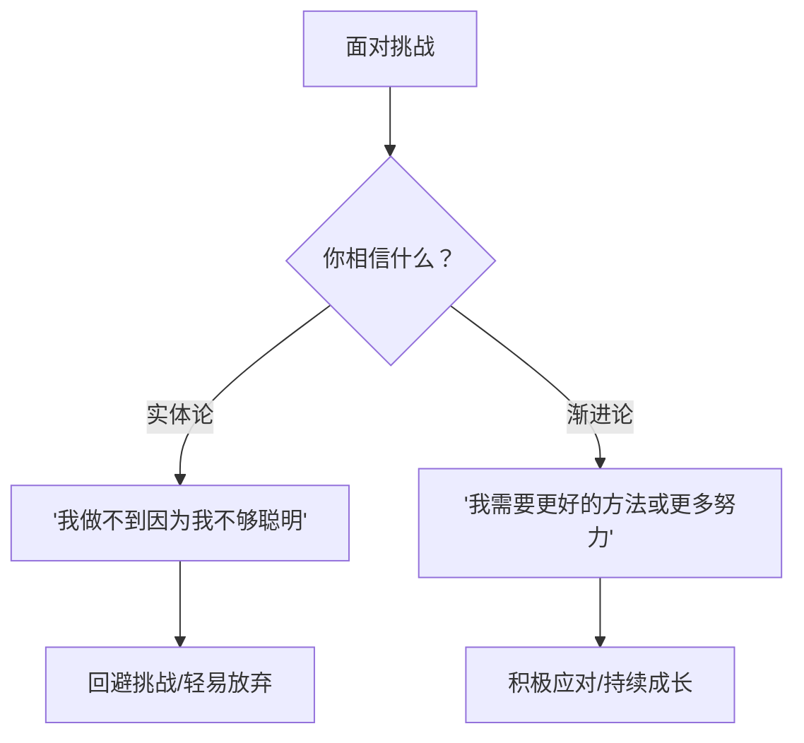
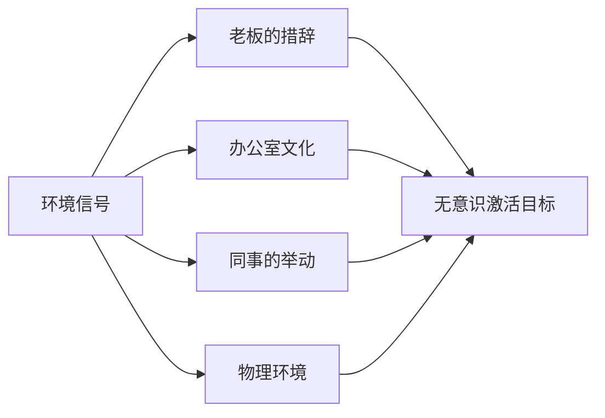

# 第04课：能力信念的力量

如果有人对你说"数学是天赋"，你会怎么看待自己的数学目标？如果换个说法"数学是可以练出来的"，你的行为会不同吗？

这就是**能力信念**的力量。

## 实体论 vs 渐进论

卡罗尔·德韦克（Carol Dweck）发现人们对能力有两种基本信念：

| 信念类型 | 核心观点 | 行为模式 | 面对困难时 |
|---------|---------|---------|-----------|
| **实体论**（僵固型心智） | 能力固定不变 | 需要证明自己 | "我做不了这个"——容易放弃 |
| **渐进论**（成长型心智） | 能力可以发展 | 追求成长进步 | "我需要更努力"——坚持寻找方法 |

> [!TIP] 德韦克的经典实验
> 表扬孩子"聪明" vs "努力"——被夸"聪明"的孩子后来更不愿意挑战难题，被夸"努力"的孩子则更愿意尝试更难的任务。
>
> **赞美天赋，使人害怕考验。赞美努力，使人拥抱成长。**

## 信念如何影响目标

你的能力信念决定了你选择什么类型的**目标**：

- **实体论者** → 选择**表现目标**（证明自己）→ 回避挑战、怕失败
- **渐进论者** → 选择**进步目标**（提升自己）→ 拥抱挑战、学习成长

> [!WARNING] 职场启示
> 你在工作中更关注"展示我很专业"还是"学会新技能"？前者让你看起来好但在原地踏步，后者让你犯错但持续成长。

## 环境对目标的无意识影响

你知道吗？你的目标不完全是"自己选的"——环境中的各种信号会**无意识**地触发你的目标。

### 如何利用这个原理

| 场景 | 环境设计 | 预期的目标激活 |
|------|---------|--------------|
| 想提升学习 | 桌上放一本专业书 | 激活"成长进步"目标 |
| 想提高效率 | 办公桌只放当前任务物 | 激活"专注完成"目标 |
| 想健康饮食 | 把水果放在显眼位置 | 激活"健康饮食"目标 |

> [!QUESTION] 自我诊断
> 1. 面对工作中不熟悉的领域，你的第一反应是什么？
> 2. 你的工作环境中，有哪些信号在"暗示"你追求什么样的目标？
> 3. 你可以怎么调整环境来支持自己想要的目标？
>
> 

> 
示例

> 1. 我第一反应是"我不擅长这个"，这是实体论的信号
> 2. 办公室大家都在加班，暗示我"要展示我很努力"
> 3. 把学习资料放在电脑旁，每天早上写下今天要学的一个新东西
> 

## 要点回顾

- ✅ **实体论**和**渐进论**深刻影响着目标选择
- ✅ 相信能力可以改变（成长型心智）的人更坚韧
- ✅ 环境中的信号可以在无意识中激活目标
- ✅ 通过调整环境和自我对话，可以塑造更健康的目标取向

## 下节课

[[0005-zhan-shi-cai-hua-vs-mou-qiu-jin-bu|第05课：展示才华还是谋求进步]]——深入理解"表现目标"和"学习目标"如何影响你的坚持力。

> **推荐阅读**：本书第2章"你知道目标来自哪里吗"