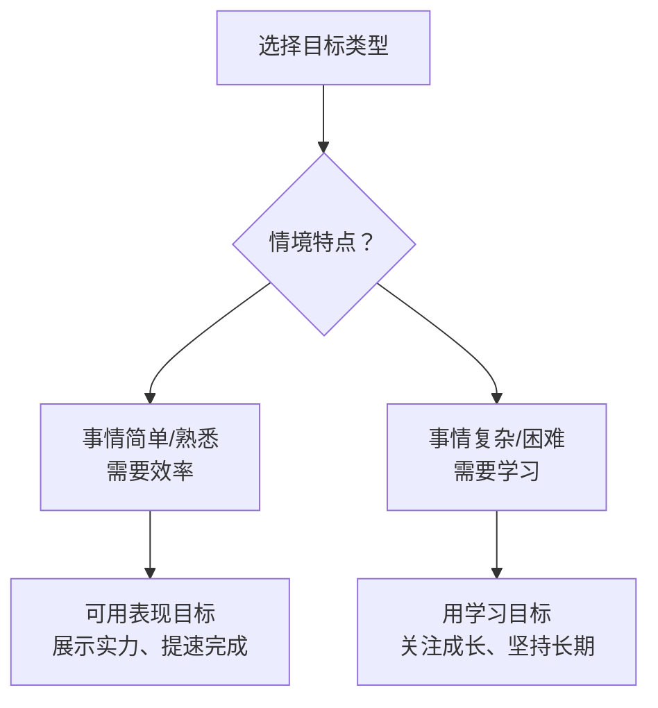

# 第05课：展示才华还是谋求进步

回想你在上一次项目中的心态：你是想"证明自己很能干"，还是想"从中学到新东西"？这两种心态看似相近，实则天壤之别。

## 两种目标的核心区别

| 维度 | 表现目标（展示才华） | 学习目标（谋求进步） |
|------|-------------------|-------------------|
| **核心问题** | "我看起来聪明吗？" | "我能学到什么？" |
| **成功标准** | 比别人做得好 | 自己进步了 |
| **面对挑战** | 回避——怕失败暴露不足 | 迎接——视作成长机会 |
| **面对挫折** | 放弃——"我不够好"！ | 坚持——"我需要更努力" |
| **对反馈的态度** | 防御，抗拒批评 | 欢迎，视作学习机会 |

## 哪种目标更能让你坚持？

来看两组学生：

| 场景 | 表现目标学生 | 学习目标学生 |
|------|------------|------------|
| 遇到难课 | 沮丧、逃课 | 寻求帮助、加倍努力 |
| 考试失利 | "我不适合学这个" | "我的方法不对" |
| 需要帮助 | 不好意思求助（怕丢脸） | 积极求助（想弄懂） |

> [!NOTE] 医学院预科生研究
> 研究发现：追求进步目标的医学生比追求表现目标的同行更能从容应对失败，并且像欣赏最终结果一样欣赏奋斗历程。

## 两种目标的适用场景

> [!TIP] 职场建议
> - **新任务/不熟悉的领域** → 用**学习目标**（关注成长，允许犯错）
> - **擅长领域/需要交付** → 短期用**表现目标**（保证效率和质量）
> - **关键选择**：当长期发展重要时，永远优先选学习目标

> [!QUESTION] 自我评估：你是什么倾向？
> 使用1-5分（1=完全不符，5=完全符合）：
> 1. 对我来说在工作中比同事做得好非常重要
> 2. 我喜欢有挑战性的工作，即使会犯错
> 3. 当别人指出我的不足时，我会感到不舒服
> 4. 我乐于尝试不熟悉的工作方法
>
> 

> 
解读

> 奇数题（1、3）高分→表现目标倾向
> 偶数题（2、4）高分→学习目标倾向
> 两者可以并存，关键是在觉察到自己是"表现目标"模式时，主动切换为"学习目标"模式。
> 

## 要点回顾

- ✅ **表现目标**关注证明自己，**学习目标**关注提升自己
- ✅ 面对困难时，学习目标让人更坚韧
- ✅ 学习目标者更愿意寻求帮助，更容易从反馈中受益
- ✅ **情境决定目标类型**——新领域用学习目标，熟悉领域可适当用表现目标

## 下节课

[[0006-jin-qu-xing-vs-fang-yu-xing|第06课：进取型焦点与防御型焦点]]——你的动机是追求成就还是避免损失？两类人都能成功，但路径完全不同。

> **推荐阅读**：本书第3章"使人们不断前进的目标"