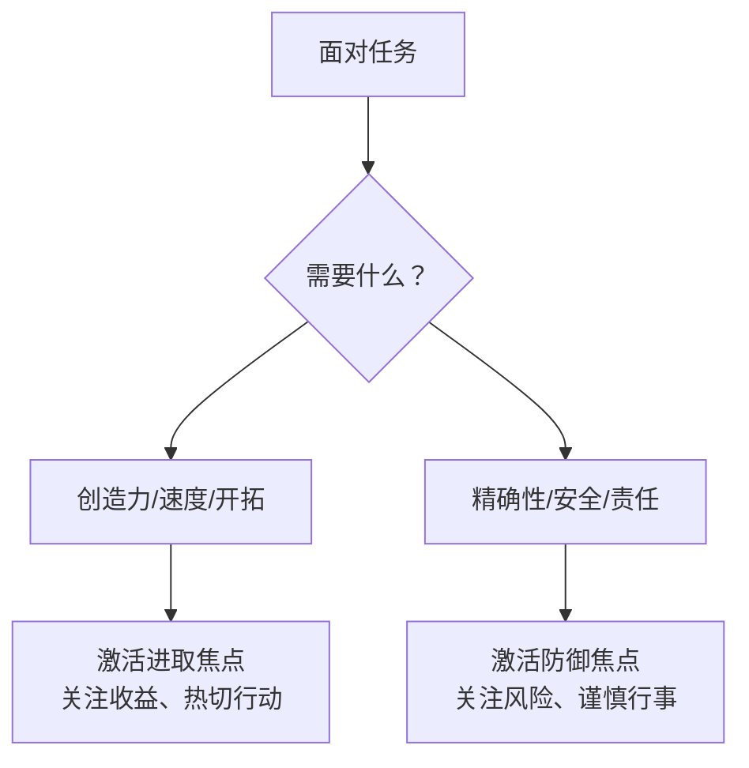

# 第06课：进取型焦点与防御型焦点

同样是让一岁的孩子学走路——作者海蒂和丈夫的目标相同，但焦点完全不同：丈夫鼓励儿子爬楼梯，热切期待儿子征服新挑战；而母亲则装防护门、铺地毯，生怕儿子受伤。

这就是**进取型焦点**（Promotion Focus）和**防御型焦点**（Prevention Focus）的区别。

## 两种焦点的本质

| 维度 | 进取型焦点 | 防御型焦点 |
|------|-----------|-----------|
| **关注** | 获得成就、实现理想 | 履行责任、保证安全 |
| **策略** | 热切策略（寻找所有可能成功的方法） | 警惕策略（避免所有可能的错误） |
| **成功时感受** | 快乐、兴奋、骄傲 | 平静、安心、松了口气 |
| **失败时感受** | 沮丧、失望、缺乏热情 | 焦虑、担忧、紧张 |
| **激励方式** | 赞美和鼓励 | 批评和警告 |

## 你的主导焦点是什么？

> [!QUESTION] 快速自测
> 回想你的学生或工作时期：
> - 考A对你来说是"梦寐以求的成就"还是"应该尽到的义务"？
> - 你更怕"错过好机会"还是更怕"犯错误"？
> - 你更容易被"这样做会让你获得什么"打动，还是被"不这样做会有风险"推动？

## 两种焦点的形成

焦点类型主要受**教养方式**影响：

| 教养风格 | 培养的焦点 | 典型表达 |
|---------|-----------|---------|
| 鼓励成就、奖励成功 | 进取型 | "如果你考好了，我们就去庆祝！" |
| 强调责任、强调避免错误 | 防御型 | "如果你考不好，你会让全家失望" |

> [!NOTE] 两种焦点都有效
> 与"表现vs进步"目标不同，进取和防御焦点**没有优劣之分**。每个人同时追求两类目标，只是有主导倾向。

## 目标-焦点匹配：让策略对焦

| 目标类型 | 最佳策略 | 进取型焦点更适合 | 防御型焦点更适合 |
|---------|---------|----------------|----------------|
| **需要创造力** | 头脑风暴、大胆尝试 | ✅ 天然适合 | ❌ 可能会受限 |
| **需要精确性** | 仔细检查、按步骤执行 | ❌ 可能会冒进 | ✅ 天然适合 |
| **需要速度** | 快速决策、行动 | ✅ 追求效率 | ❌ 容易过度谨慎 |
| **需要安全** | 风险评估、预案 | ❌ 可能忽略风险 | ✅ 天然适合 |

> [!WARNING] 一个目标不能同时兼顾两种焦点
> 试图在同一目标上既追求"最好表现"又追求"零失误"，往往导致策略混乱。在设定目标时确定你是"想要成功"还是"避免失败"。

> [!QUESTION] 应用练习
> 选一个当前的工作目标：
> 1. 你目前是用进取型还是防御型焦点在追求它？
> 2. 如果换成另一种焦点，策略会有什么变化？
> 3. 哪种焦点在当前情境下更有效？
>
> 

> 
示例：准备项目汇报

> 1. 我是防御型焦点——怕出错、怕被老板批评
> 2. 换成进取型的话，我会把重点放在"展示项目亮点"而不是"检查有没有错误"
> 3. 目前防御型让我做了充分准备但不够有说服力，需要增添一些进取型视角
> 

## 要点回顾

- ✅ **进取型焦点**追求成就（收益最大化），**防御型焦点**避免损失（损失最小化）
- ✅ 两种焦点都有效，关键是在适当情境使用适当焦点
- ✅ 进取型适合**创造性和速度**场景，防御型适合**精确性和安全性**场景
- ✅ 同一个目标不能同时兼顾两种焦点——确定主次

## 下节课

[[0007-zhui-qiu-xing-fu-de-mu-biao|第07课：追求真正让你幸福的目标]]——不是所有目标都能带来幸福，有些目标即使实现了也让人空虚。

> **推荐阅读**：本书第4章"乐观者和悲观者的目标"