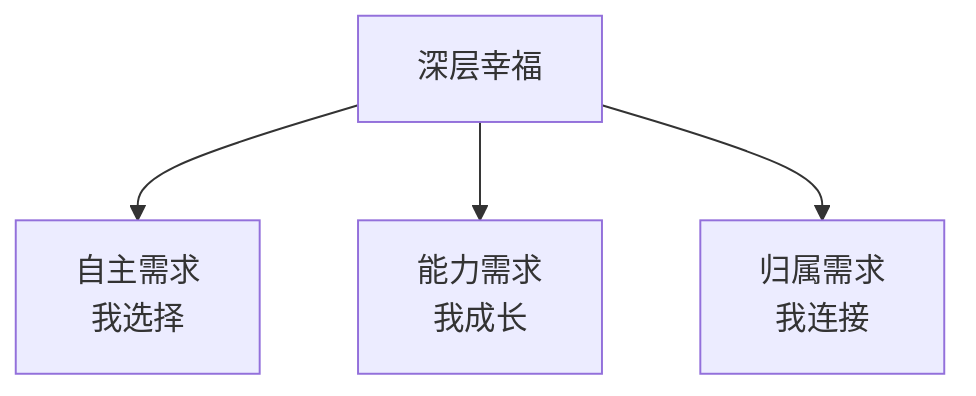

# 第07课：追求真正让你幸福的目标

德博拉·柯尼希斯贝格尔创办了一个帮助无家可归母亲的慈善组织。她每天5点起床，工作极其辛苦，但她的脸上总是带着笑容。为什么？因为她追求的目标满足了她内心最深层的需求。

## 为什么有些目标带来的快乐转瞬即逝？

目标实现通常会带来快乐，但不是所有快乐都一样：

| 快乐类型 | 来源 | 持续时间 | 为什么？ |
|---------|------|---------|---------|
| **浅层快乐** | 名望、财富、外表 | 短暂 | 不满足基本需求 |
| **深层幸福** | 关系、成长、奉献 | 持久 | 满足基本心理需求 |

> [!NOTE] 研究发现
> 追求名利和外表的人**即使成功了也往往不快乐**。因为这些目标无法满足人类的基本心理需求。

## 三种基本心理需求

| 需求 | 含义 | 被满足时 | 被剥夺时 |
|------|------|---------|---------|
| **自主** | 感觉自己在主导选择 | 充满热情、自由 | 感觉被控制、抵触 |
| **能力** | 感觉自己在成长进步 | 自信、有动力 | 沮丧、无力 |
| **归属** | 感觉与他人有连接 | 快乐、有意义 | 孤独、空虚 |

## 奖赏为什么会"伤人"？

当你因为有内在兴趣而做一件事时，如果外界突然给了一个外部奖赏，会发生什么？

### 职场中的教训

| 场景 | 外部压力 | 效果 | 更好的做法 |
|------|---------|------|-----------|
| 员工做项目 | "做不完扣绩效" | 敷衍完成，交差了事 | "这个项目能帮你积累什么能力" |
| 学习新技能 | "公司要求必须学" | 抵触、应付考试 | "这门技能能让你解决哪些实际问题" |
| 完成报表 | "老板要的" | 拖延、质量差 | "这份报表能帮你发现什么业务洞察" |

## 如何将外部目标转化为自己的目标

当外部目标无法回避时，可以通过**内化**让它变得更有意义：

1. **理解价值**：这个目标对我真正的好处是什么？
2. **创造自主**：即使不能选"做不做"，也可以选"怎么做"
3. **连接意义**：这个目标能帮助我成为什么样的人？
4. **构建归属**：谁和我一起追求这个目标？

> [!QUESTION] 内化练习
> 想一个你因外部压力而追求的目标（如老板安排的任务）：
> 1. 为什么这个目标对你当前或未来的发展有价值？
> 2. 在"怎么做"方面你有什么选择权？
> 3. 这个目标如何与你关心的价值观连接？
>
> 

> 
示例：公司强制轮岗

> 1. 价值：轮岗能让我理解全链路业务，未来更有竞争力
> 2. 选择：我可以主动选择轮岗到最想了解的部门，而不是被动分配
> 3. 意义：成为能跨部门解决问题的人，这正是我想发展的方向
> 

## 要点回顾

- ✅ 追求**名利、财富、外表**的目标满足不了基本需求，不会带来持久幸福
- ✅ 三种基本需求：**自主、能力、归属**
- ✅ 外部奖赏会削弱内在动机——**小心不要让奖励成为你唯一的动力**
- ✅ 通过**内化**可以把外部目标变成自己的目标

## 下节课

[[0008-xuan-ze-shi-he-zi-ji-de-mu-biao|第08课：选择适合自己的目标]]——9种常见情境，每种情境适合什么目标。

> **推荐阅读**：本书第5章"让你幸福的目标"