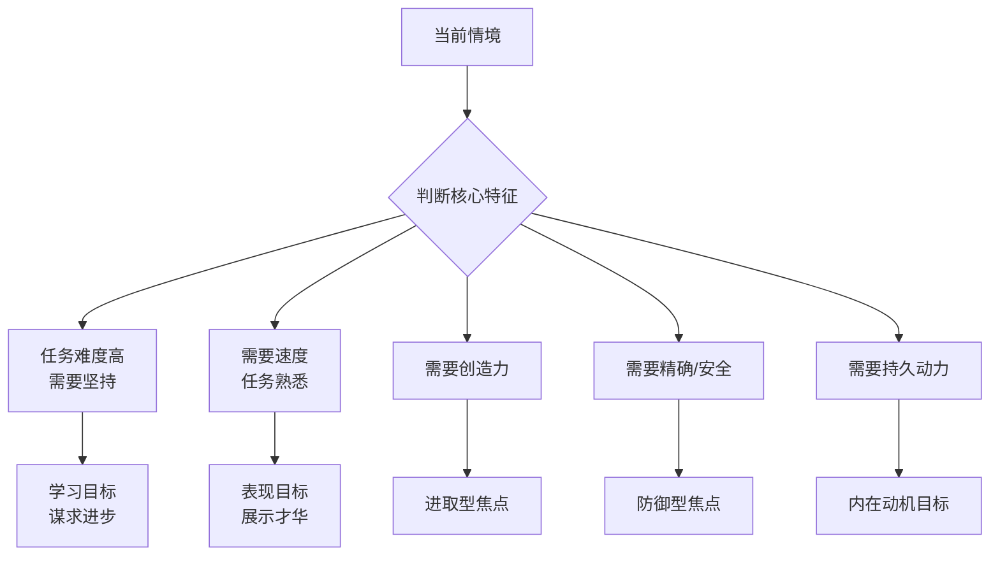

# 第08课：选择适合自己的目标

没有哪个目标能适用于所有情形。**目标-情境匹配**是成功的关键——你的目标类型必须适合当前任务的性质。这也是本章要讲的**目标匹配策略**核心原则：不同情境需要匹配不同类型的目标，选择正确的情境匹配目标能大幅提高成功概率。

## 如何选择目标类型

## 9种常见情境及最佳目标选择

| # | 情境 | 最佳目标 | 为什么 |
|---|------|---------|--------|
| 1 | 成功不易实现、挑战很大 | **学习目标**（谋求进步） | 关注成长让你在困难中坚持 |
| 2 | 需要速度/效率 | **表现目标**（展示才华） | 关注结果让你集中精力冲刺 |
| 3 | 道路宽阔（有很多方法） | **进取型焦点** | 鼓励探索和创新 |
| 4 | 无法享受乐趣、枯燥 | **把任务与更大意义连接** | 用"为什么"思维激发动力 |
| 5 | 你已经是专家 | **表现目标或进取型** | 挑战自己达到新高度 |
| 6 | 需要创造力 | **进取型焦点** | 热切策略促进发散思维 |
| 7 | 需要持久动力 | **内在动机目标** | 满足基本需求才能持续 |
| 8 | 道路枯燥、容易放弃 | **"为什么"思维** | 连接更大的意义 |
| 9 | 需要更多自我控制 | **防御型焦点** | 警惕策略防止失误 |

## 典型匹配场景分析

### 难而重要的项目 → 学习目标

当你接手一个不熟悉的高难度项目时，把目标定为"从中学到东西"而不是"证明我能行"。

> 因为：你必然会遇到挫折，学习目标让你把挫折当反馈而不是当失败。

### 紧急且熟悉的任务 → 表现目标

当月底需要提交一个你已经做过很多次的报表时，把目标定为"准确高效地完成"。

> 因为：任务没有学习空间，你需要的是执行力。

### 创新性工作 → 进取型焦点

当需要提出新产品方案时，用进取型思维思考——"怎样才能最好"而不是"怎样才能不出错"。

> 因为：创造性需要发散和探索，防御型会让你过于保守。

> [!WARNING] 常见错误
> - 在需要长期坚持的事情上用了表现目标→稍有挫折就放弃
> - 在需要精准的任务上用了进取型焦点→犯了不该犯的错
> - 把枯燥的任务只当任务做→没有思考"为什么"而失去动力

> [!QUESTION] 匹配练习
> 对于你当前最重要的3个工作目标，分别判断：
> 1. 当前你用的是哪种目标类型？
> 2. 根据情境特征，它是不是最佳选择？
> 3. 如果需要调整，应该换成什么类型？
>
> 

> 
示例

> 目标1：推进新客户开发（困难、充满不确定性）
> - 当前：表现目标（证明自己能搞定）
> - 问题：被拒绝后容易受挫
> - 调整：改为学习目标（每见一个客户都记录学到了什么）
> 

## 要点回顾

- ✅ **没有万能的目标类型**——关键是根据情境选择
- ✅ 困难任务→**学习目标**；紧急任务→**表现目标**
- ✅ 创造性工作→**进取型焦点**；精准工作→**防御型焦点**
- ✅ 需要持久动力→连接**"为什么"**和**内在动机**

## 下节课

[[0009-bang-zhu-ta-ren-she-ding-mu-biao|第09课：帮助他人设定目标]]——如果你是管理者或父母，如何潜移默化地影响他人的目标？

> **推荐阅读**：本书第6章"选择适合自己的目标"