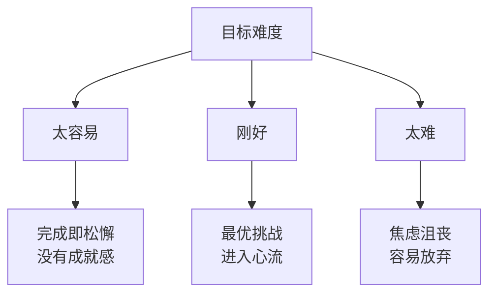

# 第10课：扫除行动中的障碍

大多数目标无法实现的原因**不是不知道怎么做**，而是执行环节出了岔子——机会溜走了、目标冲突了、难度把握错了。

## 三大执行障碍

### 1. 让机会从指间溜走

最常见的问题是：机会出现了，但你没注意。

> 你计划"今天要健身"，但忙了一天，快下班时才想起——这就是典型的错过时机。

**解决：执行意图（详见第11课）**

提前确定"我在什么时候什么地点做什么事"——大脑会在机会出现时自动捕捉。

### 2. 目标之间的冲突

每个目标都在争夺你的时间、注意力和意志力：

| 冲突类型 | 例子 | 解决方案 |
|---------|------|---------|
| 时间冲突 | 既要加班又要健身 | 优先级排序+执行意图 |
| 精力冲突 | 工作累到没精力学习新技能 | 保护精力、降低消耗 |
| 资源冲突 | 预算有限，多个项目争抢 | 明确优先级、做取舍 |

> [!TIP] 保护目标的策略
> - 为目标设定**不可侵犯的时间块**
> - 把手机放一边、关掉通知、关闭无关网页
> - 告诉同事你在做什么，请他们不要打扰

### 3. 难度把握不当

**目标难度**的恰到好处至关重要——**不要太难也不要太容易**：

> [!NOTE] 黄金难度法则
> 目标难度应该让你**需要付出较大努力但通过努力可以完成**。如果太容易，完成即松懈；如果太难，容易导致放弃。

## 扫除障碍的四步法

1. **预判障碍**：提前想好可能会遇到什么困难
2. **制定预案**：如果障碍出现，打算怎么做
3. **保护目标**：减少诱惑和干扰，为重要目标预留资源
4. **监控进度**：定期检查是否走在正确的轨道上

> [!QUESTION] 实战练习
> 选一个你一直在拖延的重要目标：
> 1. 最大的执行障碍是什么？（错过时机？目标冲突？难度不对？）
> 2. 你可以在什么时间、什么地点、怎么做来执行第一步？
> 3. 什么可能会干扰你？怎么提前预防？
>
> 

> 
示例：学习数据分析

> 1. 障碍：白天工作太忙，晚上回家后"没劲儿了"
> 2. 计划：每周二四的午休时间（12:30-13:00），在工位上用手机看一节课程
> 3. 干扰：同事可能会约午饭 → 提前说好周二四中午有安排
> 

## 要点回顾

- ✅ 执行失败最常见的原因：**机会溜走、目标冲突、难度不当**
- ✅ 用**执行意图**抓住关键时机
- ✅ 为目标设置**保护机制**——时间块、减少干扰
- ✅ 让目标难度落在**最优挑战区**

## 下节课

[[0011-zhi-ding-ji-hua|第11课：制定能落地的计划]]——为什么简单的"如果……那么……"计划能让你成功概率翻倍？

> **推荐阅读**：本书第8章"扫除障碍"