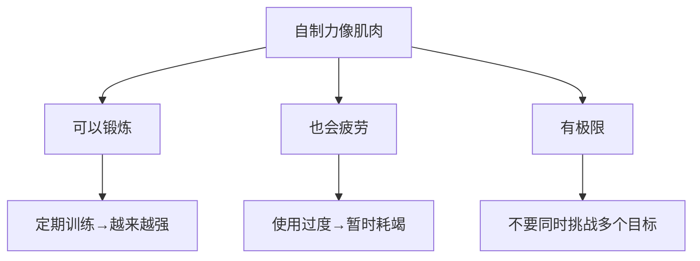

# 第12课：增强自制力

作者海蒂在30岁经历离婚、事业低谷时，养了一只小狗——正是这个决定，意外地帮她重建了生活。为什么？因为照顾小狗这件需要坚持的事，**锻炼了她的自制力肌肉**。

## 自制力的肌肉模型

### 两个核心特性

| 特性 | 含义 | 启示 |
|------|------|------|
| **可消耗性** | 每用一次就消耗一部分 | 重要的事放在精力最好的时候做 |
| **可训练性** | 长期坚持使用会变强 | 从小事开始训练自制力 |

> [!NOTE] 自制力下降的例子
> - 工作一天后，晚上更难抵抗零食诱惑
> - 节食时，意志力消耗大，更容易对家人发脾气
> - 同时戒烟和节食，两项都更容易失败

## 如何恢复自制力

| 方法 | 原理 | 做法 |
|------|------|------|
| **休息** | 肌肉需要恢复时间 | 小憩5-10分钟 |
| **补充葡萄糖** | 自制力消耗需要能量 | 吃一点健康零食（坚果、水果） |
| **积极情绪** | 快乐可以恢复自制力 | 看搞笑视频、听喜欢的音乐 |
| **转换任务** | 不同任务消耗不同资源 | 从高认知任务转到低认知任务 |

## 如何训练自制力

### 从一件小事开始

> 不要同时挑战太多目标。**从一件小事开始坚持。**

| 强度 | 做法 | 例子 |
|------|------|------|
| **轻度** | 坚持每天做一件小事 | 每天整理床铺、每天喝8杯水 |
| **中度** | 坚持每天做一件需要意志力的事 | 每天做50个仰卧起坐 |
| **重度** | 坚持一项有挑战性的日程 | 每周4次运动、每天学习1小时 |

### 训练原则

1. **从一个小习惯开始**——不要贪多
2. **坚持执行**——不能三天打鱼两天晒网
3. **逐步加量**——自制力增强后再增加挑战
4. **提前制定应对策略**——如果我想偷懒了，我就……

> [!WARNING] 最后的警告：不要挑战极限
> 即使你的自制力很强，也**不要同时执行两件具有挑战性的任务**。比如：
> - 不要在戒烟的同时开始节食
> - 不要在冲刺项目目标的同时学习一门新技能
>
> 成功人士**不会把目标故意设置得太难**。

> [!QUESTION] 自制力评估
> 1. 目前你的自制力在什么水平？（1-10分）
> 2. 一天中什么时候你的自制力最强？什么时候最弱？
> 3. 你可以在生活中有意地培养什么小习惯来训练自制力？
>
> 

> 
示例

> 1. 6分——工作能集中，但下班后就不行
> 2. 早上9-11点最强，下午3点后最弱
> 3. 养成每天早上下班前整理桌面的习惯（2分钟就能做，但需要坚持）
> 

## 要点回顾

- ✅ 自制力**像肌肉**——可消耗、可训练、有极限
- ✅ 用**休息、能量补给、积极情绪**恢复自制力
- ✅ 从**一件小事开始坚持**，逐步增强
- ✅ **不要同时挑战多个目标**——承认自制力有限是智慧

## 下节课

[[0013-qie-he-shi-ji-de-le-guan|第13课：切合实际的乐观]]——乐观很重要，但过度乐观是失败的根源。如何把握分寸？

> **推荐阅读**：本书第10章"增强自制力"