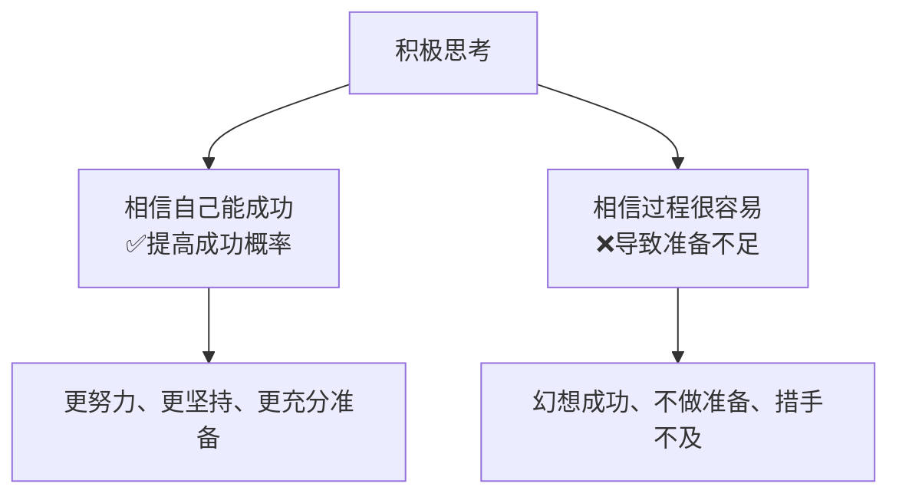

# 第13课：切合实际的乐观

几乎所有励志书都告诉你"保持积极、相信自己"。但科学研究发现：**基于现实的乐观者比盲目乐观者成功概率高得多。**

## 两种"乐观"的区别

回顾[[0001-ming-que-er-jian-ju-de-mu-biao|第01课]]提到的关键发现——厄廷根的研究证明了两种积极思考的天壤之别：

| 类型 | 想法 | 行为 | 结果 |
|------|------|------|------|
| **乐观期望** | "我能做到" | 付出努力、制定计划 | 更可能成功 |
| **乐观幻想** | "成功是自然而然的" | 不做准备、低估挑战 | 更容易失败 |

## 谁更容易成功？

厄廷根的减肥研究：

| 群体 | 一年后减重 |
|------|-----------|
| 相信自己能成功的人 | **多减了26磅** |
| 认为减肥很容易的人 | **反而少减了24磅** |

> [!TIP] 规律
> 成功人士**不但有信心获得成功，而且同样相信成功之路不会一帆风顺。**

## 切合实际的乐观主义

| 层面 | 应该乐观 | 不建议幻想 |
|------|---------|-----------|
| **对成功概率** | 我相信自己能做到 | 这事没什么难的 |
| **对努力过程** | 我准备好付出努力了 | 我应该不费力就能做好 |
| **对潜在障碍** | 我提前想好了应对方案 | 应该不会有什么问题 |
| **对时间预估** | 我会坚持直到成功 | 很快就能搞定 |

### 职场中的应用

| 场景 | 盲目乐观 | 切合实际的乐观 |
|------|---------|---------------|
| 接项目时 | "这个月肯定能搞定" | "这个月挑战很大，我需要每天专注4小时" |
| 学新技能 | "Python一周就能上手" | "Python基础需要1-2个月系统学习" |
| 面对批评 | "我觉得自己做得很好" | "我有哪些可以提升的地方？" |

> [!QUESTION] 反思练习
> 回忆一个你因过度乐观而失败的目标：
> 1. 哪个环节你的"乐观"变成了"幻想"？
> 2. 如果当时更现实地看待困难，你会做出什么不同的准备？
> 3. 下次你该如何在乐观和现实之间找到平衡？
>
> 

> 
示例：三个月学完课程

> 1. 我以为周末都有时间学习，没考虑加班和社交——低估了时间成本
> 2. 如果提前做了时间预算，我会选择更现实的时间安排
> 3. 以后用"预演困难"的方式：问自己"什么可能会阻碍我"，然后提前想对策
> 

## 要点回顾

- ✅ **相信自己能成功**是好事，**相信过程很容易**是灾难
- ✅ 成功人士不仅乐观，而且**对困难有清晰认知**
- ✅ 切合实际的乐观 = 相信能力 + 相信努力 + 预见困难
- ✅ 用"实施意图"和"心理对照"来平衡乐观与现实

## 下节课

[[0014-jian-chi-yu-fang-qi|第14课：坚持与放弃的智慧]]——什么时候该咬牙坚持，什么时候该果断放弃？这是成功者最关键的分辨力。

> **推荐阅读**：本书第11章"切合实际的乐观"