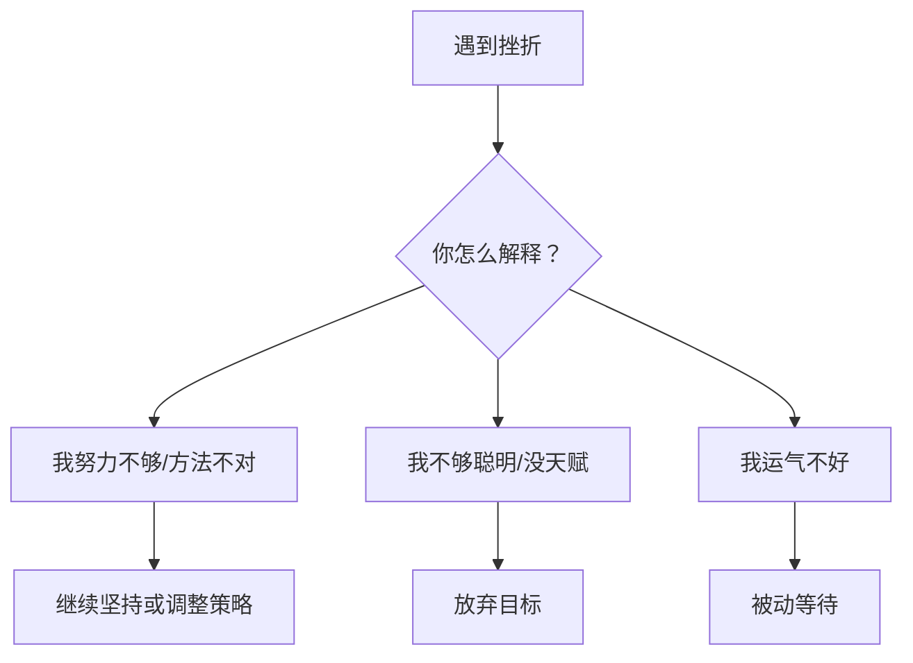

# 第14课：坚持与放弃的智慧

西点军校的学员能否通过艰苦的第一年训练？预测指标不是体能、不是智商、不是领导力——而是**毅力**（Grit）。但同样重要的是：**知道什么时候该放弃。**

## 毅力为什么比天赋重要

研究发现，坚持与成功的关系比天赋与成功的关系更紧密：

| 研究 | 发现 |
|------|------|
| 西点军校 | 毅力预测谁通过"野兽营"训练 |
| 拼字比赛 | 毅力预测谁走到最后 |
| 大学成绩 | 有毅力的学生平均GPA更高 |

> [!NOTE] 好消息
> 毅力**不是天赋**。它是一种可以培养的素质。认为自己"没毅力"本身就是一种误导性的信念。

## 归因风格：你如何看待失败

面对挫折时，不同归因方式决定你是坚持还是放弃：

| 归因方式 | 失败时想 | 结果 | 常见领域 |
|---------|---------|------|---------|
| **努力归因** | "我还不够努力" | 继续努力、坚持 | 成长型心智者 |
| **策略归因** | "我的方法不对" | 调整策略、尝试新方法 | 善于反思者 |
| **能力归因** | "我不够聪明/没这个天赋" | 放弃、不再尝试 | 僵固型心智者 |
| **运气归因** | "我运气不好" | 被动等待、不主动改变 | 外部归因者 |

> [!TIP] 改变你的归因方式
> 下次遇到挫折，主动问自己三个问题：
> 1. 我可以多做什么努力？
> 2. 我可以尝试什么不同的方法？
> 3. 我可以向谁求助？

## 什么时候该放弃

坚持不懈很重要，但**所有书都在教你坚持，很少书教你什么时候该放弃**。以下是该考虑放弃的信号：

### 去或留的决策框架

| 问题 | 继续的提示 | 放弃的提示 |
|------|-----------|-----------|
| 这个目标还重要吗？ | 仍然符合核心价值观 | 已经不再重要 |
| 成功的可能性？ | 合理，只是需要更多时间/努力 | 几乎为零，或需要不可能的资源 |
| 代价是否可承受？ | 投入可控，回报可期 | 身心俱疲，机会成本过高 |
| 有没有更好的选择？ | 不放弃也能做其他事 | 放弃这个才能专注于更好的机会 |

### 如何体面地放弃

1. **承认现实**：这个目标已不再适合
2. **从中学习**：这段经历教会了我什么？
3. **转移焦点**：把精力转到下一个更有价值的目标
4. **放下愧疚**：放弃不适合的目标，才能为新目标腾出空间

> [!QUESTION] 决策练习
> 想一个你一直在犹豫是否要坚持的目标：
> 1. 使用"去或留"框架，逐条评估
> 2. 你的直觉是继续还是放弃？
> 3. 基于评估，你理性的决定是什么？
>
> 

> 
示例：坚持参加一个可能无法毕业的课程

> 1. 重要性：仍然重要（职业需要）
> 可能性：很低（时间无法保证）
> 代价：巨大（熬夜、焦虑、影响工作和家庭）
> 替代：有其他更合适的课程
> 2. 直觉放不下——已经投入了这么多
> 3. 理性决定：放弃，选择更适合的课程
> 放弃不是失败，是把资源重新配置到更有效的地方
> 

## 要点回顾

- ✅ **毅力比天赋更重要**——而且可以培养
- ✅ **归因方式**决定你是否坚持——归因于努力和策略，而不是能力
- ✅ 坚持是美德，但**放弃是智慧**
- ✅ 用"去或留"框架做决策——**基于证据，而不是恐惧**

## 下节课

[[0015-gei-yu-fan-kui|第15课：给予有效反馈]]——如何表扬和批评才能激励他人？这是管理者的必修课。

> **推荐阅读**：本书第12章"懂得坚持"