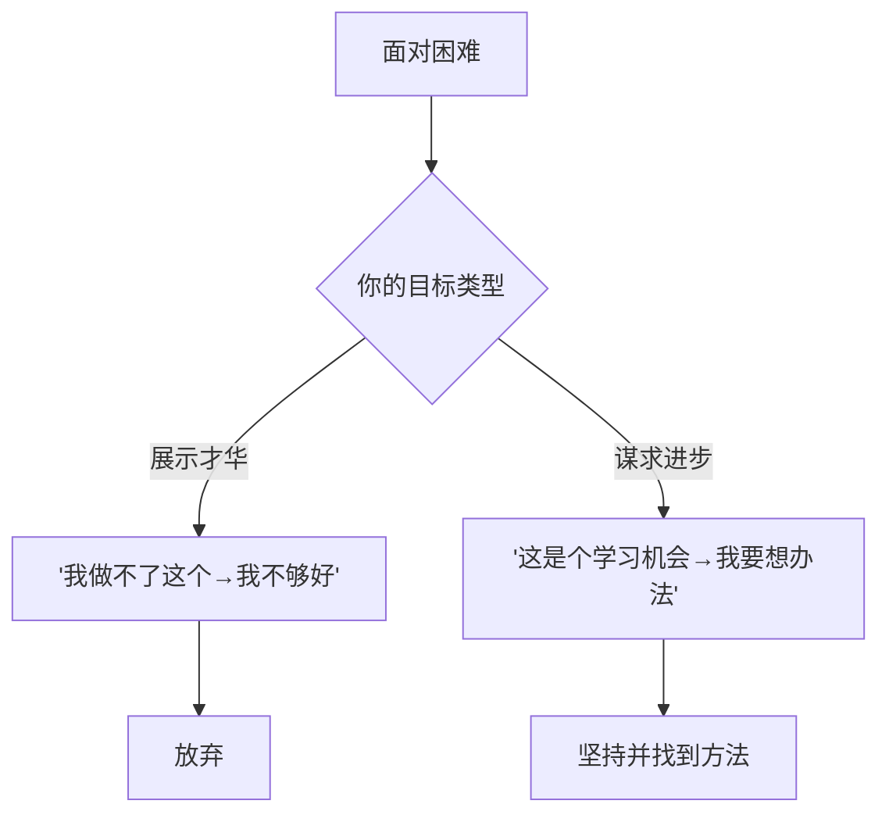
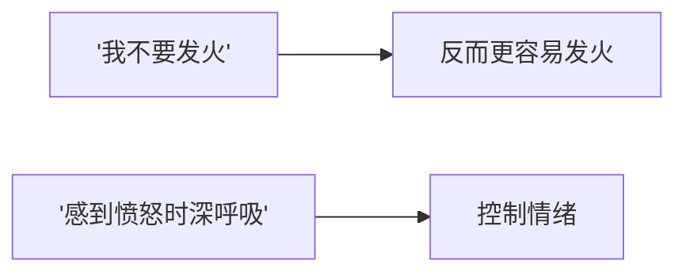

# 第16课：成功人士的9种做法

成功人士之所以能达成目标，**不仅仅因为他们是什么人，更多的时候还因为他们做了什么事情。**

以下是本书浓缩的9种做法，每一条都配有具体的操作指南。建议打印出来当作日常参考。

## 9种做法详解

### 1. 明确

设定目标时尽可能明确。

| ❌ 模糊 | ✅ 明确 |
|--------|--------|
| "我要减肥" | "未来三个月减掉5公斤" |
| "我要多学习" | "每周二四晚上8-9点学习Python" |
| "我要做得更好" | "这个季度客户满意度提升到95%" |

### 2. 抓住机会

事先确定你在什么时候、什么地方采取行动。

> **执行意图**：如果 [时机]，那么 [行动]
>
> 这能让你的成功概率提高约 **30%**。

### 3. 准确知道还有多远

定期监控你的进展——每周甚至每天。

- 如果目标是减肥——每周称一次体重
- 如果目标是业绩——每天追踪关键指标
- 如果目标是学习——每周测评掌握程度

> 不知道自己做得好不好，就无法调整行动和策略。

### 4. 做一名现实的乐观主义者

| ✅ 应该乐观的 | ❌ 不建议幻想的 |
|------------|--------------|
| 相信能成功 | 相信过程很容易 |
| 相信自己能克服困难 | 觉得困难不会发生 |
| 预想最好的结果 | 忽视可能的失败 |

### 5. 聚焦谋求进步，而不是展示才华

> 能力不是固定的，**一切能力都可以通过努力来提升**。

### 6. 有毅力

毅力 = 致力实现长远目标 + 面对困难百折不挠

如何培养毅力：
- 从**一个**有挑战但能坚持的事情开始
- **每天都做**，不中断
- 告诉自己："再坚持一次"

### 7. 增强自制力

自制力像肌肉——不练就会萎缩。从小事开始坚持：

> 第一阶段：每天整理床铺 × 1个月
> 第二阶段：每天50个仰卧起坐 × 1个月
> 第三阶段：每天学习30分钟 × 1个月

### 8. 不挑战命运

**不要同时执行两件具有挑战性的任务。**

| ❌ 错误做法 | ✅ 正确做法 |
|-----------|-----------|
| 同时戒烟和节食 | 先戒烟，稳定后再节食 |
| 刚换了新工作就开始马拉松训练 | 适应新工作后再加运动计划 |
| 冲刺项目KPI的同时学一门新课 | 项目结束后系统性学习 |

### 9. 把注意力放在要做的，而不是不要做的

> 越想"不要想白熊"，白熊越在脑海中挥之不去。

## 目标故障诊断

当你目标推进困难时，对照以下问题快速诊断：

| 症状 | 可能问题 | 解决方案（对应课） |
|------|---------|----------------|
| 日子过去了但什么都没做 | 让机会溜走 | 第11课：执行意图 |
| 其他目标互相冲突 | 目标冲突 | 第11课 + 第14课 |
| 认为能力不够 | 实体论信念 | 第04课：能力信念 |
| 沮丧、想彻底放弃 | 过度关注表现而非进步 | 第05课：表现vs进步 |
| 无法抵抗诱惑 | 自制力不足 | 第12课：增强自制力 |
| 总是低估所需时间 | 过度乐观 | 第13课：切合实际的乐观 |
| 不知道做对了还是错了 | 缺乏反馈 | 第15课：给予反馈 |

## 查漏补缺

回到目录，对照一下各课的要点，看看哪些你已经掌握、哪些需要复习：

- [[0001-ming-que-er-jian-ju-de-mu-biao|第01课]] 明确而艰巨的目标
- [[0002-wei-shi-yao-yu-shi-shi-ya|第02课]] 大局与细节思维
- [[0003-zi-wo-jue-ding-lun|第03课]] 自我决定论
- [[0004-neng-li-xin-nian|第04课]] 能力信念
- [[0005-zhan-shi-cai-hua-vs-mou-qiu-jin-bu|第05课]] 展示才华vs谋求进步
- [[0006-jin-qu-xing-vs-fang-yu-xing|第06课]] 进取型vs防御型
- [[0007-zhui-qiu-xing-fu-de-mu-biao|第07课]] 幸福的目标
- [[0008-xuan-ze-shi-he-zi-ji-de-mu-biao|第08课]] 选择适合的目标
- [[0009-bang-zhu-ta-ren-she-ding-mu-biao|第09课]] 帮助他人
- [[0010-sao-chu-zhang-ai|第10课]] 扫除障碍
- [[0011-zhi-ding-ji-hua|第11课]] 制定计划
- [[0012-zeng-qiang-zi-zhi-li|第12课]] 增强自制力
- [[0013-qie-he-shi-ji-de-le-guan|第13课]] 切合实际的乐观
- [[0014-jian-chi-yu-fang-qi|第14课]] 坚持与放弃
- [[0015-gei-yu-fan-kui|第15课]] 给予反馈

> **推荐阅读**：附录"成功人士与众不同的9种做法" + "目标故障诊断与解决"