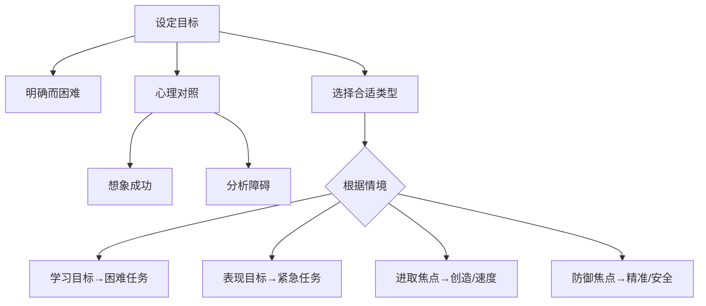

# 目标策略参考表

## 按需求快速定位

| 你的需求 | 推荐策略 | 对应课程 |
|---------|---------|---------|
| 设定一个好目标 | 明确+困难+心理对照法 | [[0001-ming-que-er-jian-ju-de-mu-biao\|第01课]] |
| 缺乏动力 | 从"为什么"角度思考 | [[0002-wei-shi-yao-yu-shi-shi-ya\|第02课]] |
| 任务太难/陌生 | 从"是什么"角度拆解 | [[0002-wei-shi-yao-yu-shi-shi-ya\|第02课]] |
| 拖延严重 | 用"是什么"思维+执行意图 | [[0002-wei-shi-yao-yu-shi-shi-ya\|第02课]]、[[0011-zhi-ding-ji-hua\|第11课]] |
| 觉得能力不够 | 培养成长型心智 | [[0004-neng-li-xin-nian\|第04课]] |
| 遇到挫折想放弃 | 从"展示才华"切换到"谋求进步" | [[0005-zhan-shi-cai-hua-vs-mou-qiu-jin-bu\|第05课]] |
| 需要速度/效率 | 使用表现目标+进取型焦点 | [[0005-zhan-shi-cai-hua-vs-mou-qiu-jin-bu\|第05课]]、[[0006-jin-qu-xing-vs-fang-yu-xing\|第06课]] |
| 需要创造力 | 使用学习目标+进取型焦点 | [[0005-zhan-shi-cai-hua-vs-mou-qiu-jin-bu\|第05课]]、[[0006-jin-qu-xing-vs-fang-yu-xing\|第06课]] |
| 需要精准/安全 | 使用防御型焦点 | [[0006-jin-qu-xing-vs-fang-yu-xing\|第06课]] |
| 对目标失去兴趣 | 连接内在动机 | [[0007-zhui-qiu-xing-fu-de-mu-biao\|第07课]] |
| 不知道选什么目标 | 根据情境匹配 | [[0008-xuan-ze-shi-he-zi-ji-de-mu-biao\|第08课]] |
| 错过关键时机 | 使用执行意图 | [[0011-zhi-ding-ji-hua\|第11课]] |
| 自制力不足 | 训练自制力肌肉 | [[0012-zeng-qiang-zi-zhi-li\|第12课]] |
| 过于乐观 | 心理对照+现实评估 | [[0013-qie-he-shi-ji-de-le-guan\|第13课]] |
| 不知道是否该放弃 | 用"去或留"框架 | [[0014-jian-chi-yu-fang-qi\|第14课]] |
| 需要给他人反馈 | 表扬努力不表扬聪明 | [[0015-gei-yu-fan-kui\|第15课]] |

## 核心概念速览

### 目标设定框架

### 三种关键分类

| 分类维度 | 类型A | 类型B | 关键区别 |
|---------|-------|-------|---------|
| 思维层次 | "为什么"（抽象） | "是什么"（具体） | 动力vs执行 |
| 成就取向 | 表现目标（展示才华） | 学习目标（谋求进步） | 证明vs成长 |
| 动机焦点 | 进取型（追求获得） | 防御型（避免损失） | 热切vs谨慎 |

### 目标实现四阶段

| 阶段 | 关键任务 | 核心策略 | 易犯错误 |
|------|---------|---------|---------|
| **设定** | 选择正确目标 | 心理对照法；情境匹配 | 目标太模糊或太容易 |
| **计划** | 制定行动方案 | 执行意图（如果……那么……） | 只列了愿望没列步骤 |
| **执行** | 坚持行动 | 增强自制力；切合实际的乐观 | 同时做太多事；过度乐观 |
| **反馈** | 评估并调整 | 定期检查进展；调整策略 | 只看结果不看过程 |