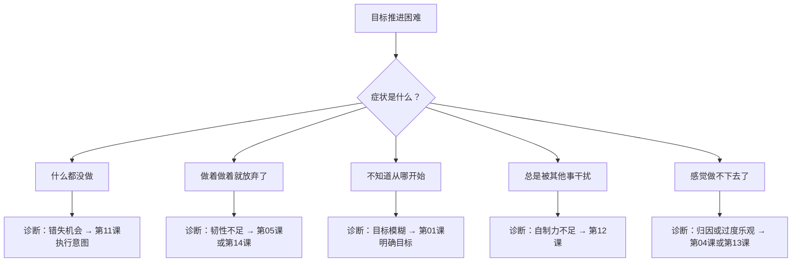

# 目标故障诊断指南

当你的目标推进遇到困难时，用下面的问题快速定位问题所在，然后参考对应的课程章节。

## 快速诊断

## 7种常见问题与解决方案

### 问题1：日子过去了但什么都没做

**可能原因**：让机会从指间溜走

**解决方案**：制定执行意图

> **如果** [具体时间/地点]，**那么** [具体行动]

示例：如果到了每周一三五的早上7点，那么我就去操场跑步。

📖 [[0011-zhi-ding-ji-hua|第11课：制定能落地的计划]]

### 问题2：做着做着就想放弃

**可能原因**：过度关注"展示才华"而非"谋求进步"

**解决方案**：转换目标类型

> 把"我要证明我能做好"转换成"我能从中学到什么"

📖 [[0005-zhan-shi-cai-hua-vs-mou-qiu-jin-bu|第05课：展示才华 vs 谋求进步]]

### 问题3：觉得"我做不了"

**可能原因**：僵固型心智（实体论）

**解决方案**：培养成长型心智

> 把"我不擅长这个"换成"我只是还没掌握"

📖 [[0004-neng-li-xin-nian|第04课：能力信念的力量]]

### 问题4：目标之间的冲突

**可能原因**：多个目标互相争夺时间和精力

**解决方案**：优先级排序 + 执行意图

> 明确哪个目标最重要 + 为每个目标设置固定的时间块

📖 [[0010-sao-chu-zhang-ai|第10课：扫除障碍]]

### 问题5：无法抵抗诱惑

**可能原因**：自制力不足或过度消耗

**解决方案**：

1. 把重要的事放在自制力最强的时候做
2. 训练自制力（从小事开始）
3. 减少诱惑（环境设计）

📖 [[0012-zeng-qiang-zi-zhi-li|第12课：增强自制力]]

### 问题6：总是低估所需时间

**可能原因**：过度乐观

**解决方案**：

> 设定目标时既要积极想象成功，也要冷静分析可能遇到的障碍。

用[[0001-ming-que-er-jian-ju-de-mu-biao|心理对照法]]平衡乐观与现实。

📖 [[0013-qie-he-shi-ji-de-le-guan|第13课：切合实际的乐观]]

### 问题7：不知道是坚持还是放弃

**可能原因**：缺少决策框架

**解决方案**：用"去或留"框架评估：

| 问题 | 继续 | 放弃 |
|------|------|------|
| 这个目标还重要吗？ | 是 | 否 |
| 成功的可能性存在吗？ | 是 | 几乎为零 |
| 代价可承受吗？ | 是 | 否 |
| 有没有更好的选择？ | 没有 | 有 |

📖 [[0014-jian-chi-yu-fang-qi|第14课：坚持与放弃的智慧]]

## 个性化方案

根据你的主导焦点选择最适合的激励方式：

| 如果你的主导焦点是 | 适合的策略 | 应避免的陷阱 |
|-----------------|-----------|------------|
| **进取型**（追求成就） | 关注收益、想象成功、热切行动 | 不要忽略风险 |
| **防御型**（避免损失） | 关注安全、制定预案、谨慎执行 | 不要过度犹豫 |
| **进取+防御平衡** | 视情境切换焦点 | 不要在同一目标中混用 |

📖 [[0006-jin-qu-xing-vs-fang-yu-xing|第06课：进取型焦点与防御型焦点]]

## 每日自查清单

- [ ] 我的目标明确吗？（具体结果+完成标准）
- [ ] 它既有挑战性又可实现吗？
- [ ] 我知道下一步具体要做什么吗？
- [ ] 我设定了执行意图吗？（如果X那么Y）
- [ ] 我为这个目标保留了不可侵犯的时间吗？
- [ ] 我知道可能的障碍并提前想好了对策吗？
- [ ] 我有定期检查进展的机制吗？