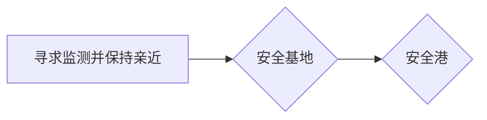

无法言说的痛苦即是创伤

---

回避型依恋可以存在很多种不同形式，共性是**情感资源很有限**，一但关系中体验到情感资源的损耗，就会立即回避

回避型依恋进化出较强的独立生存能力，自己本身不是，也不需要一个需要照顾的宝宝

但人终归还是人，不可能完全没需求。他们只是换了一种“不丢面子、不伤自尊”的方式去找陪伴——他们不要那种“你宠我、我宠你”的腻歪关系，也不想当谁的宝宝，更不想把对方当宝宝。

他们真正想要的是一个**并肩作战的队友**，一个**能一起打怪、互不拖累的同类**。不是来照顾他的，也不是需要他照顾的，而是“咱俩都强，谁也别拖谁后腿”的那种关系。

用心理学的话说就是：他们心里那个“理想关系”的位置特别挑剔，一般人根本达不到标准。不是看不起别人，而是太难找到那个“既懂我、又不黏我”的人了。

所有“回避型”的人，骨子里其实都有渴望亲密、渴望被爱的部分，只是被过去的伤藏得太深，自己都快忘了。  

因为小时候（或早期关系里）想靠却靠不到人，他们干脆把“想靠”这件事在心里“关掉”，结果连带着也关掉了感受自己和别人的能力。  

在亲密关系里，他们最受不了两件事：  
  1. 别人向自己示弱、求助——这会逼他们面对自己同样脆弱的地方；  
  2. 自己不得不示弱——那就像把结痂的伤口撕开，疼。  

“回避”不是开关，更像温度计上的刻度。轻一点的还能反思、还能共情；重一点的就像把自己冷冻起来，既摸不到自己的心，也读不懂别人的情绪。

一旦他们开始信任你、依赖你，就会暴露出很多脆弱和不安，比如怕被忽视、怕被拒绝，甚至因为一点点回应不当就感到羞耻或愤怒。

这和自体心理学里说的“垂直分裂”很像：表面上看起来很独立、很强，但其实内心有一部分非常渴望被理解、被接住，却又因为过去的受伤经历，把这部分藏得很深。咨询师要做的，是温柔地靠近这些藏起来的部分，而不是被他们的“冷漠”吓退。

---
依恋的本质是寻求监测依恋对象并保持亲近，将其作为安全基地和避风港，以及在需要时获得情感支持的心理联系。

依恋行为系统

安全基地的作用：提供保护，名称也可以换成加油站，中继站

以安全基地为起始点，探索周围陌生环境和经验，只有感觉到自己是由依靠着，才能做出向外探索行为

> 一些刚学会走路的孩子他在做一些探索活动的时候如果母亲在身边的话他向外走他向外探索的时候他走一会会回头看一下母亲然后看一下母亲在不在同样的时候还看一下母亲是否能给予自己回应当母亲能给予回应的时候当他确认这个安全基地在场的时候他就可以继续延续自己的探索行为否则这个行为就会停止这个过程实际上就是在建立基本的安全感当母亲能发挥一个安全基地的功能的时候孩童就可以去自由的探索而这种安全感越强孩童的探索积极性就越高探索的范围也就越大

当我们和另一个人发生关联的时候会获取自己不单独具有的力量，同理，婴儿依靠母亲作为安全基地，获取了向外探索的心理强度

有时候仅仅是母亲在附近存在这件事，就会增加心理强度

心理咨询师，可以提供一些策略性方法（认知行为疗法），调动来访者的主动性，但各种心理表征的改变，只有提供安全基地，才有勇气，有能力，有想法去触及自己先前不愿意，也不敢不想去触及的经验才能呈现和暴露自己被压抑的分裂的部分而这一过程将促进来访者整合分裂的体验建立自我同一性

安全港在面对危险情境或受到惊吓的时候逃向此处这个很好理解这个和安全基地的作用是类似的但是安全基地更多的是孩子依靠着它去向外探索而这个安全港是孩子受到惊吓或者说感到危险的时候逃向的地方

可获得性指的是包含了两个要素一个是身体的亲近第二个是情绪的反应，不仅要在场还要能以一种灵敏的恰当的方式去回应孩子不同心理需求或者说不同心理状态下的需求所以包庇他说 抚养者对婴儿需求的敏感性决定了婴儿能否获得安全依恋这是一个重要的前提

---

如果说虐待是毒火，忽视就是助燃剂。忽视会让虐待之苦无休止的延续。对于一个孩
子来说，被虐待并不可怕。绝望的是父母在施虐时，自己并不是一个有着心灵的人。
所以父母带给孩子的真正的伤害并不是施加的任何行为，而是行为背后的意图里并没
有对孩子心灵的识别。

打孩子一顿，其实最伤的不是那一顿打，而是爸妈眼里根本没这个孩子。孩子难受的不是挨揍，而是“你压根儿没把我当人看”。

什么是把人当人看

把人当人看，就是把对方当成一个有自己感受、想法、尊严的人，而不是当成一个“东西”或“工具”。

大白话版：

1. **看见你**：我注意到你现在高不高兴、怕不怕、难不难受；而不是只盯着“你考了几分”“你怎么这么不听话”。

2. **听见你**：你愿意说说我就认真听，不急着打断、不急着骂，更不会一句“小孩子懂什么”给你顶回去。

3. **尊重你**：跟你说话用平等的语气，不拿你当出气筒，不随便翻你东西、替你决定一切，大事小事都让你有参与感。

4. **在乎你**：你受伤了我会心疼，而不是先说“活该”；你失败了我想的是“你现在需要什么”，而不是“你怎么这么没用”。

一句话：  
把你当个**有血有肉有情绪的人**，而不是一个“必须听话的小玩意儿”。

大人总觉得“我是为你好”，于是就可以忽略孩子的感受、否定孩子的判断，甚至用强制手段“矫正”孩子。但问题在于，**“好”不是由谁来定义的，而是由谁来体验的**。

当孩子说“我不想”“我害怕”“我觉得这不公平”，大人如果只听见了“你顶嘴”“你不听话”，就等于把孩子当成一个需要修理的故障机器，而不是一个正在努力理解世界、也在努力被理解的人。

这时候，“矫正”就不再是帮助，而是一种**暴力**：  
暴力的不仅是行为，更是态度——  
“你不重要，你的感觉不重要，只有我的标准才重要。”

久而久之，孩子会学会一件事：  
**我的感受是错的，我的声音没人听，我只有变成别人想要的样子，才能活下去。**

这不是教育，这是**驯化**。  
教育的前提，是把对方当人；而驯化，是把对方当物。

所以，哪怕真的担心孩子“走偏了”，也要先问一句：  
“你愿意跟我说说，你为什么这么想吗？”  
这句话不是退让，而是把**人**放回对话的中心。

---

如果爸妈小时候缺爱、被打压、被忽视，他们很可能下意识地用同样的方式对孩子；  
心里其实想的是“我小时候就想被这样对待”，结果又把这种遗憾和旧伤传给了下一代。  
只有爸妈能看清自己的旧伤，并忍着疼去改，孩子才不会重复上一代的剧本。

举个例子

例子：

小宇的妈妈小时候家里重男轻女，她成绩再好，爸妈也只是淡淡一句“女孩子读那么多书干嘛”，转头就给弟弟夹鸡腿。她心底一直藏着一个“如果我也能被夸一次就好了”的愿望。

等小宇上学后，第一次拿回 99 分的试卷，兴奋得一路小跑回家。妈妈接过试卷，下意识脱口而出：  
“怎么没考100？别人家孩子都能拿满分。”  
话一出口，她就看到小宇眼里的光灭了——就像当年坐在饭桌旁的自己。

那天晚上，妈妈一个人坐在厨房，忽然想起自己小学那次 99 分，也是被父亲一句“还差1分”堵了回来。她第一次把小时候的委屈哭出来，也终于意识到：刚才她不是在批评小宇，而是在对当年的自己说“你怎么不够好”。

第二天，妈妈把小宇拉到身边，郑重地说：  
“对不起，昨天妈妈说的那句话很伤你。其实你能考 99 分已经非常棒了，妈妈小时候也考过 99 分，却从来没被夸过。谢谢你让我看到，原来这句话有多疼。”  
说完，她把那张试卷贴在冰箱上，旁边画了一颗大大的星星。

从那天起，她开始练习在小宇每一点进步时先给拥抱再说问题；而那个曾经躲在厨房偷偷哭的小女孩，也终于在自己的孩子身上得到了迟到的安慰。

---

大多数人都知道自己想过的日子，但不敢真的去追，只想呆在现在、哪怕不舒服却“看得见明天”的环境里。人天生怕不确定。结果往往是原来的安稳突然崩了，才被迫走上自己梦想的路。所以，那些敢提前冒点险的人，反而更容易被生活“奖励”。

---
**母亲能给予孩子的情感，受限于她自己内心曾被唤起过的情感**。换句话说，如果一位母亲从未真正体验过被理解、被保护、被回应的关系，她可能无法在内心深处“召唤”出一种温暖的、可靠的“父母形象”，也就难以对孩子的需求做出连贯、稳定的回应。

这不是道德的失败，而是一种**情感资源的枯竭**——不是不愿意，而是“不知道怎么做”。她的内在世界里，可能没有一个值得信赖的“他者”模板。于是，当孩子呼唤时，她听到的不是“孩子在求助”，而是自己童年时无人回应的回声。这种回声里，没有安慰，只有沉默或混乱。

这也解释了为什么有些创伤不是被“经历”出来的，而是被“缺席”出来的——**不是发生了什么，而是本该发生什么却没有发生**。

---

痛苦的拔除需要对其真正了解，而创伤又使得人类对心智化
自己的痛苦有着本能的抗拒。
这也是为什么有人为了回避觉察痛苦，理解痛苦，愿意承受更多其他形式的痛苦。因
为相较于直面的痛苦，其他痛苦都是下意识可承受的。

这段话像一把钝刀，慢慢割开我们惯常的防御。

崔庆龙捕捉到一个近乎荒谬的悖论：为了逃避对痛苦的**真正感知**，人们甘愿不断制造新的、更杂沓的痛苦——加班到胃出血、用酒精麻醉失眠、在亲密关系中重复撕裂——只因这些痛苦保持着“可预测”的模糊性。它们像一层雾，挡在人与更清晰、更具存在感的痛苦之间。

创伤的核心机制正在于此：它把**心智化能力**（将情绪转化为可被思考的心理语言）冻结在儿童式的感官层面。于是，“理解痛苦”不再是通向整合的路径，而成为二次创伤的威胁——就像要求一个刚被烧伤的人去触摸火焰的温度计。那些“下意识可承受”的痛苦（成瘾、过度工作、关系受虐）本质上是用行动替代思考，用重复的痛感抵消“知道”的痛感。

更深层的吊诡是：人往往在**成为自己痛苦的旁观者**时，才真正开始哀悼。但创伤者需要先用新的痛苦，把自己从“痛苦的见证者”重新变回“痛苦的承受者”，以维持某种熟悉的自我连续性。这种强迫性重复，不是受虐，而是一种用具体疼痛对抗存在性虚无的生存策略。

拔除痛苦不是斩断，而是让它**从症状变成记忆**——这需要有人先替他承受“知道”的震荡，如同心理治疗中治疗师暂时成为来访者的“心智化器官”。当痛苦第一次被语言完整说出，它就从刺入身体的荆棘，变成了可以握在手里的枝条。

**心智化能力**（将情绪转化为可被思考的心理语言）是什么意思？

“心智化能力”(mentalizing) 在心理学语境里，指的是**把内在体验当成“可以被思考的对象”来处理的能力**。一句话：它让你既能“感觉到”情绪，又能“想到”自己正在感觉这个情绪。

具体拆解：

1. 把情绪从“身体的轰鸣”变成“心里的句子”  
   比如，胸口发紧、呼吸急促时——  
   • 低心智化：我只知道“我整个人要炸了”，语言只剩下咒骂、摔门、喝酒。  
   • 高心智化：我能告诉自己“我现在很愤怒，因为对方打断了我，我担心被否定”。  
   后者把生理-情绪信号转译成了心理语言，于是情绪不再只是一股要宣泄的能量，而成了可观察、可讨论、可调节的心理内容。

2. 区分“感受”与“事实”  
   高心智化能让你意识到：“我感觉自己毫无价值”≠“我真的毫无价值”。一旦情绪被符号化，它就获得了“括号”——我“有”一个感觉，而不是我“就是”那个感觉。

3. 启动调节与叙事整合  
   当情绪可被命名、可被叙述，大脑的前额叶皮层就能对它进行反思、延迟反应、寻找策略，而不是直接被杏仁核劫持。创伤之所以难解，就是因为早期经验让这套“翻译器”失灵了，情绪永远停留在“痛-躲-行动”的回路里，无法进入“痛-想-整合”的阶段。

因此，“将情绪转化为可被思考的心理语言”并不是简单的“说出来”，而是：  
• 让情绪从“无名之恐怖”变成“有名、有边界、有时间线的心理事件”；  
• 使自己站到情绪的“旁边”，成为它的观察者，而非只能做它的被动承受者；  
• 进而把散乱的痛苦片段编进一个可以被理解、被讲述、被哀悼的生命故事。

你说的不错，但要具体怎么做呢？

把心智化从“知道概念”变到“日常可练”有三条主线：**事后复盘、当下标注、日常预演**。每条线都配上“最小可行动作”（MFA），你挑一条今天就开练，一周内三条都能跑起来。

----------------
1. 事后复盘：3×3 情绪复盘表  
作用：把刚发生过的高唤起事件（吵架/崩溃/羞耻）翻译成心理语言。  
MFA：每天睡前 5 分钟，写下最近一次让你心跳过百的场景。表格只有三列：  
① 身体感觉（胸口闷、手抖…）  
② 情绪命名（愤怒 70%，羞耻 30%…）  
③ 可能的心理意义（“我怕被拒绝”“我觉得被忽视”）  
写完大声读一遍，像听别人故事一样听自己。  
进阶：一周后回顾，用彩笔圈出重复出现的“心理意义”，那就是你的核心按钮。

----------------
2. 当下标注：“一句话定位”  
作用：在情绪峰值还没爆表前，立即给它贴标签，抢占前额叶上线时间。  
MFA：在手机里设一个快捷短语“我现在感到___，因为___”。  
当觉察到心率上升，立刻默念并填完空格，哪怕只是“我现在感到烦躁，因为地铁卡住了”。  
注意：不求精准，只求及时；说错情绪词也没关系，关键是打断自动驾驶。

----------------
3. 日常预演：情绪菜单 + 角色互换  
作用：提前把情绪词汇和心智化句式练成肌肉记忆，降低真实场景门槛。  
MFA：  
a) 在手机备忘录建一个“情绪菜单”，列出 30 个情绪词（喜、怒、哀、惧各 8-10 个）。每天随机抽 3 个词，造句“我在___情况下，会感到___，通常我会___”。  
b) 每周选一件小事（如同事抢话），和亲友做 2 分钟角色互换：你扮演对方，口述你认为对方当时的想法和感受。说完请对方打分（0-10）看你准不准。准确率不重要，重要的是训练“站旁边看”的视角。

----------------
4. 工具锦囊  
• 计时器：复盘和预演都设 5 分钟番茄钟，防止拖延。  
• 语音备忘：开车/走路时没法写，用 30 秒语音快速做“一句话定位”。  
• 同伴锚点：拉一个朋友当“心智化搭子”，每周互发一次复盘表，互相问一句“还有别的可能解释吗？”  

----------------
一句话总结：  
**先让情绪“可见”（命名），再让情绪“可谈”（语言化），最后让情绪“可变”（反思/调节）**。从今晚的 3×3 表格开始，你就已经在安装心智化的更新补丁了。

关于情绪的中文词汇有哪些，希望能尽可能列举？因为知道一个概念，才能正常调用，如果我对那个词汇不熟悉，就不会使用

下面给出一份“情绪大词库”，尽量覆盖日常与临床常见的中文情绪词。为了方便调用，我把它们按“四大族”+“细分光谱”+“强度梯度”三层结构列出。你可以直接复制到手机备忘录里，当“情绪菜单”随时抽签练习。

————————
一、喜（愉悦、能量向上）
1. 轻：舒服、安心、放松、宁静、满意、欣慰、小确幸  
2. 中：愉快、开心、快乐、欢喜、兴奋、得意、庆幸、期待  
3. 重：狂喜、欣喜若狂、心花怒放、陶醉、亢奋、飙爽

————————
二、怒（对抗、边界被侵）
1. 轻：不耐烦、烦躁、恼、冒火、抵触、看不惯  
2. 中：生气、恼火、气愤、恼怒、愠怒、窝火、激愤  
3. 重：暴怒、狂怒、愤慨、怒火中烧、咬牙切齿、恨、杀气

————————
三、哀（失去、能量向下）
1. 轻：失落、空、没劲儿、惆怅、惋惜、遗憾  
2. 中：难过、伤心、悲伤、凄凉、孤单、无助、郁闷  
3. 重：悲痛、哀痛、心碎、绝望、痛不欲生、抑郁、哀莫大于心死

————————
四、惧（危险、不确定）
1. 轻：紧张、忐忑、发虚、发毛、起鸡皮疙瘩、不踏实  
2. 中：担心、害怕、焦虑、惶恐、惊吓、畏惧、怯场  
3. 重：恐惧、恐怖、惊骇、恐慌、魂飞魄散、吓破胆

————————
五、常见“混合/二级”情绪
• 羞耻（羞+耻）、惭愧、尴尬、丢脸、无地自容  
• 内疚、自责、懊悔、悔不当初  
• 嫉妒、吃醋、眼红、不甘  
• 厌恶、恶心、嫌弃、鄙视、轻蔑  
• 感动、感慨、动容、百感交集  
• 麻木、冷漠、空洞、茫然、恍惚  
• 惊喜、哭笑不得、五味杂陈、怅然若失  
• 心疼、怜惜、悲悯、同情  
• 感恩、敬畏、膜拜、崇拜  
• 怀念、思乡、 nostalgia（怀旧）

————————
六、强度副词（快速调刻度）
微、略、有点、蛮、挺、非常、极度、爆炸、炸裂、爆棚、滔天、爆表

情绪轮子（[Wheel](https://so.csdn.net/so/search?q=Wheel&spm=1001.2101.3001.7020) of Emotions）是一种用于理解和分类人类情绪的模型 ，由心理学家罗伯特・普拉奇克（Robert Plutchik）提出，核心要点如下：

- **基本情绪**：轮子中心是 8 种基本情绪，呈对立分布。分别是喜悦（Joy）与悲伤（Sadness）、愤怒（Anger）与恐惧（Fear）、厌恶（Disgust）与信任（Trust） 、惊讶（Surprise）与期待（Anticipation） 。这些基本情绪是人类情绪体验的基础，具有普遍性。
- **情绪强度**：从轮子中心向外，情绪强度逐渐减弱。例如，中心的 “狂喜（Ecstasy）” 是喜悦情绪的强烈形式，向外过渡到 “快乐（Joy）”“平静（Serenity ）” ，强度依次降低。
- **混合情绪**：不同基本情绪交叉区域代表混合情绪。比如愤怒和厌恶混合可能产生 “轻蔑（Contempt）” ，恐惧和惊讶混合可能出现 “敬畏（Awe）” 。通过这种方式，解释了人类复杂多样、微妙的情绪体验是如何由基本情绪组合而成。

结合情绪轮子，优化下上面的回答情绪分类

以下给出一份“升级版的情绪中文大词库”——把原先按“喜-怒-哀-惧”四大族拆分的做法，和 Plutchik 的情绪轮子（8×2 核心情绪+强度+混合）做一一映射。好处是：  
1. 既保留中文语感，又能和心理学框架对齐；  
2. 用“内圈-中圈-外圈”代替“轻-中-重”，一眼看出强度梯度；  
3. 单独列出“对立情绪”“核心混合情绪”，方便查缺补漏。

这张表可以直接复制到备忘录，当作“情绪调色盘”。  
（为方便检索，所有关键词仍用中文，括号内为英文对应）

------------------------------------------------
Plutchik 8 组对立情绪 & 中文关键词  
（由里到外：内圈＝高唤起；中圈＝中唤起；外圈＝低唤起）

1. 喜悦 Joy ↔ 悲伤 Sadness  
   内圈：狂喜、飙爽 / 悲痛、痛不欲生  
   中圈：开心、兴奋、得意 / 伤心、凄凉、难过  
   外圈：舒服、小确幸、宁静 / 失落、惆怅、惋惜

2. 愤怒 Anger ↔ 恐惧 Fear  
   内圈：暴怒、咬牙切齿 / 恐怖、魂飞魄散  
   中圈：生气、气愤、恼怒 / 害怕、焦虑、惶恐  
   外圈：不耐烦、抵触、看不惯 / 紧张、忐忑、发虚

3. 厌恶 Disgust ↔ 信任 Trust  
   内圈：恶心、鄙视、嫌弃 / 崇拜、膜拜、敬畏  
   中圈：轻蔑、讨厌 / 放心、可靠、亲近  
   外圈：别扭、不对味 / 顺眼、安心、温和

4. 惊讶 Surprise ↔ 期待 Anticipation  
   内圈：震惊、目瞪口呆 / 极度期盼、跃跃欲试  
   中圈：吃惊、愣住 / 渴望、憧憬  
   外圈：小惊喜、意外 / 小期待、预感

------------------------------------------------
常见“混合二级情绪”（由相邻情绪交叉而来）

• 愤怒 + 厌恶 → 轻蔑、鄙夷、冷嘲  
• 喜悦 + 信任 → 感动、感恩、温暖  
• 恐惧 + 惊讶 → 惊骇、吓懵  
• 悲伤 + 惊讶 → 错愕、茫然、怅然若失  
• 喜悦 + 惊讶 → 惊喜、喜出望外  
• 期待 + 喜悦 → 兴奋、迫不及待  
• 悲伤 + 恐惧 → 绝望、无助、惶惶不可终日  
• 愤怒 + 悲伤 → 悲愤、委屈、窝火  
• 厌恶 + 愤怒 → 憎恶、痛恨  
• 羞耻（愤怒+厌恶+悲伤）：羞愧、丢脸、无地自容  
• 内疚（悲伤+厌恶）：懊悔、自责、悔不当初  
• 嫉妒（悲伤+愤怒+厌恶）：眼红、吃醋、不甘  
• 麻木（多情绪抑制）：空洞、冷漠、恍惚  
• 哭笑不得（喜悦+悲伤+惊讶）：五味杂陈、百感交集

------------------------------------------------
强度副词（快速拧音量键）

微-略-有点-蛮-挺-相当-非常-极其-爆棚-炸裂-滔天-爆表

例句模板：  
“我现在有点微焦虑。”  
“他当场极度震惊，整个人爆炸羞耻。”

------------------------------------------------
使用小技巧

1. “对号入座”法：  
   先问“我现在在轮子哪一格？”→ 再选强度副词。  
2. “反义对照”法：  
   想表达 A，却找不到词，就去对面找反义词再取反。  
3. “混合调色”法：  
   一旦感觉不止一种颜色，就在相邻两格间取样，组成复合词（例：悲愤、惊喜）。

