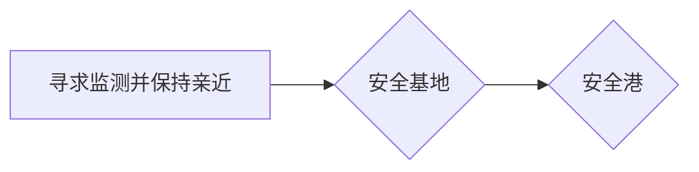

无法言说的痛苦即是创伤

---

回避型依恋可以存在很多种不同形式，共性是**情感资源很有限**，一但关系中体验到情感资源的损耗，就会立即回避

回避型依恋进化出较强的独立生存能力，自己本身不是，也不需要一个需要照顾的宝宝

但人终归还是人，不可能完全没需求。他们只是换了一种“不丢面子、不伤自尊”的方式去找陪伴——他们不要那种“你宠我、我宠你”的腻歪关系，也不想当谁的宝宝，更不想把对方当宝宝。

他们真正想要的是一个**并肩作战的队友**，一个**能一起打怪、互不拖累的同类**。不是来照顾他的，也不是需要他照顾的，而是“咱俩都强，谁也别拖谁后腿”的那种关系。

用心理学的话说就是：他们心里那个“理想关系”的位置特别挑剔，一般人根本达不到标准。不是看不起别人，而是太难找到那个“既懂我、又不黏我”的人了。

所有“回避型”的人，骨子里其实都有渴望亲密、渴望被爱的部分，只是被过去的伤藏得太深，自己都快忘了。  

因为小时候（或早期关系里）想靠却靠不到人，他们干脆把“想靠”这件事在心里“关掉”，结果连带着也关掉了感受自己和别人的能力。  

在亲密关系里，他们最受不了两件事：  
  1. 别人向自己示弱、求助——这会逼他们面对自己同样脆弱的地方；  
  2. 自己不得不示弱——那就像把结痂的伤口撕开，疼。  

“回避”不是开关，更像温度计上的刻度。轻一点的还能反思、还能共情；重一点的就像把自己冷冻起来，既摸不到自己的心，也读不懂别人的情绪。

一旦他们开始信任你、依赖你，就会暴露出很多脆弱和不安，比如怕被忽视、怕被拒绝，甚至因为一点点回应不当就感到羞耻或愤怒。

这和自体心理学里说的“垂直分裂”很像：表面上看起来很独立、很强，但其实内心有一部分非常渴望被理解、被接住，却又因为过去的受伤经历，把这部分藏得很深。咨询师要做的，是温柔地靠近这些藏起来的部分，而不是被他们的“冷漠”吓退。

---
依恋的本质是寻求监测依恋对象并保持亲近，将其作为安全基地和避风港，以及在需要时获得情感支持的心理联系。

依恋行为系统

安全基地的作用：提供保护，名称也可以换成加油站，中继站

以安全基地为起始点，探索周围陌生环境和经验，只有感觉到自己是由依靠着，才能做出向外探索行为

> 一些刚学会走路的孩子他在做一些探索活动的时候如果母亲在身边的话他向外走他向外探索的时候他走一会会回头看一下母亲然后看一下母亲在不在同样的时候还看一下母亲是否能给予自己回应当母亲能给予回应的时候当他确认这个安全基地在场的时候他就可以继续延续自己的探索行为否则这个行为就会停止这个过程实际上就是在建立基本的安全感当母亲能发挥一个安全基地的功能的时候孩童就可以去自由的探索而这种安全感越强孩童的探索积极性就越高探索的范围也就越大

当我们和另一个人发生关联的时候会获取自己不单独具有的力量，同理，婴儿依靠母亲作为安全基地，获取了向外探索的心理强度

有时候仅仅是母亲在附近存在这件事，就会增加心理强度

心理咨询师，可以提供一些策略性方法（认知行为疗法），调动来访者的主动性，但各种心理表征的改变，只有提供安全基地，才有勇气，有能力，有想法去触及自己先前不愿意，也不敢不想去触及的经验才能呈现和暴露自己被压抑的分裂的部分而这一过程将促进来访者整合分裂的体验建立自我同一性

安全港在面对危险情境或受到惊吓的时候逃向此处这个很好理解这个和安全基地的作用是类似的但是安全基地更多的是孩子依靠着它去向外探索而这个安全港是孩子受到惊吓或者说感到危险的时候逃向的地方

可获得性指的是包含了两个要素一个是身体的亲近第二个是情绪的反应，不仅要在场还要能以一种灵敏的恰当的方式去回应孩子不同心理需求或者说不同心理状态下的需求所以包庇他说 抚养者对婴儿需求的敏感性决定了婴儿能否获得安全依恋这是一个重要的前提

