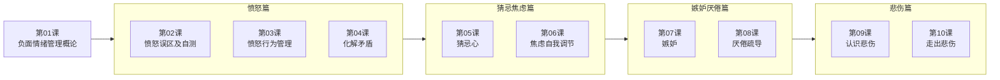

# 课程地图

本课程以"认知 — 觉察 — 管理 — 转化"为主线，从情绪管理的底层逻辑出发，逐一攻克愤怒、猜忌、焦虑、嫉妒、厌倦、悲伤六大负面情绪。以下为完整的课程架构与学习路径。

> [!TIP]
> 如果你是初学者，建议从第 01 课开始顺序学习。如果你正被某种特定情绪困扰，可以直接跳转到对应模块。

## 课程总览

## 模块与课程列表

### 模块一：愤怒管理（第 01-04 课）

| 课程 | 标题 | 核心内容 |
|---|---|---|
| 第 01 课 | [负面情绪管理概论](lessons/0001-intro-negative-emotions.md) | 情绪化定义、八种负面情绪的价值、三个学习准备 |
| 第 02 课 | [愤怒误区及多种判断自测](lessons/0002-anger-misconceptions.md) | 愤怒两种误区、身体思维信号、控制与爆发的判断 |
| 第 03 课 | [愤怒行为的基本管理](lessons/0003-anger-behavior.md) | 降温技巧、无感转移法、To Say To Do、安全发泄 |
| 第 04 课 | [如何彻底化解矛盾](lessons/0004-conflict-resolution.md) | 矛盾化解五步思路、五步沟通原则、男女思维差异 |

### 模块二：猜忌与焦虑（第 05-06 课）

| 课程 | 标题 | 核心内容 |
|---|---|---|
| 第 05 课 | [猜忌心](lessons/0005-suspicion.md) | 猜忌成因（三高人士、自我保护、自食恶果）、调节方法 |
| 第 06 课 | [焦虑的自我调节](lessons/0006-anxiety.md) | 焦虑七大表现、四种思维模式、自我对话调节法 |

### 模块三：嫉妒与厌倦（第 07-08 课）

| 课程 | 标题 | 核心内容 |
|---|---|---|
| 第 07 课 | [嫉妒](lessons/0007-envy.md) | 嫉妒四种分类、性别差异、治标治本方法 |
| 第 08 课 | [厌倦疏导法则](lessons/0008-boredom.md) | 恋爱厌倦四种原因、职场厌倦五种原因及处理方法 |

### 模块四：悲伤情绪（第 09-10 课）

| 课程 | 标题 | 核心内容 |
|---|---|---|
| 第 09 课 | [认识悲伤情绪](lessons/0009-understanding-sadness.md) | 悲伤定义与来源、五个表现方面、库伯勒-罗斯五阶段 |
| 第 10 课 | [走出悲伤](lessons/0010-overcoming-sadness.md) | 悲伤表达方式、自怜与痛苦回避、三种走出方法 |

## 先修要求

本课程无硬性先修要求。但以下基础认知有助于提升学习效果：

- 对自身情绪状态有基本的觉察意愿
- 愿意以开放心态审视自己的情绪反应模式
- 能够投入每节课 15-20 分钟的专注学习时间

## 如何使用本课程

1. **顺序学习**：按课时顺序逐课推进，适合系统掌握情绪管理方法的新手
2. **按需切入**：根据当前遇到的情绪困扰，直接跳转到对应模块。如正经历分手悲伤，可从第 09 课开始
3. **工具导向**：每节课提供可直接使用的练习方法（自测题、行为练习、沟通话术），建议学完一节后立即尝试
4. **循环复习**：情绪管理是长期练习，建议定期回顾课程地图和 [[reference/glossary|术语表]]，将方法内化为习惯

> [!NOTE]
> 课程中的练习和方法并非一次性见效，请给自己至少 2-3 周的实践周期来观察改变。

---

返回 [[index|课程首页]]。