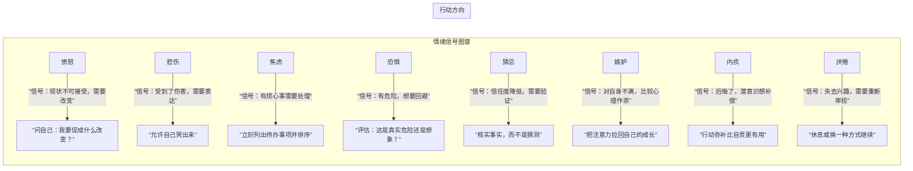

# 第01课：负面情绪管理概论

> 每一種负面情绪都有它的用处，我们不是要消灭情绪，而是要把它们控制在正常的范围内。

---

## 为什么需要情绪管理？

如果你有以下三种情况之一，说明你已经是情绪管理的目标人群了：

### 三种需要管理情绪的人

| 类型 | 表现 | 典型场景 |
|------|------|----------|
| **型一：情绪写在脸上** | 生气就发火、难过就哭、嫉妒就流露 | 吵架后一天都缓不过来 |
| **型二：一味隐忍压抑** | 信奉"吃亏是福"，所有情绪自己消化 | 被误解也不解释，回家后才爆发 |
| **型三：敏感多疑** | 过度在意他人看法、容易误解别人的话 | 对方没回消息就开始胡思乱想 |

> [!TIP] 你是哪一类？
> 大多数人不是单一类型，而是几种类型的混合体。先观察自己一周，记录每次情绪反应的模式。

---

## 为什么女性尤其需要情绪管理？

女性的**框额叶皮层（orbitofrontal cortex）**——主管情绪的大脑区域——比男性更大，这既是天赋也是挑战。

### 女性更容易被情绪影响的四大原因

1. **生理基础差异**：女性的大脑中情绪脑区更发达，天生对情绪更敏感。
2. **环境影响更强**：女性更容易被周围的气氛、他人的表情和语气所感染。
3. **过度解读倾向**：容易从对方的反应中"脑补"出并不存在的负面含义，把小事放大。
4. **沟通诉求不同**：男生吵架是为了讲道理，女生吵架是为了讲态度——诉求错位导致情绪升级。

> [!WARNING] 长期负面情绪的代价
> 长期积压的负面情绪会转化为**生理疾病**：失眠、胃溃疡、心脏病、妇科疾病……"忍一时乳腺增生"并非玩笑话。

---

## 八种负面情绪的存在价值

每一种负面情绪都是一则来自潜意识的**信号**。试着把情绪看成"警报器"，而不是"敌人"。

### 简要对照表

| 情绪 | 信号含义 | 健康应对 |
|------|----------|----------|
| 愤怒 | 你无法接受现状 | 促进行动，推动改变 |
| 悲伤 | 你受到了伤害 | 允许表达，释放情绪 |
| 焦虑 | 有事情需要处理 | 列出清单，逐个解决 |
| 恐惧 | 感知到危险 | 区分真实与想象的危险 |
| 猜忌 | 信任出现裂痕 | 追求事实，而非脑补 |
| 嫉妒 | 对自己不满意 | 回归自身成长节奏 |
| 内疚 | 后悔，想补偿 | 用行动弥补而非自责 |
| 厌倦 | 失去兴趣 | 休息或切换模式 |

---

## 学习前的三项准备

> [!EXAMPLE] 学习前的三项心理准备

**准备一：正视负面情绪，不要否认**
不要对自己说"我不该生气"，而是说"我现在很生气，这很正常"。

**准备二：放下侥幸心理**
不要指望一节课就能根治。情绪管理是肌肉训练，不是吃药片。

**准备三：随时给自己积极的心理暗示**
告诉自己："我正在学习与情绪共处，每一点进步都值得肯定。"

---

## 自检测试

点击展开自测题

**1. 以下哪一项不是负面情绪的价值？**
A. 提醒我们需要改变
B. 帮助我们了解内心的真实状态
C. 情绪越强越好，说明你很敏感
D. 帮助我们做出保护自己的判断

正确答案：C。负面情绪是信号，但信号太强或太弱都可能失真，中庸才是关键。

---

**2. 女性更需要情绪管理的原因不包括以下哪一项？**
A. 女性的大脑情绪脑区更发达
B. 女性更容易受环境气氛影响
C. 女性不需要情绪管理，男性需要
D. 女性容易将对方的反应过度解读

正确答案：C。

---

**3. 当你感到"嫉妒"时，最合理的解读是什么？**
A. 对方不配拥有那些东西
B. 你对自己某些方面感到不满，正在与他人比较
C. 嫉妒是坏的，应该立刻压制
D. 你应该直接去抢过来

正确答案：B。嫉妒是对自身不满的投射，核心是回归自我成长。

---

**请反思：今天你经历了哪种负面情绪？它想告诉你什么？**

---

## 课程地图

下一课：[[0002-anger-misconceptions|第02课：愤怒误区及多种判断自测]]

> [!TIP] 学习规划
> 建议每周学习一课，每课结束后记录一周的情绪日记，再进入下一课。

---

*情绪不是敌人，是信使。听懂它，而不是赶走它。*