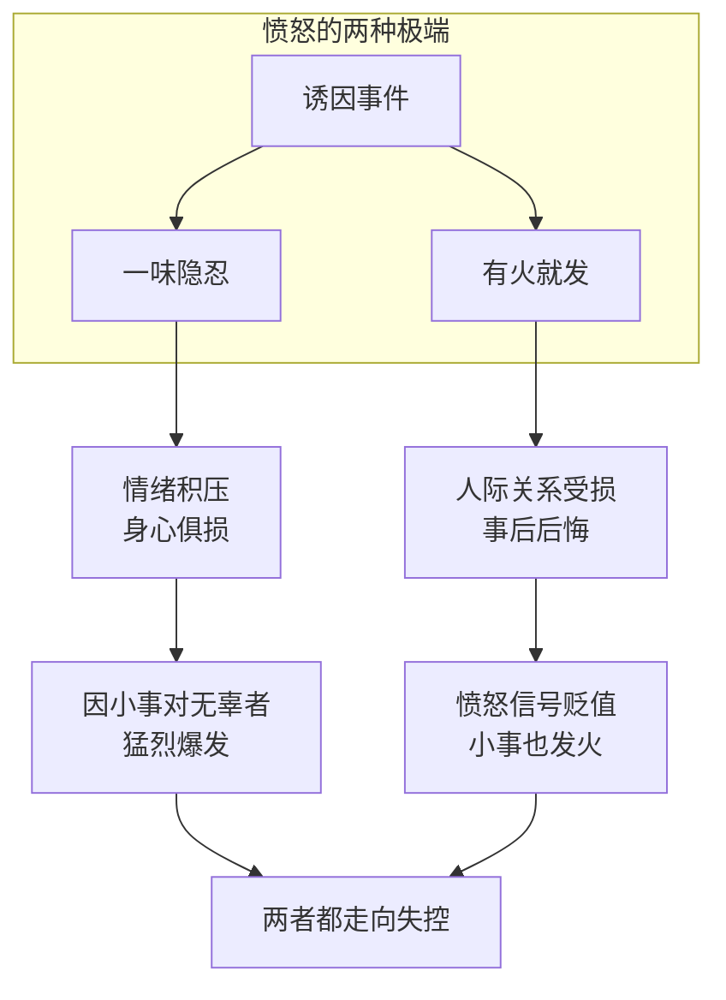
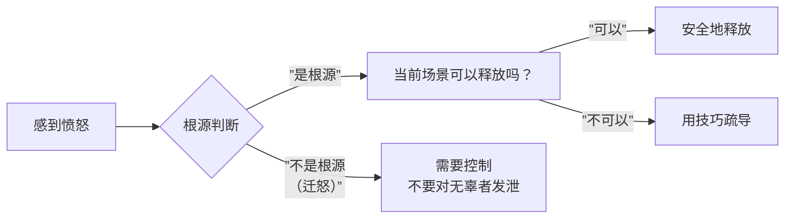

# 第02课：愤怒误区及多种判断自测

> 愤怒本身不是问题，问题在于我们对愤怒的**处理方式**。

上一课我们了解了八种负面情绪的信号价值，本课聚焦其中最具破坏力也最容易被误解的情绪——**愤怒**。

---

## 两大愤怒误区

### 误区一：一味隐忍

典型表现：不管什么场合、不管谁引起的，全都往肚子里吞。

> [!WARNING] 一味隐忍的后果
> 服务行业从业者尤其常见——整天面对客户保持微笑，回家后因为一件小事对家人**爆发**。压抑不会让愤怒消失，只会让它在某个时刻以更猛烈的形式喷发。

**为什么隐忍有害**：
- 愤怒不会自行消失，只会积累
- 积累到临界点后，爆发对象往往是**无辜的人**
- 长期压抑导致身心疾病（参考 [[0001-intro-negative-emotions|第01课]] 提到的长期负面情绪代价）

### 误区二：有火就发

典型表现："我这个人就是直，憋不住话"——不管大事小事，当下就要发泄。

> [!WARNING] 有火就发的代价
> 常常为了一点鸡毛蒜皮的事情发火，发完之后又后悔。伤了人际关系不说，还让人觉得你情绪不稳定。

**为什么有火就发也不对**：
- 发泄对象可能是**错误的归因对象**
- 过度发泄会降低他人对你的信任
- 频繁的小规模爆发会削弱愤怒的"信号价值"，让你对真正重要的事情也变得麻木

> [!TIP] 核心原则
> 愤怒管理的目标不是"不发火"或"随便发火"，而是**该收的时候收得住，该放的时候放得对**。

---

## 识别愤怒的信号

愤怒爆发之前，你的身体和精神会提前发出信号。学会识别这些信号，是管理愤怒的第一步。

### 身体信号（潜意识体征）

| 信号 | 说明 |
|------|------|
| 头皮发麻 | 最早期的身体预警 |
| 呼吸急促 | 交感神经被激活 |
| 心跳加速 | 身体进入"战斗模式" |
| 握紧拳头 | 肌肉紧张，准备攻击 |
| 咬紧牙关 | 下意识压抑或准备爆发 |
| 坐立不安 | 身体无法静止下来 |

### 思维信号（潜意识思维）

| 信号 | 具体表现 |
|------|----------|
| 想让对方闭嘴 | 不愿意再听对方说话 |
| 想让对方消失 | 极端回避念头 |
| 想逃走 | "我想离开这里" |
| 想提分手/辞职 | 用极端决定结束局面 |

> [!EXAMPLE] 练习：找到你的"愤怒指纹"
> 每个人的愤怒信号组合是不一样的。请在接下来的一周中，注意记录：
> - 生气前你的**第一个身体感觉**是什么？
> - 脑海中**第一个念头**是什么？
>
> 找到这个"信号组合"，下次它出现时你就能提前预警自己：**"警报响了，我需要先冷静一下。"**

---

## 何时控制 vs 何时释放

判断标准只有一条：

**让你生气的人/场景，是不是你愤怒的根源？**

### 具体场景应对方案

| 场景 | 处理方式 | 为什么有效 |
|------|----------|------------|
| **工作场合** | 去洗手间，做**高抬腿跑**10-20秒 | 快速消耗肾上腺素，不激化职场矛盾 |
| **电话/聊天中** | 暂停对话："我有点事要处理，回头再聊" | 中断情绪升级螺旋 |
| **独自在家** | 直接释放：捶枕头、大声说出来、写下来 | 安全地让情绪流走，不伤害他人 |

---

## 自检测试

点击展开自测题

**1. 下面哪一项是对"有火就发"这一误区的正确描述？**
A. 有火就发是最健康的情绪处理方式
B. 不管是否迁怒，先发泄再说
C. 可能导致对小事爆发，事后后悔，人际关系受损
D. 只有男性才会这样

正确答案：C。

---

**2. 以下哪一项属于愤怒的思维信号而非身体信号？**
A. 头皮发麻
B. 呼吸急促
C. 想让对方消失
D. 握紧拳头

正确答案：C。A、B、D都是身体信号，C是潜意识层面的思维信号。

---

**3. 在工作场合感到愤怒时，推荐的应急方法是？**
A. 当场和同事吵清楚
B. 去洗手间做高抬腿10-20秒
C. 发朋友圈吐槽
D. 直接摔东西

正确答案：B。

---

**请反思：回忆最近一次你生气的场景——当时你有哪些身体信号和思维信号？你做了哪种处理（隐忍/发泄），结果如何？**

---

## 课后练习

> [!EXAMPLE] 本周任务：愤怒日记
>
> 准备一个本子，每次感到愤怒时记录：
> 1. **触发事件**：发生了什么？
> 2. **身体信号**：头皮？呼吸？心跳？拳头？
> 3. **思维信号**：想说什么？想做什么？
> 4. **根源判断**：当前对象是不是根源？
> 5. **处理方式**：最终你是怎么做的？
> 6. **结果评估**：1-10分，你觉得处理得怎么样？

---

## 课程地图

- 上一课：[[0001-intro-negative-emotions|第01课：负面情绪管理概论]]
- 下一课：敬请期待

---

*愤怒是警报器，不是武器。学会读懂它，而不是被它操控。*