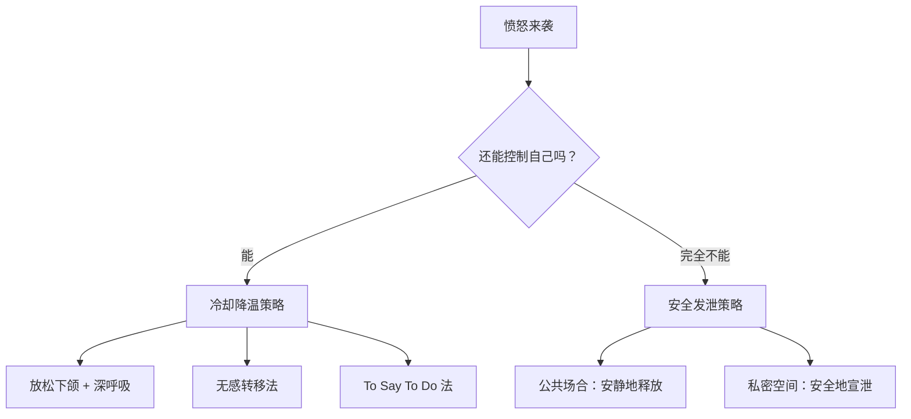
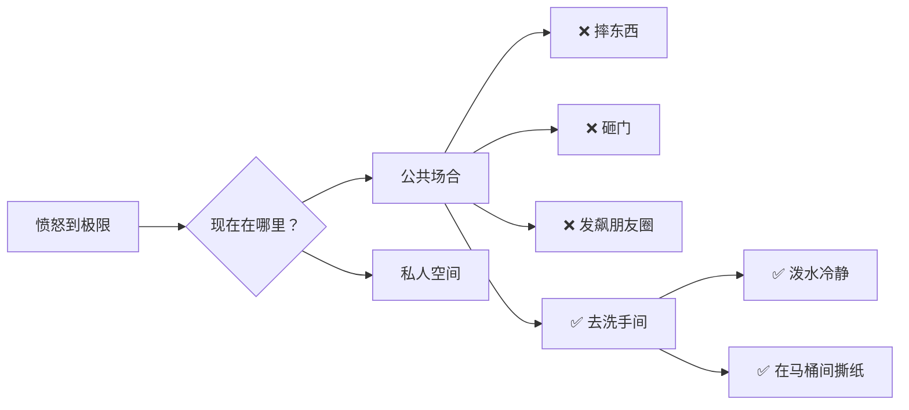
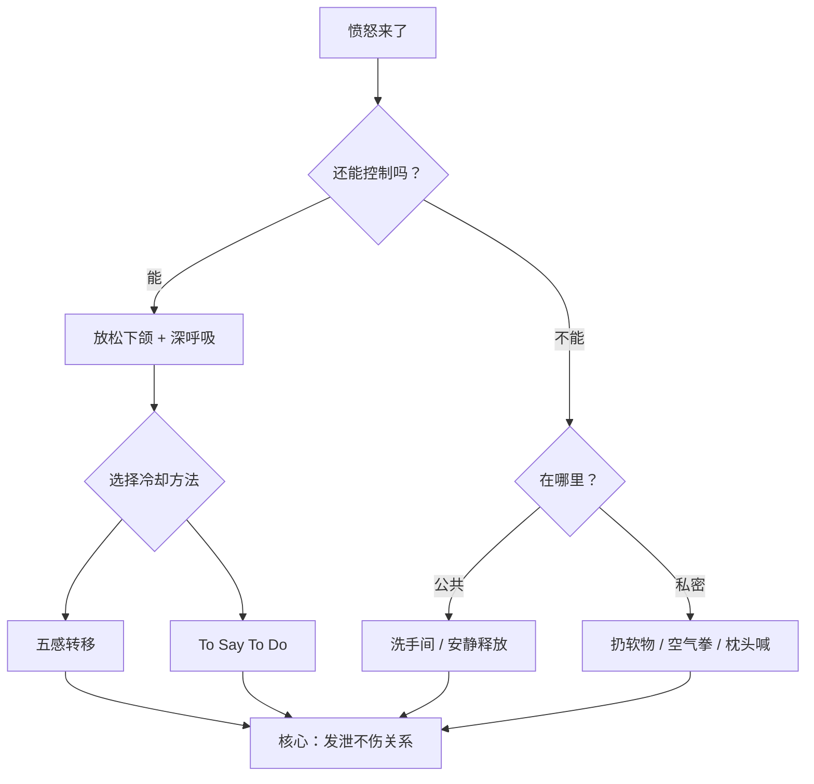

# 第03课：愤怒行为的基本管理

## Learning Objectives

- 掌握愤怒爆发前如何自我冷却的具体方法
- 理解无感转移法和 To Say To Do 法的操作要点
- 学会在必须发泄时选择安全、不伤关系的方式

---

## 两种情境：能不能控制住自己？

愤怒来临时，你的自控力处于什么状态？根据这一点，我们需要选择不同的应对策略。

---

## 情境一：还能控制自己时 —— 冷却愤怒

### 第一步：身体先行

愤怒时人的本能反应是**咬紧牙关**，这会反过来加固愤怒。你需要先打断这个循环：

1. **微微张开嘴巴**，放松下颌肌肉
2. **深呼吸**（吸气4秒 → 屏息4秒 → 呼气6秒）

> [!TIP] 生理原理
> 咬紧牙关是战斗状态的身体信号。主动放松下颌，等于告诉你的神经系统："我是安全的，不需要战斗。"

---

### 方法一：无感转移法（五感转移）

利用五种感官将注意力从愤怒源上"骗"走，让大脑自动冷却。

| 感官 | 转移方式 | 举例 |
|------|---------|------|
| 👁️ 视觉 | 看让你愉悦的画面 | 宠物照片、爱豆视频、搞笑短片 |
| 👂 听觉 | 戴上耳机切换声场 | 循环播放最喜欢的一首歌 |
| 👅 味觉 | 吃甜食或淀粉类食物 | 巧克力、蛋糕、面包（触发血清素和多巴胺） |
| 👃 嗅觉 | 吸入熟悉的舒适气味 | 香水、衣物喷雾、护手霜 |
| ✋ 触觉 | 获得安抚性的触感 | 撸猫/狗、捏减压玩具、轻轻抚摸桌面 |

> [!WARNING] 关于味觉转移
> 甜食和碳水能迅速带来愉悦感，但不要形成依赖。如果你有体重或血糖方面的顾虑，优先选择其他四种感官。

---

### 方法二：To Say To Do 法

**原理**：愤怒的核心感受是 **失控感和无力感**。To Say To Do 法通过"说一件简单的事 + 立刻去做"，帮你重新建立控制感。

**操作步骤**：
1. 在脑海里说出一件极其简单的事情
2. **立刻、马上**去做它

**举例清单**：
- 说"拍手10下"，然后真的拍手10下
- 说"选明天穿的衣服"，然后立刻去选
- 说"把垃圾丢掉"，然后起身去丢垃圾
- 说"喝一口水"，然后喝一口水

> [!EXAMPLE] 场景案例：男友约会迟到
> 小A和男友约好周末去爬山，男友睡过头迟到了一个小时。小A非常生气，但她没有直接爆发——
>
> 她对自己说："想爆发之前，我可以先去阳台浇花。"
>
> 浇完花回来，她的愤怒已经降了三分。这时她再和男友沟通，语气不再那么冲。

**关键要点**：这个方法的精髓在于**立即执行**。不要想"等一下再做"，停顿会让愤怒重新占据上风。

---

## 情境二：完全忍不住了 —— 怎样安全发泄

有些时候愤怒太过强烈，理智已经完全下线。这时强行压抑只会让后续爆发更猛烈，但发泄也需要"有底线"。

### 公共场合

**公共场合允许做的事：**
- 去洗手间待几分钟
- 往脸上泼冷水
- 如果情绪实在需要释放，把自己关进马桶间，**安静地撕纸**

> [!WARNING] 社交媒体警告
> 愤怒时发的朋友圈、微博、状态，90%以上都会在冷静后后悔。千万不要在情绪顶点发任何公开内容。

---

### 私人空间

在家或独处时可以更自由地释放，但关键原则是：**发泄完之后自己收拾，不给别人添麻烦。**

**推荐的发泄方式：**
- 扔容易清理的东西（纸巾盒、棉签盒）
- 扔枕头、抱枕、毛绒玩具
- 对着空气踢腿、挥拳
- 把头埋进枕头里大喊

> [!NOTE] 不建议做的事
> 不要摔手机、砸碗盘、砸键盘——这些东西碎了不但没法轻易收拾，还会给你带来后续的"心疼损失"，火上浇油。

---

## 核心原则：发泄不伤关系

无论用哪种方式发泄，最重要的底线是：

1. **自己收拾残局** —— 不能让别人来帮你扫尾
2. **不伤及他人** —— 愤怒是你的，不要把它变成别人的伤害
3. **不破坏贵重物品** —— 破坏物品不会解决问题，只会制造新问题

---

## Practice

> [!QUESTION] 自检提问
> 
> **题目 1：** 小B在公司被同事当众抢了功劳，非常愤怒。此时他还能保持理智，但需要迅速调整状态准备下一个会议。他应该优先使用哪种方法？请列出具体操作。
> 
> **题目 2：** 以下哪些行为属于"安全发泄"？（多选）
> 
> A. 回家把枕头狠狠摔在沙发上
> B. 发一条朋友圈含沙射影骂同事
> C. 躲进厕所撕掉开会用的废纸
> D. 摔碎一个旧杯子听声响
> 
> **题目 3：** 为什么 To Say To Do 法要求"想到立刻就做"？

点击查看答案

**答案 1：** 优先使用"无感转移法"中的听觉或触觉——因为开会场景下不方便吃东西或去洗手间。建议：戴上耳机听一首喜欢的歌（听觉），或者握紧拳头再松开几次（触觉），快速拉回注意力。

**答案 2：** A、C
- A ✅ 摔枕头——容易清理、不伤物品
- B ❌ 发朋友圈——公开发泄，伤人伤己，后悔率高
- C ✅ 厕所撕纸——私密、安静、无影响
- D ❌ 摔杯子——碎片难清理，制造新麻烦

**答案 3：** 因为停顿会让愤怒重新占据上风。To Say To Do 的核心是利用"行动"打断愤怒的思维循环，拖延会削弱这种打断效果。

---

## 本课总结

**两步回顾：**
1. 还能控制 → **冷却愤怒**（无感转移法 / To Say To Do 法）
2. 不能控制 → **安全发泄**（选对场合，事后收拾）

---

## Next Step

冷却愤怒只是第一步。当你冷静下来之后，更重要的是**彻底化解矛盾**。进入 [[0004-conflict-resolution|第04课：如何彻底化解矛盾]]，学习解决冲突的五步思路。