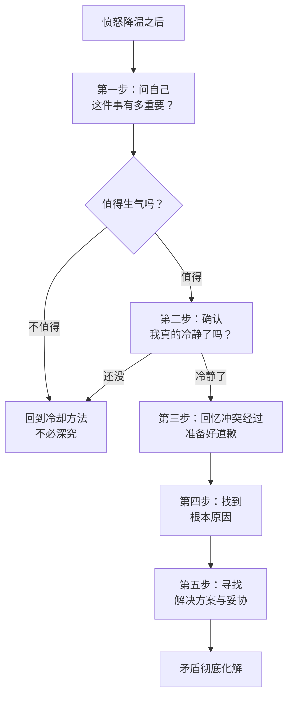
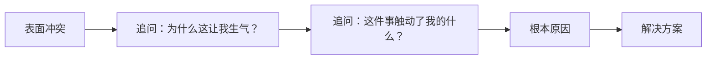
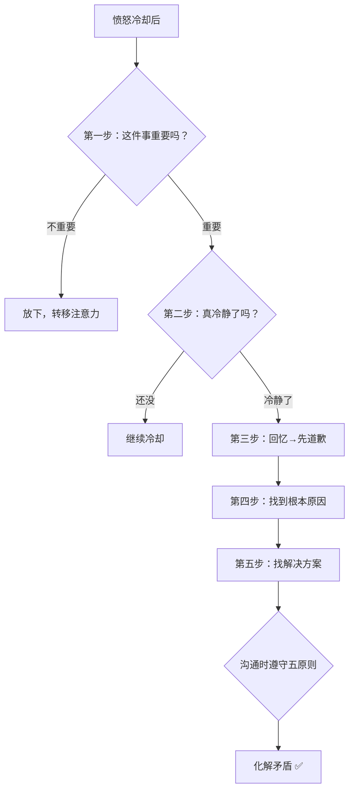

# 第04课：如何彻底化解矛盾

## Learning Objectives

- 掌握愤怒平息后的五步矛盾化解流程
- 理解并运用五大沟通原则
- 学会区分"表面冲突"和"根本原因"
- 能够在实际冲突中应用道歉、溯源和解决方案

---

## 新课导入

上节课 [[0003-anger-behavior|第03课]] 我们学会了如何冷却愤怒和安全发泄。但情绪降温只是第一步——

**愤怒冷却之后，真正的功课才刚刚开始。**

如果你只是降了温却没有解决矛盾，同一个问题会一次次引爆你的情绪。这一课，我们来学习如何**彻底化解矛盾**。

---

## 五步矛盾化解流程



---

### 第一步：问自己——这件事有多重要？

不是每件事都值得你花精力去化解矛盾。先做一个快速判断：

> [!TIP] 自问清单
> - 这件事在一天后还重要吗？——不重要，放下
> - 这件事在一周后还重要吗？——不重要，可以等情绪完全过去再说
> - 这件事在一个月后还重要吗？——重要，值得认真处理

如果不值得 → 回到 [[0003-anger-behavior|第03课]] 的冷却方法，转移注意力，不必深究。
如果值得 → 进入下一步。

---

### 第二步：确认——我真的冷静了吗？

愤怒时大脑的理性思考能力会显著下降。在你找对方沟通之前，先确认自己的状态：

**冷静自检清单：**
- [ ] 心跳是否恢复正常？
- [ ] 能不能客观复述对方的观点？
- [ ] 是否愿意听取不同的解释？
- [ ] 说出这件事的目的——是为了解决问题，而不是为了赢？

如果以上任意一项回答"否"，说明你还没有完全冷静。再给自己一些时间。

---

### 第三步：回忆冲突经过——准备好道歉

如果你在愤怒过程中已经和对方发生了**言语冲突或行为冲突**（吵架、摔门、说了伤人的话），那么在谈问题之前，**先道歉**。

> [!WARNING] 道歉 ≠ 认输
> 道歉的是"过激的反应"，而不是"生气的原因"。
>
> - ❌ "对不起，我不该生气"（这是否定自己的情绪）
> - ✅ "对不起，我刚才说话太大声了，吓到你了。但是我确实很在意那件事，我们聊聊好吗？"

---

### 第四步：找到根本原因

大多数人吵架吵了半天，吵的根本不是真正的问题。

**例1：职场矛盾**

> 同事 A 承诺周五交付数据，结果拖到了下周三，导致你的汇报出问题。你们大吵了一架。
>
> - **表面冲突**：对方拖延、汇报搞砸
> - **根本原因**：同事**承诺了却未履行**，这是信任被打破
> - 只有找到"信任被打破"这个根本原因，你才知道要解决的是**承诺机制**，而不是单纯催进度

**例2：亲密关系**

> 女生因为男友忘了纪念日而生气。男友觉得"补过不就好了"，女生却越想越气。
>
> - **表面冲突**：忘记日期
> - **根本原因（常见）**：女性倾向于**暗示表达**，希望对方能"猜到自己在想什么"
> - 深层需求是"我希望你主动在意我"，而不是"提醒你你在意我"
>
> 如果不挖到这个根本原因，下次还会因为类似的事情爆发。



> [!TIP] 找到根本原因的技巧
> 连续追问"为什么"——像剥洋葱一样，一层一层往下挖。通常问三次"这件事为什么让我这么生气"，就能触及核心。

---

### 第五步：寻找解决方案与妥协

找到根本原因后，问自己两个问题：

1. **我想要什么样的结果？**
2. **双方各自可以做什么让步？**

| 场景 | 根本原因 | 想要的结果 | 可能的妥协方案 |
|------|---------|-----------|---------------|
| 同事失约 | 信任被打破 | 本次工作问题解决 + 对方承认错误 + 建立新规则 | 先补救当前问题 → 双方约定新的确认节点 |
| 男友忘纪念日 | 希望被主动在意 | 感受到心意，不是被提醒的敷衍 | 男友做一件特别的事表达心意 + 女生以后可以直接提醒重要日子 |

---

## 五大沟通原则

当坐下来沟通时，遵循这五个原则，能确保沟通有效、不翻车。

```mermaid
flowchart TD
    subgraph ”五大沟通原则”
        P1[1、目标是平息情绪+解决问题<br>不是赢]
        P2[2、不用嘲弄型语言]
        P3[3、保持原谅的意愿]
        P4[4、就事论事，不翻旧账]
        P5[5、不说未经深思的决定]
    end
    P1 --> P2 --> P3 --> P4 --> P5
```

---

### 原则一：目标是平息情绪和解决问题，而不是"赢"

如果你抱着"我一定要说服你""我一定要证明你错了"的心态，这场沟通从一开始就注定失败。

> [!NOTE]
> 真正的"赢"是：**问题解决了，关系变好了。** 而不是你把他辩得哑口无言，但他心里不服气。

---

### 原则二：不用嘲弄型愤怒语言

嘲弄型愤怒是以讽刺、阴阳怪气的方式表达不满。例如：

- ❌ "行行行，你最有道理了。"
- ❌ "对，你永远是对的，我活该呗。"
- ❌ "哟，您还记得回来啊？"

这类语言不会解决问题，只会**激化矛盾**，让对方感到被羞辱而非被理解。

**正确的做法**：直接说感受和需求。

- ✅ "我不太认同你的观点，因为你漏掉了XX这个信息。"
- ✅ "你回来晚了，我有点担心，下次能不能提前告诉我？"

---

### 原则三：保持愿意原谅的态度

如果你心里已经预设"这个人不可原谅"，那就没必要沟通了。

> [!TIP] 自我提醒
> 沟通的目标是解决问题。如果对方愿意承认错误并做出改变，你要准备好接受这份诚意。原谅不是软弱，而是为解决问题清空障碍。

---

### 原则四：就事论事，不翻旧账

翻旧账是矛盾升级的最快方式。

- ❌ "你上次也是这样！上上次也是！你从来都不靠谱！"
- ✅ "这次的问题是这样处理的……下次我们怎么避免？"

**一次只解决一件事。** 如果你忍不住想翻旧账，说明上一个问题根本没有真正解决。

> [!WARNING] 翻旧账的信号
> 当你发现自己开始说"你总是……""你从来都……""每次你都……"时，停下来。这说明你没有在解决当前问题，而在攻击人。

---

### 原则五：不要说出未经深思的决定

愤怒时最容易说出的话：

- ❌ "我们分手吧！"
- ❌ "我不干了！"
- ❌ "绝交！"

说出口的那一刻或许很痛快，但你真的想好了吗？如果对方真的说"好"，你怎么办？

> [!TIP] 给自己一个暂停按钮
> 在说出重大决定之前，做一个30秒的深呼吸。"我现在的愤怒会让我说出我不真正想做的事情吗？"

---

## Worked Example

**场景：** 室友连续三周没有洗碗，厨房堆满了用过的锅碗瓢盆。

**应用五步流程：**

| 步骤 | 做法 |
|------|------|
| ① 这件事有多重要？ | 影响生活质量，重要，值得解决 |
| ② 确认冷静 | 先出门散步20分钟，确认自己不会一开口就吵架 |
| ③ 回忆冲突 | 之前已经催过两次，语气不太好，先道歉："对不起，之前催你的时候口气急了" |
| ④ 找到根本原因 | 不是"懒"，而是"我们对脏碗的定义不同"——她认为泡一晚没什么，你认为必须立刻洗 |
| ⑤ 寻找解决方案 | 协商：碗筷最多泡一晚，第二天早上必须洗完；各自用自己的餐具区分责任 |

**应用五大沟通原则：**

- 不翻旧账："上次你说改也没改" → 不提，只解决当前方案
- 不嘲弄："您这碗泡出艺术感了" → 不这样说

---

## Practice

> [!QUESTION] 自检提问
> 
> **题目 1：** 小C被朋友放鸽子，朋友没提前通知就在约定时间改了其他安排。小C非常生气。请按照五步流程，写出小C每一步应该做的具体事项。
>
> **题目 2：** 以下哪些话违反了五大沟通原则？请指出违反了哪一条。
>
> A. "你总是这样，上次也是，上上次也是。"
> B. "我们要不要想一个折中的方案？"
> C. "对对对，你全世界最对。"
> D. "你这样做我很难过，你能说说你是怎么想的吗？"
> E. "我们分手吧！"（正在气头上说的）
>
> **题目 3：** 如何区分"道歉"和"否定自己的情绪"？请各举一个例子。

<details>
<summary>点击查看答案</summary>

**答案 1：**
- ① 重要程度：朋友失信是重要的问题，值得认真处理
- ② 确认冷静：先做几个深呼吸，或者用 [[0003-anger-behavior|第03课]] 的方法冷却，确认自己能理性沟通
- ③ 回忆冲突：如果当时已经在微信上发了脾气，先道歉："对不起，刚才我语气不好"
- ④ 根本原因：被放鸽子感到"不被尊重"，自己做好的心理准备全部落空
- ⑤ 解决方案：告诉朋友"我希望你下次如果改计划，提前至少两小时告诉我"；朋友承认这次处理不当

**答案 2：**
- A ❌ 违反原则四（翻旧账）——"总是、上次、上上次"
- B ✅ 符合原则一（目标：解决问题）
- C ❌ 违反原则二（嘲弄型愤怒）——阴阳怪气
- D ✅ 符合原则三（愿意理解对方）
- E ❌ 违反原则五（未经深思的决定）——气头上提分手

**答案 3：**
- 否定情绪（❌）："对不起，我不该生气"——抹杀了自己情绪的合理性
- 正确道歉（✅）："对不起，我刚才说话太大声了。但我确实很在意这件事，我们聊聊好吗？"——为过激反应道歉，但不否定情绪本身

</details>

---

## 本课总结



**五步化解流程：**
1. 判断重要性 → 2. 确认冷静 → 3. 回忆并道歉 → 4. 找到根本原因 → 5. 提出解决方案

**五大沟通原则：**
1. 目标不是赢，是解决问题
2. 不用嘲弄型语言
3. 保持原谅的意愿
4. 不翻旧账
5. 不说未经深思的决定

---

## Next Step

你已经学会了如何化解矛盾。在下一课中，我们将继续探索更深层的情绪管理技巧。在此之前，建议你将这两课的方法结合使用——先用 [[0003-anger-behavior|第03课]] 冷却愤怒，再用本课的方法彻底化解矛盾。

> [!TIP] 行动建议
> 下一次你和别人发生冲突时，**不要急着说任何话**。先在脑海里过一遍五步流程，再开口。四次五步走下来，你就会发现它变成了你的本能反应。