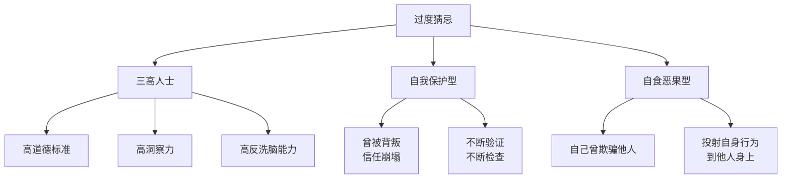
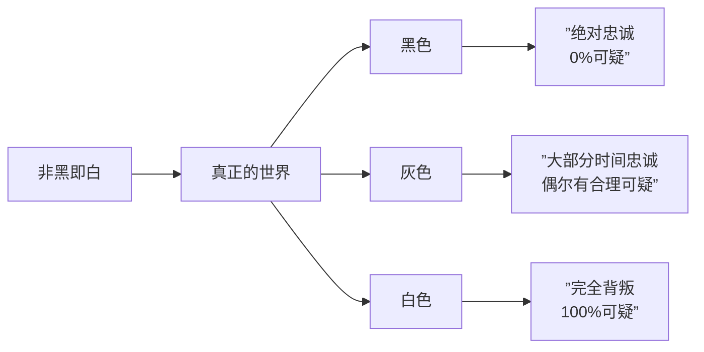
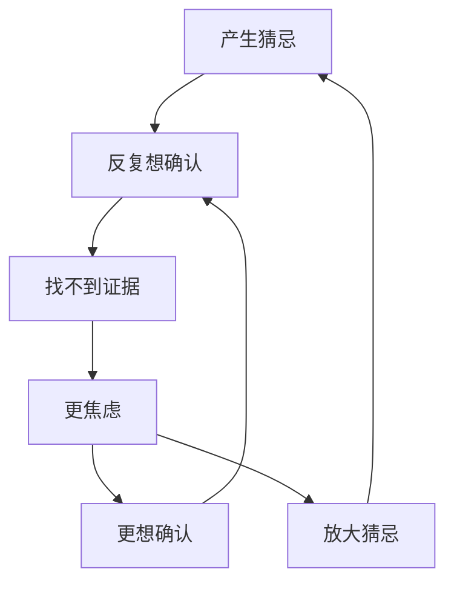

# 第05课：猜忌心

## 学习目标

- 识别自己的猜忌倾向属于哪种类型
- 理解过度猜忌的三大心理成因
- 掌握降低猜忌心的三种实用方法

---

## 为什么我们会猜忌？

猜忌心，本质上是对**不确定性**的排斥和对**安全感**的渴求。当我们无法确认对方的忠诚或事情的真实性时，大脑会自动"补全"一个最坏的可能——这是进化留下的自我保护机制。

但过度猜忌就像戴着墨镜看世界，把所有灰色都看成了黑色。

---

## 猜忌心自测

在继续之前，先花一分钟做一个小自测。以下问题没有标准答案，但能帮助你定位自己的猜忌倾向。

### 情感方面

点击展开情感方面自测题

1. 你或你的伴侣在感情中安全感是 **高** 还是 **低**？会想要翻看对方手机吗？
2. 你曾出轨 / 被出轨过吗？
3. 你曾欺骗 / 被欺骗过吗（善意的谎言除外）？
4. 你或你的伴侣是否反感对方有任何异性接触？

> 如果以上问题中有多项答案为"是"，你的猜忌可能已经影响到关系质量了。

### 性格方面

点击展开性格方面自测题

1. 你或对方的道德标准是否**非常高**，有非黑即白的倾向？
2. 你或对方是否容易走极端——极端言论、极端情绪？
3. 你或对方是否**非常精明**，绝不愿意吃亏？

> 性格层面的特质往往比情感经历更顽固，也更需要觉察。

---

## 过度猜忌的三大成因

猜忌心并非凭空产生。根据成因的不同，可以分为以下三类：

### 1. 三高人士

"三高"不是指高血压高血脂，而是指：

| 维度 | 说明 | 举例 |
|------|------|------|
| **高道德标准** | 对人对己要求极高，非黑即白 | 认为"忠诚"是绝对底线，任何可疑行为都不能容忍 |
| **高洞察力** | 能敏锐捕捉细节和异常 | 能从语气变化、微表情中发现蛛丝马迹 |
| **高反洗脑能力** | 不容易被说服，坚持己见 | 对方解释再多，内心仍然不信 |

> 典型例子：**警察男友**。职业习惯让他对任何可疑点都高度警觉，道德感强又不容易被说服——三重buff叠满，猜忌自然爆表。

### 2. 自我保护型

当一个人曾经被背叛过——无论是被出轨、被欺骗还是被伤害——信任体系就会像摔碎的玻璃杯，即使粘回去也布满裂痕。

这类人的猜忌逻辑是：
> "上次我信任了，结果我受伤了。所以这次我必须保持警惕，不断验证，确保自己不会再受伤。"

于是他们变成了**关系侦探**：查手机、问行程、对时间线、反复试探。

### 3. 自食恶果型

这里有一个经典的"石头与糖果"故事：

> 从前有两个小孩交换玩具。女孩把所有的糖果都给了男孩。男孩却在心里盘算——他把最好的石头藏了起来，只把次等的给了女孩。
>
> 但从此以后，男孩开始提心吊胆：**"她会不会也藏了一手？她是不是也在骗我？"**

**核心机制**：当自己曾经欺骗过别人，就会把"欺骗"投射到别人身上——"我自己会骗人，所以别人也一定在骗我。"

这是一种**心理投射**——你在用你自己的行为标准去衡量全世界。

---

## 如何降低猜忌心？

### 方法一：承认灰色地带

世界上大多数事情不是非黑即白的，人性也是如此。

> [!TIP] 核心认知
> 一个人的手机里可能有不想让你看到的聊天记录，但那可能只是帮同事带个午饭的价格讨论——而不是出轨证据。**放弃黑白思维，接受灰度，是降低猜忌的第一步。**

### 方法二：学会适度自我洗脑

这不是让你变成无脑信任的傻瓜，而是学会**放下那些无意义的小情绪**。

> **筛选标准**：这件事值得你消耗今天的精力去纠结吗？

- 对方回消息慢了5分钟 → 大概率在忙
- 对方和异性同事吃了个午饭 → 大概率正常工作社交
- 对方今天语气有点冷淡 → 大概率只是累了

学会对**微小的不确定性**说："我不需要知道答案，这也不影响我。"

> [!WARNING] 适度 ≠ 过度
> 自我洗脑不等于忽视原则性问题。如果确实有实质证据，那该面对的还是要面对。这里讨论的是**那些无法证实也无法证伪的微小猜忌**。

### 方法三：当猜忌带来痛苦——及时断舍离

如果一段关系让你长期处于猜忌和痛苦中，且无论对方怎么解释、你怎么调整，都无法缓解——

> **或许不是你的问题，也不是对方的问题，而是这段关系本身就不适合你。**

[[0006-anxiety|焦虑]] 和猜忌常常相伴而生。当猜忌让你持续焦虑时，问问自己：
- 这段关系是滋养我还是消耗我？
- 如果我的猜忌永远无法消失，我还能继续吗？

有时候，离开也是一种勇气。

---

## 猜忌与焦虑的关系

猜忌和[[0006-anxiety|焦虑情绪]]是孪生兄弟。猜忌催生焦虑，焦虑又反过来强化猜忌，形成一个恶性循环：

打破这个循环的方法，可以参考[[0006-anxiety|焦虑的自我调节]]一课中的**自我对话法**和**焦虑层级分析法**。

---

## 实践练习

> [!QUESTION] 自我诊断
> 回想最近一次你产生强烈猜忌的场景，用今天学到的三种成因模型分析一下：
>
> 1. 我是哪种类型？三高人士 / 自我保护型 / 自食恶果型？
> 2. 这件事真的只有黑或白两种可能吗？灰色地带的可能性是什么？
> 3. 这个猜忌值得我消耗情绪去纠结吗？

参考答案方向

**成因分析示例：**
- 如果你发现对方和前任还有联系 → 先判断自己是哪种类型
  - 三高人士：会认为"有联系就是背叛"
  - 自我保护型：会被触发旧伤
  - 自食恶果型：会认为"我要是他/她肯定有鬼"

**灰色地带思考：**
- 有联系不一定有暧昧 → 可能是共同朋友婚礼、工作关系、共同养宠物
- 对方没有主动告诉你 → 可能只是觉得不重要，或者怕你多想

**值得纠结吗？**
- 如果只是偶尔联系且内容正常 → 不值得消耗情绪
- 如果频繁联系且内容暧昧 → 这是实质性问题，需要坦诚沟通

---

> 猜忌是爱的影子——影子再长也改变不了光的方向。与其追影子，不如转过身来，看看光在哪里。

---

*第05课完*