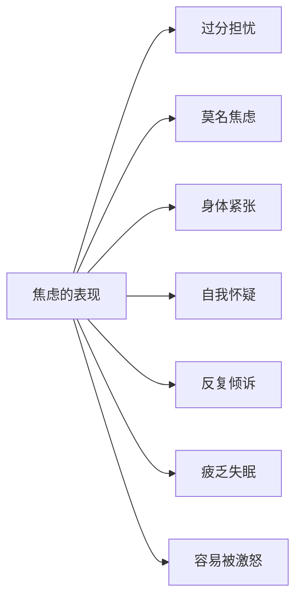
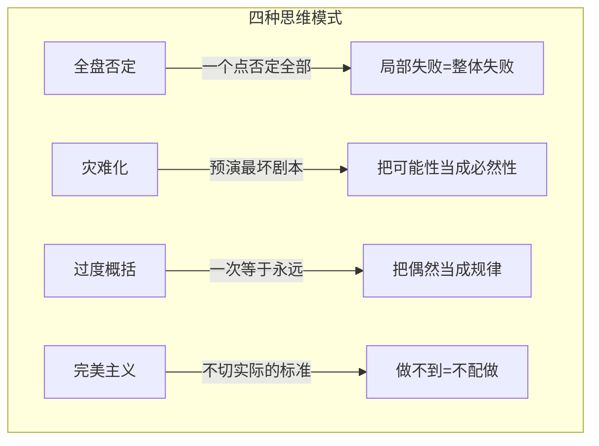
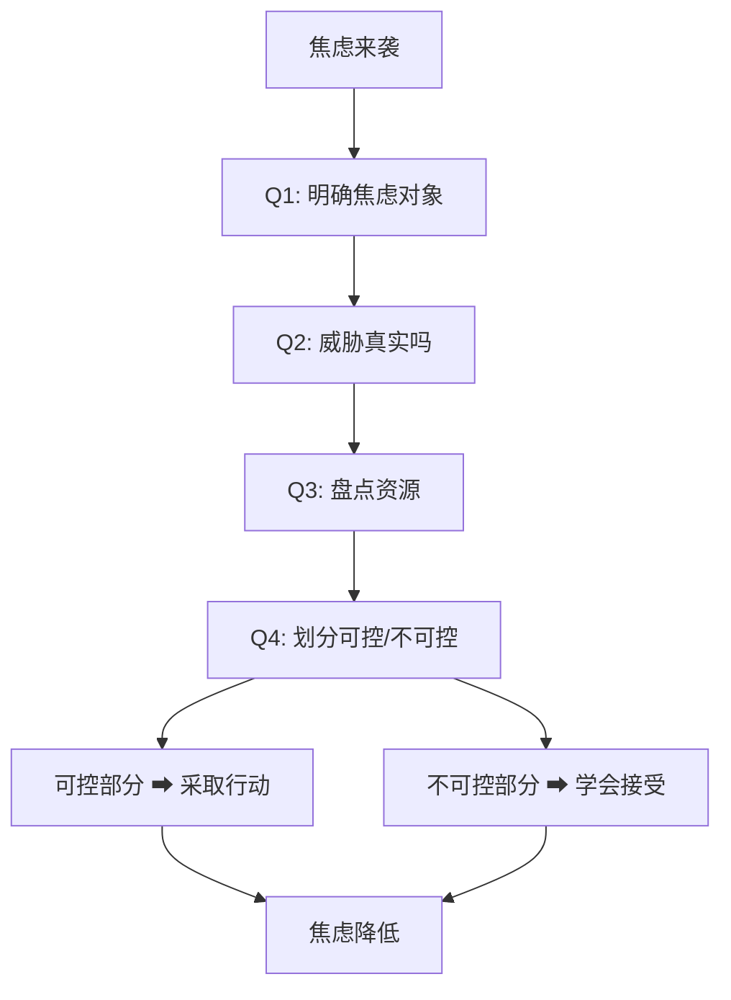

# 第06课：焦虑的自我调节

## 学习目标

- 识别焦虑的七大表现信号
- 理解四种非适应性的焦虑思维模式
- 掌握自我对话三步法
- 学会用五问法分析焦虑等级
- 了解辅助缓解焦虑的实用方法

---

## 焦虑的七大表现

焦虑并不总是以"我很焦虑"的形式出现。它常常穿着各种外衣，潜伏在我们的日常行为中。

### 1. 过分担忧

每隔10分钟就要发消息确认朋友/伴侣的状态，担心对方出意外、担心自己被遗忘、担心事情超出掌控。

> 担忧就像摇椅——它让你有事可做，但永远不会带你到任何地方。

### 2. 莫名焦虑

没有明确的原因，突然就感到坐立不安、心慌意乱。就好像身体里的警报系统失灵了，在没有火灾的时候也拉响警报。

### 3. 身体紧张

焦虑不只是心理状态，它会直接体现在身体上：

- 眉头紧锁
- 拳头不自觉地握紧
- 咬牙切齿
- 肩膀和颈部肌肉僵硬
- 呼吸变浅变快

### 4. 自我怀疑

考试前不断想"我肯定考不过"、面试前反复想"我不够格"、提案前暗自认为"会被否掉"。

> 焦虑时的自我怀疑，是你大脑里的一个**骗子**——它谎称自己能预测未来，而它的预测永远是坏的。

### 5. 反复倾诉

像祥林嫂一样，把同一件事翻来覆去地讲给不同的人听。表面上看是在寻求建议，实际上是在**寻求安全感**——希望通过别人的安慰来平复内心的不安。

### 6. 身体疲乏、睡不好觉

| 症状 | 表现 |
|------|------|
| 入睡困难 | 躺下后大脑停不下来，反复想事情 |
| 失眠 | 凌晨醒来后无法再次入睡 |
| 多梦/噩梦 | 睡眠质量差，醒来比睡前还累 |
| 白天疲乏 | 精神萎靡，注意力无法集中 |

### 7. 过分激进、容易被激怒

对声音和光线变得敏感——别人小声放音乐都让你烦躁。一点小事就会爆发，像是情绪的**火药桶**。

---

## 四种焦虑思维模式

焦虑的背后，往往隐藏着特定的思维模式。用一场跑步比赛来类比，会更清晰：

### 1. 全盘否定（All-or-Nothing Thinking）

> 比赛中途摔倒了，于是全程只盯着"我摔倒了"这件事，完全忘记自己**还在继续跑**。

**日常表现**：
- 一次考试没考好 → "我完了，我什么都做不好"
- 一次会议发言卡壳 → "我根本没有表达能力"
- 一次约会气氛尴尬 → "我这个人就是无趣"

**本质**：用一个点否定全部面，把局部失败等同于整体失败。

### 2. 灾难化（Catastrophizing）

> 比赛还没开始，就已经在想象：自己会摔倒、摔断牙齿、摔骨折脚踝……

**日常表现**：
- 伴侣晚回家10分钟没回消息 → "他/她肯定出车祸了"
- 老板说"有空聊聊" → "我要被开除了"
- 身体有点不舒服 → "会不会是绝症"

**本质**：在脑海中预演最坏的剧本，并且坚信这个剧本一定会发生。

### 3. 过度概括（Overgeneralization）

> 曾经在跑道最外圈跑的时候差点摔倒，从此只要在最外圈就觉得"又要摔了"。

**日常表现**：
- 一段感情被劈腿 → "所有男人/女人都不可信"
- 一个项目失败 → "我做什么项目都会失败"
- 一次面试被拒 → "我永远找不到好工作"

**本质**：把一次性的负面经历，放大成永恒的、普适的规律。

### 4. 完美主义（Perfectionism）

> 给自己设定一个根本不可能达到的标准——比如"每一步都要像世界冠军一样完美"，达不到就认为自己"不配跑"。

**日常表现**：
- "这篇报告必须完美无瑕，否则就是不合格"
- "我必须让所有人都喜欢我"
- "这件事要么做到100分，要么不做"

**本质**：用不可能的标准要求自己，然后在达不到时惩罚自己。

> [!TIP] 关键认知
> 焦虑不是因为你**能力不够**，而是因为你**想问题的方式出了问题**。同样的场景，换一种思维模式，焦虑感可能瞬间减半。

---

## 自我对话法（三步骤）

当你意识到焦虑来袭时，不要急着和焦虑对抗——先和自己对话。

### 第一步：识别暗示

问自己：**"我现在的思维模式，在向我暗示什么？"**

| 思维模式 | 潜在的暗示 |
|---------|-----------|
| 全盘否定 | "你做什么都没用" |
| 灾难化 | "最坏的结果一定会发生" |
| 过度概括 | "永远都会这样" |
| 完美主义 | "你必须完美无缺" |

### 第二步：判断价值

问自己：**"这个暗示对我有帮助，还是有害？"**

> 如果这个暗示只会让你更焦虑、更无力、更不敢行动——那它就是**有害的暗示**，不值得你相信。

### 第三步：替换暗示

问自己：**"这个暗示基于客观事实，还是被扭曲了？"**

针对扭曲的部分，用**更现实、更积极**的自我对话替换：

| 扭曲的暗示 | 现实的替代 |
|-----------|-----------|
| "我什么都做不好" | "我在这件事上遇到了困难，但其他方面我做得不错" |
| "一定会出大事" | "可能发生最坏情况的概率其实很低" |
| "永远都会这样" | "这次只是暂时的，我可以调整" |
| "我必须完美" | "做得够好就可以了，完成比完美重要" |

---

## 焦虑等级分析法（五问法）

当焦虑很强时，情绪会淹没理性。这五个问题帮助你**从情绪中抽离出来**，用理性重新审视：

> [!QUESTION] 五个问题
> 1. **我在焦虑什么？** —— 明确具体对象
> 2. **我焦虑的对象真的对我构成威胁吗？** —— 评估威胁的真实性
> 3. **我有什么资源可以应对？** —— 盘点技能、信念、人脉等
> 4. **以我的资源，我能控制到什么程度？** —— 划分可控与不可控
> 5. **我控制不了的部分，有没有办法解决？** —— 接受不可控

**示例**：

| 步骤 | 焦虑找工作 |
|------|-----------|
| Q1 | 我焦虑下周的面试 |
| Q2 | 面试本身不是威胁，只是评估匹配度。最坏的结果就是被拒，不会受伤 |
| Q3 | 我有相关经验、准备了作品集、有朋友内推 |
| Q4 | 能控制：准备内容、调整状态、提前到场。不能控制：面试官心情、其他候选人 |
| Q5 | 不能控制的部分——面试官怎么想是他的事，我做我能做的就好 |

---

## 辅助缓解方法

除了思维层面的调节，以下方法可以作为日常辅助：

### 1. 利用情绪低谷期

研究表明，每天下午**4~5点**是人的情绪自然低谷期。这个时间段：

- **适合做**：做一些不需要太多情绪投入的事情，或者通知坏消息（对方接受度更高）
- **不适合做**：做重大决定、处理敏感关系问题

### 2. 转移注意力

当焦虑来自"胡思乱想"而非"真实威胁"时，转移注意力是有效策略：

- 吃点好吃的（吃东西本身有安抚作用）
- 出去走一走（环境切换打破思维反刍）
- 找个人聊聊天（话题转移，不要聊焦虑的内容本身）

### 3. 寻求亲密关系庇护

焦虑时，给自己找一个**情绪安全港**：

- 给父母打个电话
- 和好朋友聊聊天
- 和伴侣抱一抱（身体接触本身能降低压力激素）

> 不需要对方帮你解决问题，只需要**被接住的感觉**。

### 4. 运动释放

运动是天然的**焦虑灭火器**：

| 运动类型 | 推荐项目 | 效果 |
|---------|---------|------|
| 对抗性运动 | 羽毛球、网球、拳击 | 通过击打释放攻击性能量 |
| 耐力运动 | 跑步、游泳 | 持续消耗，让身体疲劳从而让大脑安静 |
| 团体运动 | 篮球、足球 | 社交+运动的双重效果 |

---

## 焦虑与猜忌的关联

焦虑和[[0005-suspicion|猜忌心]]之间存在双向强化关系：

- 焦虑的人更容易猜忌（因为对不确定性的容忍度低）
- 猜忌的人更容易焦虑（因为不断验证带来持续紧张）

如果你发现自己同时被这两种情绪困扰，建议将本课与[[0005-suspicion|第05课：猜忌心]]结合起来学习，效果更好。

---

## 实践练习

> [!QUESTION] 焦虑拆解练习
> 回想最近一次让你感到焦虑的事情，用五问法拆解：

点击展开练习模板

**我的焦虑对象**：________________

**Q1 - 我在焦虑什么？**
> 请具体描述，不要用笼统的"我焦虑一切"

**Q2 - 这对我构成真实威胁吗？**
> 最坏的结果是什么？它发生的概率有多大？

**Q3 - 我有什么资源？**
> 技能、经验、人脉、过往的成功经历……

**Q4 - 能控制到什么程度？**
> 列出可控清单和不可控清单

**Q5 - 不可控部分怎么办？**
> 接受 + 预备方案

---

**自我对话练习：**
识别你当时的思维模式是四种中的哪一种，然后用现实的替换语句重新对自己说一遍。

---

> 焦虑是对未来的恐惧，而未来从未被写好。你手中握着的笔，比你想象中更有力量。

---

*第06课完*