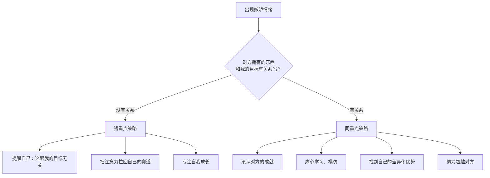

# 第07课：嫉妒

嫉妒是一种最常见却也最不被承认的情绪——我们很少愿意大方地说"我在嫉妒"，却常常在背后用贬低和八卦来悄悄消化它。这节课我们先看清嫉妒的真面目，再学一套行之有效的疏导方法。

---

## 嫉妒的性别差异

### 男性友谊：围绕共同活动

男性的友谊建立在**共同活动**上——打球、打游戏、一起做事。当一个朋友比自己做得好时，男性会倾向于把对方的成就转化为**认同感**（自我认同），把这层关系当作社会资本。"我认识的哥们儿很牛"——这种心理让他们更容易消化嫉妒。

### 女性友谊：围绕情感分享

女性的友谊建立在**情感分享**上——自我暴露、情绪支持、彼此倾诉。正是这种亲密，让嫉妒更容易滋生。比如：我跟你诉苦分手，你却顺带炫耀你男朋友多好——那一瞬间，我可能表面祝福你，内心已经开始嫉妒了。

> 不是说男性不会嫉妒或女性一定嫉妒——而是说，不同的友谊结构决定了嫉妒的**触发场景**不同。理解这一点，你就能更清醒地看待自己的嫉妒从哪里来。

---

## 嫉妒的本质

一句话总结嫉妒：

> **短期无法拥有别人拥有的东西，又不愿接受这个差距，于是通过贬低对方、说八卦来让自己心里好受一点。**

嫉妒的本质是一种**防御机制**——它保护的是你的自尊。当你觉得自己"应该拥有"却"没能拥有"时，嫉妒就出来了。

---

## 四种嫉妒类型

| 类型 | 特征 | 典型表现 |
|------|------|----------|
| **混蛋式嫉妒** | 损人利己 | 主动搞破坏、使绊子，想通过打压对方让自己上位 |
| **脑残式嫉妒** | 损人不利己 | 并不想从对方身上获利，纯粹看不得别人好，就想把对方拉下来 |
| **怨妇式嫉妒** | 闷在心里 | 嫉妒但不说出来，默默诅咒，表面若无其事，内心翻江倒海 |
| **圣母式嫉妒** | 自我压抑 | 嫉妒又觉得"我不该这样"，拼命压抑，表面祝福，内心煎熬 |

> 前两种是**向外攻击**，后两种是**向内攻击**。无论哪种，都在消耗你的能量。

---

## 治标方法：有底线地宣泄

当嫉妒已经冒出来了，你不需要立刻变成圣人——但要学会**有底线地宣泄**。

### 1. 做不伤害人的自私事

- **设静音 / 屏蔽**：暂时不看对方的朋友圈、动态
- **不评论**：忍住点赞或留言的冲动
- **不帮忙转发**：不需要为了"显得大度"而勉强自己

### 2. 定规则

说八卦可以，但只跟**不认识对方的人**说。向共同朋友说八卦，既伤害对方也伤害你自己的形象。

### 3. 设底线

两条红线绝对不能碰：
- **不编造事实**
- **不做恶意揣测**（比如："她一定是被包养的""他肯定是走后门的"）

### 4. 及时止损

万一没忍住，已经说了过分的话——**立刻停下来**。不要为了圆第一个谎说第二个谎，不要越陷越深。

---

## 治本方法：转化嫉妒的能量

### 错重点策略

当你嫉妒的东西跟你的目标**没有关系**时——比如你不做自媒体却嫉妒别人粉丝多——提醒自己一句话：

> **"这跟我的目标无关。我的精力应该放在属于我的赛道上。"**

注意力拉回来，该干什么干什么。

### 同重点策略

当你嫉妒的东西跟你的目标**在同一个赛道**——比如你们都是设计师，对方就是比你有创意——四步走：

1. **承认对方的成就**：大方承认"他确实做得好"，这不是认输，是面对现实
2. **虚心学习**：分析他哪里做得好，能不能学过来
3. **找到差异化**：不是复制对方，而是在他的长处之外找到自己的独特优势
4. **超越**：把嫉妒当燃料，而不是毒药

---

> [!QUESTION] 自检问答
>
> **Q1：回想最近一次让你感到嫉妒的场景——对方拥有的东西，和你的目标有关系吗？**
> 

> 
点击查看引导

> 如果你的回答是"没关系"，那你正在浪费情绪能量在一个无关的赛道上。练习错重点策略，提醒自己"这不关我的事"。
> 

>
> **Q2：面对同一赛道比你强的人，你的第一反应通常是？**
> 

> 
点击查看引导

> A. 贬低对方（"他也就是运气好"）→ 警惕混蛋式或脑残式嫉妒
> B. 表面祝福内心不爽（"为什么不是我？"）→ 怨妇式嫉妒正在内耗你
> C. 压抑自己（"我不该这样想"）→ 圣母式嫉妒，先接纳再说
> D. 分析差距、想办法提升 → 你已经走在转化嫉妒的路上了
> 

---

本课介绍了嫉妒的性别差异和四种类型，以及治标与治本两套方法。下一课我们看看另一种常常被忽视的消极情绪——[[0008-boredom|厌倦]]——并学习如何在亲密关系和职场中疏导它。

*记住：嫉妒不是道德缺陷，它只是一个信号——提醒你有些渴望还没有被满足。正视它，转化它，而不是审判它。*

---