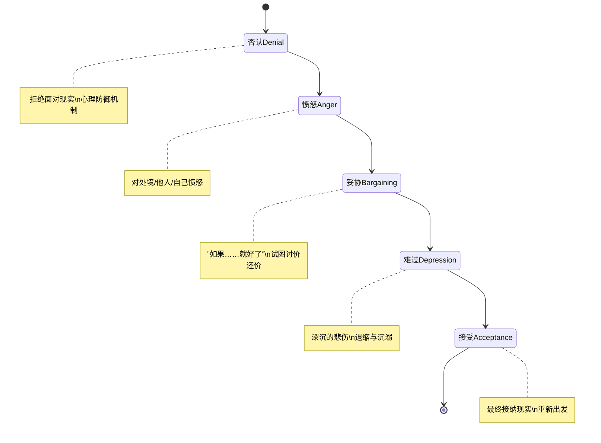

# 第09课：认识悲伤情绪

---

## 学习目标

- 理解悲伤作为一种负性基本情绪的定义与核心触发因素
- 掌握悲伤在情感、认知、躯体、行为、存在判断五个维度的表现
- 学会识别库伯勒-罗斯悲伤五阶段模型并理解各阶段的递进关系
- 认识悲伤的自愈属性及其正常持续时间范围

---

## 什么是悲伤？

**悲伤（Sadness）** 是人类的[[0001-intro-negative-emotions|负性基本情绪]]之一，通常由**分离、丧失或失败**所引发。它并非单一的感受，而是一组相关联的情绪体验，包括：

- 沮丧
- 失望
- 气馁
- 意志消沉
- 孤独
- 孤立

> [!NOTE] 悲伤的强度取决于两大因素
> 1. **失去对象的重要性**——失去一只昂贵的、带有纪念意义的情侣戒指，与丢掉一顿早餐，情感重量完全不同
> 2. **个体的意识倾向与人格特征**——同样程度的失去，不同的人会有截然不同的悲伤体验

---

## 悲伤的五个方面表现

悲伤不是仅仅"心里难受"那么简单，它是一个**全身心的反应模式**，表现在以下五个维度：

| 维度 | 具体表现 |
|------|----------|
| **情感方面** | 悲伤、愤怒、内疚、羞耻、如释重负（ paradoxical relief）、无助感 |
| **认知方面** | 对失去对象的强迫性思维、注意力难以集中、走神发呆、迷茫感 |
| **躯体方面** | 头痛、肌肉酸痛、腹痛、胸闷、恶心、失眠、食欲变化；免疫系统功能下降；压力激素皮质醇水平升高 |
| **行为方面** | 无法控制的哭泣、坐立不安、回避社交、吸烟饮酒量增加 |
| **存在判断方面** | 质疑生命的意义、思考死亡与关系的本质、重新审视核心信念与价值观 |

> [!WARNING] 躯体症状不可忽视
> 持续的悲伤会通过"脑-体轴"影响整个生理系统。如果你在悲伤期间频繁感冒、消化不良或长期失眠，这不是"矫情"，而是身体在发出信号。

---

## 库伯勒-罗斯悲伤五阶段

瑞士裔美国精神科医生 **伊丽莎白·库伯勒-罗斯（Elisabeth Kubler-Ross）** 在其1969年经典著作《论死亡与临终》中提出了著名的**悲伤五阶段模型**。这一模型后来被广泛应用于各种丧失体验——不仅仅是亲人离世，也包括失恋、失业、梦想破碎等。

### 各阶段解析

#### 1. 否认（Denial）
一种[[0002-anger-misconceptions|心理防御机制]]，拒绝承认丧失已经发生。常见的内心独白："这不是真的""一定是搞错了"。否认阶段为我们提供了缓冲时间，让心灵有机会慢慢接受无法承受的现实。

#### 2. 愤怒（Anger）
当否认无法再维持时，愤怒便取而代之。愤怒的矛头可能指向：
- 命运或上帝——"为什么是我？"
- 离开的那个人——"你怎么能这样对我？"
- 自己——"我当时要是……就好了"
- 无关的第三方——医护人员、朋友、家人

#### 3. 妥协（Bargaining）
"如果我当时做了不同的事情……""如果我能再有一次机会，我一定……""只要他能回来，我愿意付出任何代价。"这个阶段充满了对过去的假设和对未来的幻想性承诺。

#### 4. 难过（Depression）
当妥协也无法改变现实时，深沉的悲伤便降临。这是最痛苦但也是最关键的阶段——它意味着你终于**真正面对了失去**。在这个阶段，人会变得退缩、沉默、失去对一切的兴趣。

#### 5. 接受（Acceptance）
这不是"好了"或"忘记了"，而是**承认失去已经成为自己生命的一部分**，并学会带着这份失去继续生活。接受不是终点——而是新生活的起点。

> [!IMPORTANT] 五阶段的重要原则
> - 这五个阶段是**依次递进**的，每一个阶段都为进入下一个阶段做准备
> - **不能跳过任何阶段**——试图跳过愤怒直接进入接受，只会让悲伤拖延更长
> - 这不是一个线性的、一次性的过程——人们在各个阶段之间反复也是正常的

---

## 悲伤的自愈属性

悲伤与愤怒、焦虑等其他负性情绪不同的一点是：**悲伤本身具有自愈能力**。

- 正常的悲伤持续时间：**1-2天至4-5个月**
- 悲伤的过程实际上是心灵在"自我疗伤"——就像身体需要时间愈合伤口一样，心灵也需要时间消化失去
- 如果悲伤超过6个月仍未减轻，且严重影响了日常生活功能，可能需要寻求专业心理帮助

> [!TIP] Key Insight
> 悲伤不是敌人，而是心灵的一种**健康反应**。那些试图压抑或否认悲伤的人，往往让悲伤变得更加复杂和持久。允许自己悲伤，才是治愈的第一步。

---

## 自检问题

> [!QUESTION] 自检：真实情境判断
> 小王的宠物猫因病去世了。前三天他无法相信这是真的（否认阶段），之后他开始责怪兽医没有治好它（愤怒阶段），接着他不断回想"如果那天早点送医院就好了"（妥协阶段）。现在他每天都哭，不想出门，对任何事情都提不起兴趣。
>
> 1. 小王现在处于悲伤五阶段中的哪个阶段？
> 2. 他的朋友说"别难过了，赶紧振作起来"，这个建议合理吗？为什么？

查看答案

1. 小王目前处于**难过（Depression）阶段**。他已经依次经历了否认、愤怒和妥协，现在进入了深沉的悲伤期。

2. 这个建议**不合理**。难过的阶段是悲伤过程中最痛苦但也是最必要的部分——它意味着小王正在真正面对失去。要求他"赶紧振作"相当于让一个腿骨折的人"赶紧跑起来"。正确的做法是陪伴他、允许他悲伤，而不是催促他跳过这个阶段。

---

## 下一步

在[[0010-overcoming-sadness|第10课：走出悲伤]]中，我们将学习如何健康地表达悲伤、识别自怜情绪与痛苦回避行为，以及掌握三种科学的走出悲伤的方法——包括目标拆分法、结构性拖延法和正念练习法。