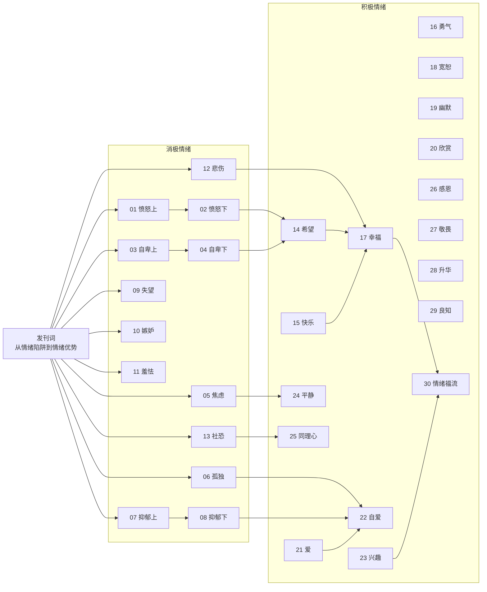

# 00 - 课程地图

## 学习建议

1. **顺序学习**：建议从第01课开始按顺序学习
2. **消极优先**：先掌握消极情绪的应对（第01-13课），再学习积极情绪的培育（第14-30课）
3. **实践导向**：每节课后的练习建议认真完成
4. **交叉引用**：章节之间存在概念联系（如自卑与嫉妒、快乐与幸福），可相互参考

## 课程结构

- **总课时**：30节正课 + 1节发刊词
- **消极情绪**：愤怒、自卑、焦虑、孤独、抑郁、失望、嫉妒、羞怯、悲伤、社恐（共13课）
- **积极情绪**：希望、快乐、勇气、幸福、宽恕、幽默、欣赏、爱、自爱、兴趣、平静、同理心、感恩、敬畏、升华、良知、情绪福流（共17课）