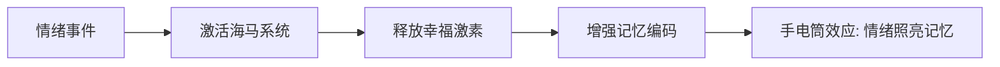
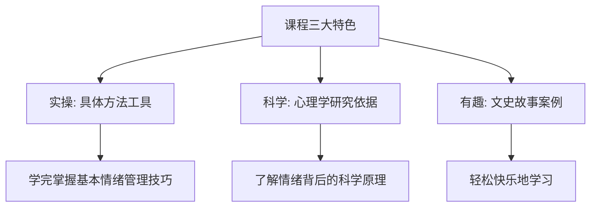

# 第00课：从情绪陷阱到情绪优势

## 开头引入：你有多少后悔是因为一时冲动？

你有没有这样的经历——

因为一时冲动朝孩子怒吼，给孩子幼小的心灵留下阴影？因为一时怄气，对家人恶语相向，伤害了彼此的感情？因为一时情绪失控，做出了让自己后悔很久的决定？

对一个成年人而言，**最重要的修养就是情绪稳定**。情绪管理，是我们一生绕不开的修行。

> [!quote] 心理学家说
> 在生活中间不会管理自己情绪的人，他们的人际关系往往会变差，做事情容易处处碰壁，还不受人待见。而懂得管理好自己的情绪，并能够发挥情绪优势的人，往往在人群中间有更高的感染力，获得更多的信任和认同。

这门课，就是帮你**把情绪陷阱转化为情绪优势**。

## 核心概念：情绪的真相

### 情绪没有好坏之分

说到"情绪"，很多人都会习惯性地往负面方向想。听到"你真是太情绪化了"这句话时，基本上都会认为是在批评自己。但事实并非如此。

> [!tip] 核心认知
> 在心理学家看来，**情绪无所谓好坏之分**，它只是人的一种自然心理行为。情绪化可以是我们的弱点，同时也可以是我们的优势。

情绪是我们对环境十分灵敏的反馈系统。不断变化的情绪，正是我们的身体应对不同挑战的表现——它能让我们防微杜渐，也能让我们使用各种技能来适应各种角色的要求。

### 两个重要共识

自1997年以来，心理学各流派对情绪的研究基本达成两个共识：

1. **人类先有情绪，后有认知**
2. **情绪的作用比认知的作用更强大**

举个简单的例子：学习没有情绪的帮助，效果往往会事倍功半。

### 手电筒效应

为什么"洞房花烛夜"这类事情让人终身难忘？因为有美好的情绪体验。结婚的幸福激活了情绪记忆，激发了大脑海马系统的活动，产生大量幸福激素。这种体验让你对当天发生的所有事情感受更深刻、记忆更清晰。

这种现象在心理学上被称为**手电筒效应**——打开手电筒，光束外的事情我们记不清楚，但光束内的东西我们很容易记住。

记忆如此，学习也是如此。带有情感的学习比不带情感的学习效果好得多。古人早就知道这个秘密——为什么古人背书时要读书声来、走来走去、摇头晃脑？因为这种积极的情感体验让理解力、记忆力、创造力增强。

### 情绪影响人生的方方面面

情绪不仅影响学习、思考和健康，甚至主宰着我们会和谁结婚。积极心理学研究发现：

- 想着"我为什么要嫁给他"的姑娘，结婚后有90%的概率感到不幸福
- 而"我就是喜欢他"而结婚的"傻女孩"，婚后幸福感的比例能达到90%以上

> [!quote] 积极心理学家芭芭拉·弗雷德里克森
> 好的情绪与爱的供给，就像洁净的空气和富有营养的食物一样，能够决定你生命的长度以及生命的质量。

## 不可忽视的语言暴力

社会心理学调查显示，超过90%的家长都曾经吼过自己的孩子。吼在心理学上是极端坏情绪的一种表现，甚至属于一种**语言暴力**，这是一种看不见的灾难，丝毫不亚于体罚孩子带来的伤害。

研究发现，语言侮辱会造成孩子大脑神经回路的损伤短路，使大脑支撑不了复杂的信息传递与分析，控制不了情绪与理性。相应的记忆力、理解力、分析力、审美力、同理心、创造力、勇气和自信都会产生抑制。

> [!warning]
> 语言暴力对孩子的伤害被严重低估了——它不仅伤害心理，还会改变大脑的物理结构。

## 课程三大特色

### 1. 实操地讲

当你控制不住愤怒时，讲授5种不被怒火牵着鼻子走的方法；当你感到焦虑时，提供2种有效的缓解压力工具。每种情绪课程中都有对应的调节或促进方法。

### 2. 科学地讲

作为积极心理学课程，结合大量心理科学与其他社会科学的研究成果。课程中的原理和案例均来自经典心理学研究著作和报告，并提供20多种独家研发的情绪测量量表。

### 3. 有趣地讲

结合生活中有趣的现象和文史故事——陶渊明怎么得的抑郁症？为什么没钱的人更爱炫富？福布斯排行榜上有多少社交恐惧患者？为什么黄色更能缓解焦虑？

## 案例：项羽为什么比刘邦更受人喜爱？

网上有调查发现，中国人喜欢项羽的人比喜欢刘邦的人多得多。项羽在楚汉战争中失败，却得到人们普遍的认可——人们认为项羽才是一个当之无愧的真英雄。

原因只有一个：**他心中有爱**。他有勇无谋，看起来是个莽夫，但这个莽夫偏偏没有刘邦那种圆滑、狡诈、阴险与无情。特别是在绝境中，项羽对自己的爱人、士兵乃至坐骑所表现出来的有情有义，激发了我们心中最柔软的情感。

> 历史是公平的。项羽虽没有赢得楚汉相争的天下，却赢得了千百年天下人的喜爱。

这足以说明**情感的重要性**——有情有义的人讨人喜欢，即使有缺点，也是一个真实的人。

## 情感负债：给生活加点情绪

中国的丈夫们常有一种抱怨："我每个月都把工资全部交给太太，她还是不满意。"

问题是——你每天拥抱她了吗？你每天说过她漂亮了吗？你每天都亲吻过她了吗？如果没有，就不能抱怨卡里的工资全都花到了太太身上。这叫做**情感负债**。

> [!tip]
> 让太太产生好情绪，其实是一个很划算的投资。想留点小金库又不会使太太不开心？那就得多抱抱、多亲亲、多夸夸、多聊聊。这些事情比你拼命赚回家多少钱更有实际意义。

## 自检练习

> [!question]
> 回想最近一次让你情绪失控的场景：
> 1. 当时发生了什么？你做出了什么反应？
> 2. 如果重新来一次，你会如何利用情绪的正面力量来应对？

思考提示

**关于问题1**：注意区分"事件本身"和"你对事件的解读"。古希腊斯多葛哲学家艾比克泰德说过："真正困扰我们的，往往不是发生在我们身上的那些事，而是我们围绕这些事编的故事。"（详见[[reference/glossary|术语表]]）

**关于问题2**：情绪的优势在于它给了你额外的能量和专注力。试着问自己：这份能量可以用在什么地方？是解决问题，还是改善关系？（参见[[reference/emotion-strategies|情绪调节策略速查]]）

## 科学依据速览

| 研究主题 | 关键发现 | 来源 |
|---------|---------|------|
| 情绪智力 | 监控自己及他人情绪，利用信息指导思想和行动的能力 | 情绪智力理论 |
| 手电筒效应 | 情绪增强记忆，激活海马系统 | 认知心理学 |
| 语言暴力 | 吼叫造成大脑神经回路损伤 | 社会神经科学 |
| 婚后幸福感 | "因为喜欢"结婚的幸福感90%以上 | 积极心理学研究 |

## 小结

- **情绪没有好坏之分**，只是自然的心理行为，关键是学会转化
- **手电筒效应**揭示情绪如何增强记忆——学习需要情感的参与
- **情绪智力**是监控和利用情绪信息的能力，直接影响人生境遇
- **语言暴力的危害**被严重低估，它是看不见的灾难
- 这门课将**实操、科学、有趣**三结合，帮你把情绪陷阱转化为情绪优势

准备好了吗？让我们一起开启情绪管理的修行之路。下一课我们将进入第一个情绪专题——[[0001-fen-nu-shang|愤怒（上）]]，学习不让自己随便发脾气的四招。