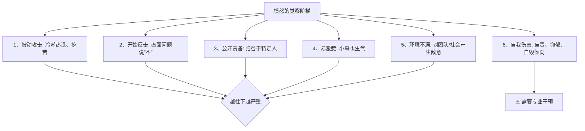
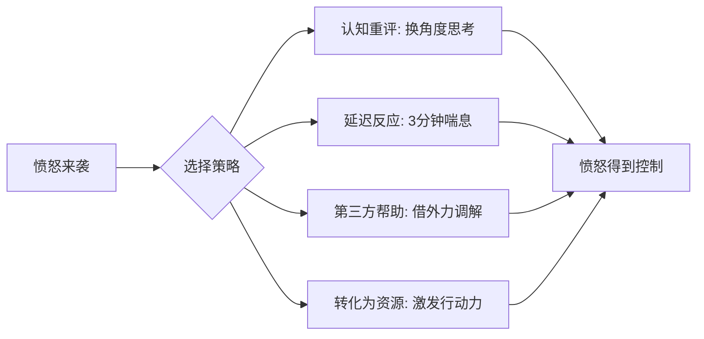

# 第01课：愤怒（上）：不让自己随便发脾气的四招

## 开头引入：你被愤怒控制过吗？

当你感觉愤怒的时候，身体会释放肾上腺素，肌肉紧绷，心率和血压升高，感官变得更加敏锐，甚至面部和手会发红——这些生理反应，你有没有注意到过？

愤怒是**人类情绪系统中最基本的情绪之一**。当我们的祖先在生命安全和交配权利受到威胁时，愤怒成为重要的情绪表达，提供了必要的原始驱动力和生命活力。

但问题是：在今天的社会里，愤怒常常失控伤人。每一次朝孩子的怒吼、对爱人发火、对同事恶语相向，都会像一把利刃一样造成伤痕。

怎么打破这个循环？答案从**觉察愤怒**开始。

## 核心概念：愤怒的身心机制

### 愤怒的生理反应

愤怒是一种**高唤醒的情绪状态**——身心反应比较强烈。从进化的角度说，愤怒的积极意义是让你集中力量，战胜各种挑战和困难。

| 生理变化 | 心理变化 |
|---------|---------|
| 肾上腺素释放 | 感官更加敏锐 |
| 肌肉紧绷 | 战斗精神增强 |
| 心率和血压升高 | 注意力高度集中 |
| 面部和手发红 | 判断力偏向简单化 |

### 愤怒感存在个体差异

每个人对愤怒的感知——频率、强度、持续时间——都不同。有些人比别人更经常感到愤怒，感受到更强的愤怒感，或者保持更长时间的愤怒状态。原因包括遗传、家庭环境和社会文化等因素。

> [!warning] 健康警示
> 愤怒感高的人得心脏疾病的风险更高。一项对一万多人连续三年的追踪研究发现，血压正常但愤怒感较高的人，发生冠心病的概率是常人的**2~3倍**。另一项10~15年的追踪研究发现，非常不擅长控制愤怒的人，得心血管疾病的风险最高。

## 关键方法：觉察愤怒的6种信号

愤怒最狡猾的地方在于：我们往往**事后**才能意识到自己愤怒了。事后反省值得提倡，因为长此以往就能提升觉察速度，形成"适中之民"，最终形成"先见之明"。

美国心理学会推荐的六种觉察愤怒的方法：

### 信号详解

| 信号 | 表现 | 典型案例 |
|------|------|---------|
| **被动攻击** | 冷嘲热讽、挖苦、冷漠 | 平时随和，现在开始讽刺别人 |
| **开始反击** | 直面问题，开始说"不" | 对老板的双标不再忍气吞声 |
| **公开责备** | 归咎于特定人 | 以前自我安慰，现在发现是对方的问题 |
| **易激惹** | 小事也生气 | 以前觉得没什么大不了的事，现在也烦 |
| **环境不满** | 对团队/社会产生敌意 | 长期的敌意和攻击性 |
| **自我伤害** | 自责、抑郁 | 无法表达愤怒，反过来攻击自己 |

其中第六种最为危险——一个人如果长期处于愤怒受抑制的状态，很可能形成自责情绪，严重到"睡不着觉、吃不下饭、呼吸都觉得是错的"。

## 关键方法：控制愤怒的4种策略

学会了觉察愤怒，接下来就是如何控制它。假设你正在餐厅排队，等了很久服务员就是不过来接待——你当然很生气。这时候怎么办？

### 策略一：认知重评

**核心**：改变自己的思维方式。

对事情重新评估一下——是不是有其他没考虑到原因？比如人太多、没有位置、服务员太忙等。当你愤怒的时候，想法会被放大、夸大甚至戏剧化，需要用更理性的思维来改变当时的想法。

> [!quote] 古希腊哲学家艾比克泰德
> 真正困扰我们的，往往不是发生在我们身上的那些事，而是我们围绕这些事编的故事。

哈佛大学心理学家丹尼尔·吉尔伯特的实验发现：人们有约**46%的时间**在想与当前任务无关的事——"世上本无事，庸人自扰之"。很多事情，没准真的是你想多了。

### 策略二：延迟反应——让愤怒在空中飞一会儿

当你感觉愤怒要发作时，给自己**三分钟的喘息时间**，转移一下注意力。三分钟之后，也许你的看法就不一样了。时间是一个特别好的心理治愈剂。

这种心理现象叫做**时间贴现效应**——一个人在当下对某件事做判断，和过一会儿再做判断，结果可能完全不同。

### 策略三：寻找第三方帮助

当局者迷，旁观者清。从第三者的角度去分析判断，对化解愤怒帮助很大。可以找经理、心理咨询师、闺蜜、朋友甚至父母来干预。第三方的调停可以把激动的事情通过理性的方式说出来。

### 策略四：把愤怒转化为资源

利用愤怒激发解决问题的行动。餐厅服务员怠慢了你？不妨趁这个时刻想想——能不能锻炼自己的控制力？或者有什么办法让服务员对顾客更主动些？

从长远来看，可以制作一个**愤怒复盘表**：

| 时间 | 愤怒事件 | 愤怒原因 | 身体反应 | 下次怎么办 |
|------|---------|---------|---------|-----------|
| | | | | |

每周翻看，同时思考下次遇到类似事情该怎么办。

## 科学依据：愤怒的健康风险

| 研究 | 发现 |
|------|------|
| 3年追踪研究（1万+人） | 愤怒感高的人冠心病概率是常人2~3倍 |
| 10~15年追踪研究 | 不善控怒者心血管疾病风险最高 |
| 面部表情观察研究 | 适度愤怒带来控制感和乐观感（非过度） |

值得注意的是：愤怒本身也是人类生机的体现。适当的愤怒和兴奋一样，都是人的生机的一种具体表现状态。**不动气未必就好**——智慧的人知道如何控制，他有气，但能够控制自己的脾气。

## 自检练习

> [!question]
> 1. 回顾过去一周，你出现过哪些愤怒信号（从6种中找）？达到了哪个级别？
> 2. 找一件最近让你生气的小事，试着用"认知重评"的方法，列举至少两种不同的解读方式。

思考提示

**关于问题1**：情绪的觉察本身就是一种能力提升。如果你发现自己经常处于第3级（公开责备）以上，说明愤怒管理需要加强。参见[[reference/emotion-strategies|情绪调节策略速查]]中的"觉察愤怒的6个信号"。

**关于问题2**：认知重评的关键在于找到"替代解释"。例如服务员不理你——可能是太忙、可能是被经理批评了心情不好、可能是新人还在培训。正如[[reference/glossary|术语表]]中提到的，"时间贴现效应"告诉我们，过一会儿再做判断本身就一种情绪调节策略。

## 小结

- 愤怒是**高唤醒情绪**，有进化上的积极意义，但失控时破坏力巨大
- 觉察愤怒是控制愤怒的第一步——**6种信号**从被动攻击到自我伤害逐级递增
- **4种控制策略**：认知重评、延迟反应（3分钟喘息）、第三方帮助、转化为资源
- 愤怒感过高的人心血管疾病风险显著增加，但**适度愤怒是生命活力的体现**
- 控制愤怒 ≠ 压抑愤怒（下一课[[0002-fen-nu-xia|愤怒（下）]]将讲解如何正确表达愤怒）