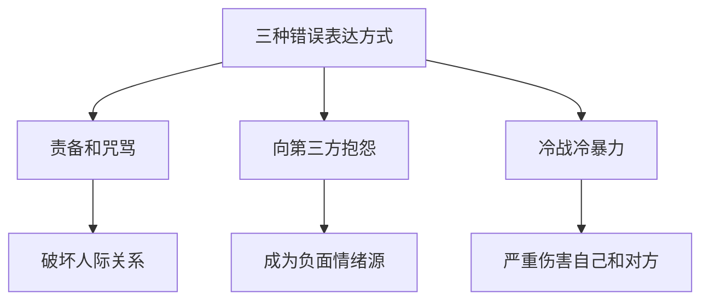

# 第02课：愤怒（下）：表达愤怒还能搞好关系的秘密

## 开头引入：愤怒一定要忍吗？

上节课我们学习了如何控制愤怒。但你可能会有疑问——**控制愤怒，是不是就是要压抑愤怒？**

答案是：**绝对不应该是这样**。

瑞士著名心理学家荣格说过："你在愤怒中消耗着自己，虽然你是用舌头讲话，却像伸出了一把冷剑，表达的是你的复仇之梦。"

但另一位心理学家也指出："无论是一触即发，还是一味隐忍，愤怒都是情绪的红色警报。"

> 控制愤怒 ≠ 压抑愤怒

压抑愤怒会引起一系列心理问题——变成内心的狂躁，让人更敏感易怒，还有可能找一个替罪羊发泄在无辜的人身上。最关键的是，**压抑愤怒并不能真正保护自己的利益**，反而让自己感到更无能、更愤怒，最后身体会慢慢用不易察觉的病痛来消化这些情绪。

所以这一课的核心问题是：**如何正确表达愤怒，既能释放情绪，又不伤害关系？**

## 核心概念：男女表达愤怒的差异

不同的人表达愤怒的方式不同。一般而言：

| 维度 | 男性 | 女性 |
|------|------|------|
| 愤怒原因 | 权力受威胁，想做某事被禁止 | 行为不符合自己意愿，被拒绝、被忽视 |
| 表达场所 | 公司、公共场合 | 更多在家里 |
| 表达方式 | 攻击性行为（被认为"有男子汉气概"） | 口头表达（容易被看作"泼妇"） |
| 社会评价 | 社会接受度较高 | 社会形象受损 |

心理医生多尼斯·赫尔明在《感觉能力》中指出：女性常常希望某人和某事有所改变，但自己却无能为力，又看不到出路，就容易发怒。所以女性可能在工作中忍受上司的无礼而一言不发，但回到家，孩子磨磨蹭蹭就可以让她气得暴跳如雷。

## 不正确的愤怒表达方式

### 方式一：责备和咒骂

这类人总希望证明自己是对的、对方是错的，总觉得自己站在道德高地上。

> 一个真实案例：一位朋友和合伙人开公司，发现合伙人出卖公司利益。他愤怒之下迅速分家、老死不相往来。但只要见到合伙人就不停责备"我那么信任你"。结果他发现，只要他责备和咒骂，其他朋友和合作伙伴也对他敬而远之——这让他更加愤怒，从此不敢再与人合伙，甚至不敢信任他人。

责备和咒骂无济于事，只会伤害自己的人际关系。

### 方式二：向其他人抱怨（祥林嫂型）

抱怨看似将愤怒直接说出来了，但诉说的对象错了——**我们应该向让我们愤怒的人表达愤怒，而不是向无关的第三方**。

最典型的例子是鲁迅笔下的祥林嫂。试想，如果从上班开始就有人向你抱怨老板、同事、甲方、甚至食堂的厨师，就像一个喷射负面情绪的怪兽——你愿意和这样的人相处吗？

> [!tip]
> 觉察自己有抱怨倾向时，给自己三秒钟的时间，告诉自己停下来。

### 方式三：冷战（冷暴力）

冷战是一种极度伤人的冷暴力，多发生在亲密关系中。

> 真实案例：一位叫小孟的读者，发现老公出轨还有了孩子。得知真相后，她**38年**（你没看错，38年）和老公同处一个屋檐下，但再也不说一句话。她从风华正茂变成白发苍苍，为不值得的人搭上了一辈子的生命。

> [!warning]
> 接纳一切正常的愤怒表达，是爱自己最好的方式。38年的沉默不是惩罚对方，而是惩罚了自己。

## 关键方法：正确表达愤怒的五部曲

如何在**不伤害他人**的前提下表达自己的愤怒？试试下面的五部曲：

### 第一步：分散注意

愤怒来袭时，歇斯底里发脾气只会让局面更糟糕。

- 给自己**三分钟喘息时间**
- 连续做几个深呼吸
- 迅速离开当前环境
- **告诉自己：现在不能做任何重要决定，我感受愤怒就好**

（回忆上节课[[0001-fen-nu-shang|愤怒（上）]]中提到的"延迟反应"策略——让愤怒在空中飞一会儿。）

### 第二步：理清思绪

一旦情绪稳定下来，对整个事件做复盘：

- 找到自己愤怒的真正原因
- 区分是当下的事件，还是在**翻旧账**？有时激起愤怒感觉的，可能是当下的某个开关唤醒了陈年旧账
- 理性失序，让自己回到事实本身，避免大脑胡说乱想

### 第三步：表达不满

允许自己表达愤怒——**表达愤怒就是向人们表达自己界限的方式**。

向对方明确表述三个要素：
1. **什么行为**让你愤怒
2. **什么感受**被激发了
3. **为什么**会有这种感受

### 第四步：提出解决方案

表达愤怒后，提出自己的解决方法。注意要真诚，同时坚持原则。

可以参考以下句式：

> **"当理..."** —— 描述对方的行为
> **"我觉得..."** —— 说出你的期望
> **"我请你..."** —— 说出你现在的需要
> **"是因为..."** —— 给出你分析的原因

**真实案例**：丈夫没有和妻子商量就自作主张重仓了一只股票，妻子可以这样表达：

> "我注意到你没有和我商量就重仓了某某股票，这件事让我感到很不安也很恐惧。（行为+感受）
>
> 我觉得我也是家庭的一分子，我希望像这样大的事情，我能够参与讨论，而不是被动接受。（期望）
>
> 虽然你可能看好未来的股市，但我希望你能够从中退出一部分，因为我觉得那样会使我们家面对很大的风险。我们应该首先保障家里的开支不出问题，并且以后家里类似的大额开支，我都希望你提前跟我商量。（方案+原因）"

### 第五步：给自己一颗后悔药

加州大学伯克利分校的心理学家詹姆斯·格罗斯提出一个概念——**情境重评**：事后把当时的场景重新想一遍，甚至把自己的愤怒体验重新感受一遍。这样可以真正做到"吃一堑，长一智"。

> [!tip]
> 后悔药 = 承认自己当时的不完美 + 吸取教训 + 不苛责自己 + 让自己下次做得更好

## 案例：马斯洛——从愤怒到超越

美国著名心理学家马斯洛的童年很不幸。他的父亲酗酒，对孩子们十分苛刻；母亲极度迷信，性格冷漠残酷暴躁。马斯洛小时候带过两只小猫回家，被母亲发现后当场活活打死。

很长一段时间，马斯洛内心充满对父母的怨恨，但他不知道如何表达。

幸亏后来他学了心理学，认识到父母的行为是由他们的成长环境和性格特征造成的，自己也不再无意识地重复父母的行为。最终他成为**人本主义心理学的奠基人**，写就了《动机与人格》《人性的境界》等经典著作。

这个案例告诉我们：**人生剧本可以改写，甚至超越**。学会表达愤怒，对孩子人格的塑造和心理力量的加强尤为重要。

## 案例：背叛创伤与孩子的愤怒

当一方在关系中感到被背叛、被欺骗时，会产生强烈的愤怒、悲伤、恐惧和后悔的综合反应——这叫做**背叛的创伤**。

孩子被父母欺骗后，除了愤怒还有恐惧。孩子依赖父母，不知道接下来会发生什么事。但他通常不会用愤怒的情绪直接表达，而是以焦虑、抑郁、做噩梦、睡不着觉、吃不下饭、内分泌失调等方式体现。

> [!warning]
> 如果孩子出现上述情况，可能是用身心疾病在表达对你的愤怒。父母要留心——孩子的身体不好，是不是有了心理上的情绪创伤？

## 自检练习

> [!question]
> 回忆一次你没有处理好愤怒的经历：
> 1. 你当时用的是哪种表达方式（责备、抱怨、冷战，还是其他）？
> 2. 如果用"五部曲"重新来一次，你会怎么说？试着用"当理……我觉得……我请你……是因为……"的句式写下来。

参考答案

**关于问题1**：注意，无法表达愤怒也是一种问题——压抑愤怒会转化为身体病痛。更多信息参见[[reference/glossary|术语表]]中的"认知重评"和"延迟反应"概念。

**关于问题2示例**：
"当理你刚才在会议上打断我的发言时，我觉得很不受尊重（行为+感受）。我觉得作为团队成员，我的意见也应该被听到（期望）。我请你下次等我把话说完再发表看法，是因为这样我们可以更完整地理解彼此的观点（方案+原因）。"

## 小结

- **控制愤怒 ≠ 压抑愤怒**——压抑会导致更严重的心理和生理问题
- **三种错误表达方式**：责备咒骂、向第三方抱怨、冷战冷暴力
- **正确表达愤怒五部曲**：分散注意 → 理清思绪 → 表达不满 → 提出方案 → 后悔药
- 表达愤怒的核心目的不是发泄，而是**表达诉求、重建关系**
- 教会孩子表达愤怒对人格塑造至关重要（[[reference/glossary|术语表]]：自我关怀、认知重评）