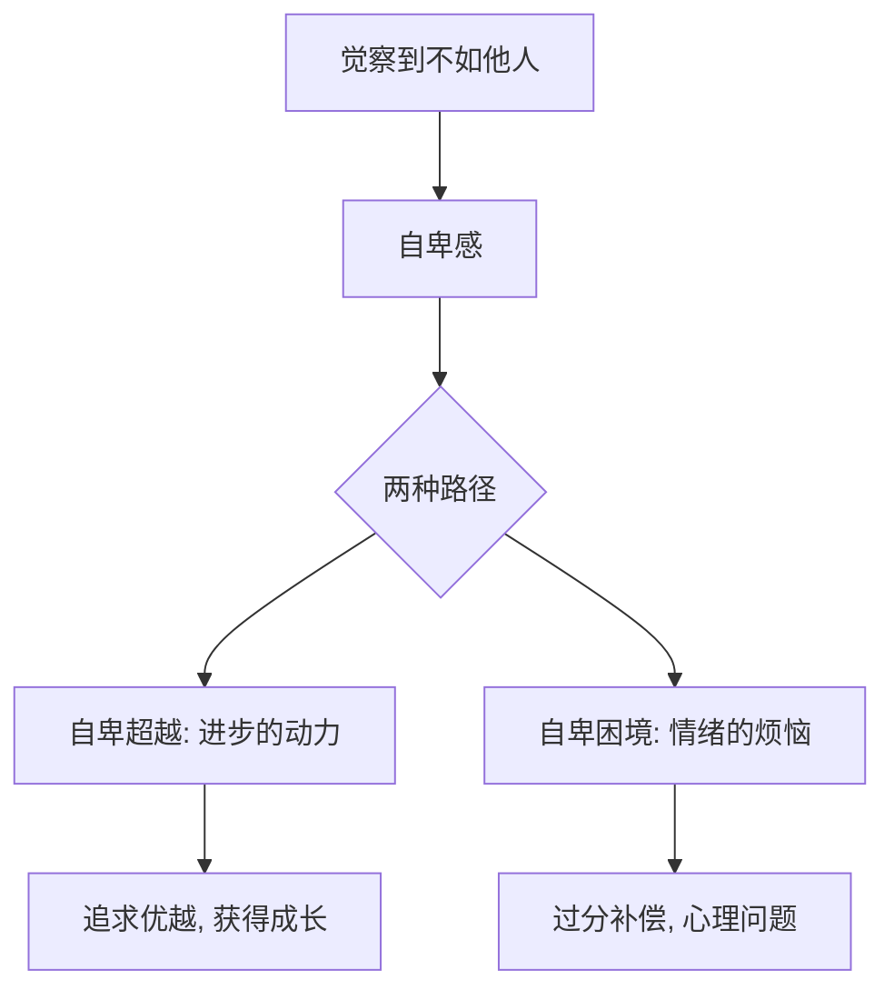
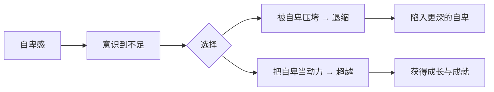

# 第03课：自卑（上）：自卑情结产生的根源是什么

## 开头引入：你觉得自己"不够好"吗？

你是否曾经因为个子太矮、说话口吃、长相欠佳而感到自卑？因为反应太慢、成绩不好、家庭条件不如别人而抬不起头？

凡是觉得自己在某一个方面不如别人——不管是生理上的缺陷，还是能力上的缺陷，甚至是家庭背景——都可能给人造成一种强烈的不安全感、不完美感，产生烦恼、不安、沮丧、焦虑、自闭等负面情绪。

这就是**自卑**。

## 核心概念：阿德勒的自卑情结理论

### 什么是自卑情结？

奥地利著名精神分析心理学大师**阿尔弗雷德·阿德勒**在其传世名作《自卑与超越》中，首次提出了"自卑情结"这个概念。

阿德勒的自卑情结理论是一个**双面模型**：

### 过度补偿与拿破仑情结

为了弥补不足，人可能会采取**过分补偿**的策略：

- 长得丑的男人，喜欢炫耀自己的女朋友多么漂亮
- 出身卑微的女性，一定要想方设法嫁入豪门
- 个子不高的人，可能更加暴力、控制欲更强

最有名的案例就是**拿破仑情结**。法国皇帝拿破仑身高只有一米六零，为了弥补身高的不足，他拼命四处攻击、控制力极强，一心一意渴望出人头地，而且一定要娶一个比他高不少的太太。研究发现，在与高个子男人的竞争过程中，矮个头的男人可能对高个头的男人表现出更多的嫉妒和攻击倾向。

### 现代心理学的质疑

但2007年，一批英国心理学家专门研究了拿破仑情结是否真的存在。他们请不同个头的人与研究人员进行"决斗"，研究人员故意反复用木棍敲打对方的手指关节。结果发现——**高个的男人反而更容易生气，攻击性更强**。

> 为什么大家会相信自卑情结的存在？因为生理上、能力上、出身境遇上的缺陷很容易让我们注意到，因此会误认为一个人的心理问题都是由这些显而易见的缺陷造成的。

## 核心概念：自卑情结 vs 自卑情绪

现代心理学认为需要区分两种不同的概念：

| 维度 | 自卑情结 | 自卑情绪 |
|------|---------|---------|
| **性质** | 下意识的，人人都可能有 | 负面的心理反应 |
| **根源** | 普遍的不完美感 | 自尊心过低 |
| **行为** | 可能成为进步动力 | 退缩、自我放弃 |
| **人群** | 普遍存在 | 仅自尊心偏低的人 |
| **结果** | 可以超越（自卑超越） | 需要心理干预 |

**自尊心**是我们每个人对自己的整体评价。有些人自我评价高（高自尊），有些人自我评价低（低自尊）。自卑情绪往往就是由于自尊心过低造成的。

低自尊的人经常觉得自己在他人眼中的社会价值微乎其微，但他们又很看重这一点，因此只能小心谨慎地进行社会活动，生怕别人因为一点不愉快就拒绝自己。于是**遵从他人的愿望，而不是自己的意愿**。

> [!warning]
> 低自尊的人还容易自暴自弃。他们的自我信念里本就相信自己会失败，因此失败后对自己的消极认识又得到了验证，从而放弃努力。

## 关键方法：判断自卑倾向的4条标准

根据美国心理学会的分析，以下4条如果你占了两条，很可能就有了自卑情绪：

| 标准 | 具体表现 |
|------|---------|
| **1. 敏感** | 过度反复关注不好的想法。同事一句无心的玩笑话，你就能想很多：他是不是对我不满意？ |
| **2. 胆小怕事** | 对自己不自信，缺乏独立解决问题的信心，畏首畏尾，缺少行动力。怕什么来什么（墨菲定律）。 |
| **3. 逃避眼神接触** | 不管看见谁，眼神都躲躲闪闪。 |
| **4. 恶意攻击他人** | 经常挖苦、陷害他人，以此来转移自己的孤独和失败情绪。内心虚弱，需要外表的强悍来保护。 |

## 自卑人格的两种类型

长期的、低自尊的情绪体验，甚至会形成**自卑人格**。它分为两种：

### 外显型自卑人格

可以通过行为、动作、语言习惯、面部表情直接判断。

> **林黛玉的案例**：林黛玉是大观园里公认的敏感多疑、多愁善感之人。她怜惜落花然后葬花，又因花联想到自己的身世处境而伤心不已。听戏班子排练《牡丹亭》，心情随着唱词大起大落。听到园子里的婆子骂人，以为在骂自己，近即气的昏厥过去。尽管林黛玉才华横溢、有钱有颜还有闲，但她仍然整天郁郁寡欢。葬花吟那句"一年三百六十日，风刀霜剑严相逼"，就是她内心自卑最真实的感受写照。

### 内隐型自卑人格

青春期的孩子往往容易滋生这种类型。他们把自己的自卑伪装得很好，让别人根本猜不透。

**案例——小王的故事**：彭老师的一个学生小王，父母只是湖南乡下普通的农民。但她平时总是装出一副家境优越、家庭幸福的样子，从不主动向别人谈论自己的家庭。后来谈了男友，见家长时男方家人问起，她只说父母是工薪阶层，并不是农民。其实班上不少家境不好的同学都可以坦荡地谈论家庭，但小王就是过不了自己心里这个坎。

**防御性悲观**是内隐型自卑的典型表现。为了避免将来感到自卑，现在就为失败制造完美的借口——明天要考试，别人都在认真复习，他反而放纵自己不复习。考不好就能自我安慰：没考好是因为没好好复习，不是我能力不行。不光孩子，很多大人也会这么做——钢琴选手比赛前感到压力太大，就故意让自己生病，为失败预先找到完美借口。

## 自卑的另一面：超越的可能

自卑真的是一无是处吗？**不是的**。

下意识的"自卑情结"可以让人超越——它是人可以变得优秀的原动力。

> **伊赛牛的创始人的故事**：荷兰著名品牌伊赛牛的创始人年轻时家里很穷，每次回家看到破旧的房子总感觉矮人一头，在村里特别自卑。于是他暗暗发誓一定要努力赚钱，把房子盖成全城最好的房子。在这种动力驱使下，他代理家人创业，历经艰辛，终于成为当地首屈一指的富豪，还创立了自己的品牌，基业长青。

对自己外貌自卑的女性，也可以变得优雅。没有丑的人，只有疏于打扮的人。三分靠颜值，七分靠打扮。那些美妆博主几乎都在各种短视频平台上找到了自己事业的春天。

> [!quote]
> 自卑并不可怕，不敢面对才更可怕。阻止你自信的，其实不是自卑，而是你对于自卑的态度和面对自卑的反应。如果你能把自卑化作长期的动力，你就会变得越来越自信——这就是**自卑的超越**。

## 自检练习

> [!question]
> 1. 回顾一下，你是否曾经因为某个方面的"不足"而产生过自卑感？它驱动了你前进，还是让你退缩了？
> 2. 你身边有没有"内隐型自卑人格"的人？他们有什么样的表现？

思考提示

**关于问题1**：阿德勒认为每个人都有不同程度的自卑感，关键是如何应对。如果你曾因自卑而努力提升自己，这就是"自卑的超越"。详见[[reference/glossary|术语表]]中的"自卑超越"。

**关于问题2**：内隐型自卑的常见表现包括：防御性悲观（为失败提前找借口）、讨好型人格（违背意愿也要帮助他人）、过度掩饰家庭背景等。这类人内心其实并不快乐，需要更多关注和支持。

## 科学依据小结

| 研究/理论 | 核心发现 |
|-----------|---------|
| **阿德勒自卑情结** | 意识到不如他人产生的不安全感，可成为进步动力 |
| **2007年拿破仑情结研究** | 高个男人反而更容易生气，矮个男人攻击性未必更强 |
| **自尊心理论** | 低自尊是自卑情绪的根本原因 |
| **防御性悲观** | 预先为失败找借口，避免内疚，实为自我伤害 |

## 小结

- **阿德勒的自卑情结理论**：自卑感是普遍的心理现象，可成为进步动力（超越），也可能导致心理问题（困境）
- **过度补偿**：为弥补缺陷采取极端行为，如拿破仑情结
- **自卑情结 ≠ 自卑情绪**：前者人人都有，后者源于自尊心过低
- **判断自卑倾向的4条标准**：敏感、胆小怕事、逃避眼神、恶意攻击
- **自卑人格分两种**：外显型（如林黛玉）和内隐型（如防御性悲观）
- 自卑不是坏事，关键是**对自卑的态度**——活用自卑情结，可以成为优秀的原动力

下一课[[0004-zi-bei-xia|自卑（下）]]我们将深入探讨：为什么追求优秀也无法克服自卑？以及如何真正战胜自卑情绪。