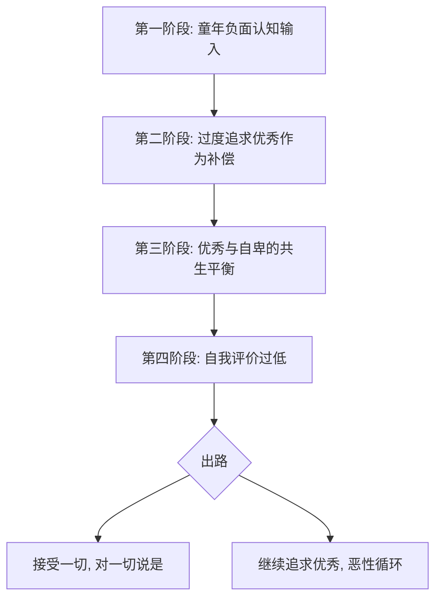
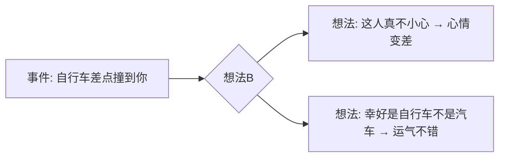

# 第04课：自卑（下）：为什么追求优秀也无法克服自卑

## 开头引入：为什么越优秀的人反而越自卑？

你有没有发现一个奇怪的现象——

有些人明明已经很优秀了，却仍然感到深深的自卑。反过来，也有一些看起来条件普通的人，反而活得自信满满。

这是为什么？

因为**优秀和自卑从来不是反义词**。很多时候，追求优秀恰恰是自卑的一种表现。

## 核心概念：自卑情绪形成的4个阶段

自卑情绪是自尊心低的一种表现，它的形成往往与早期成长经历有关。

### 第一阶段：童年负面认知的输入

孩子一出生的时候，很多父母面对眼前这个皱皱巴巴的小肉团，第一句话竟然是："怎么这么难看？"——这是很多人一生中收到的第一个负面自我评价。

随着孩子慢慢长大，父母亲言里言外经常说："你看别人家的孩子多么优秀，咱们家的孩子这也不行那也不对。"年复一年的打压、批判、对比——虽然不是父母故意为之，但这都是**孩子自卑的起因**。

### 第二阶段：过度追求优秀作为补偿

俗话说"三岁看大，七岁看老"。在人生第一个七年，如果形成了自卑的人格底色，那么这个人就会特别在乎是否优秀。

同样，**优秀和自卑就是一对平衡**——越是在乎优秀的人，就越有一些自卑的东西来平衡。所以我们经常看到那些特别要强的人，自卑得不得了。

### 第三阶段：优秀与自卑的共生

这种平衡可能在一个人自己身上体现，也可能在一段关系中体现：

- **自己身上**：特别要强的人，内心自卑得不得了
- **关系中**：一个优秀的女子找一个自卑的男人，或一个优秀的男人找一个条件远逊于自己的女人

**追求优秀并不是直面自卑**，它只是给自卑披上了一件华丽的外衣。

### 第四阶段：自我评价过低

> [!quote] 《蛤蟆先生去看心理医生》
> 没有一种批评比自我批评更强烈，也没有一个法官比我们自己更严苛。

实际和自己斗争的，不是别人，而是那个高度敏感、低自尊、追求完美的自我。

竞争意识过强的生活环境——无论是家庭还是同学、同事、朋友——都在互相比较、攀比，要达到和别人相同的优秀标准。同时缺乏同情、接纳、关怀、支持，这些都容易让人产生自卑的感受。

低自尊的人时时刻刻在意别人的眼光，总能从这些眼光中读出挑剔和鄙视。最典型的表现是**将所有责任全部包揽**——稍微出点差错，都归结为自己不好，是自己的错。

> 古人说"行有不得，反求诸己"——出问题反省自己，但这与低自尊否定自己是完全两回事。

## 核心洞见：如何直面自卑？

答案是对一切说"是"——**接受这一切**。

坦然接受命运馈赠的礼物：
- 承认自己自卑
- 承认自己的父母亲确实让自己自卑
- 承认自己对他们有点瞧不起、甚至很有意见

当接受这些事实的时候，你对自己的自卑就不会那么在乎了，你的自卑也不再那么敏感了，对优秀也不再那么执着了。这个时候，你会发现心中充满了一种轻松、幸福的感受。

## 关键方法：克服自卑的4种策略

既然低自尊引起的自卑情绪是后天的体验，它就可以通过后天的努力来改变。

### 策略一：用自我同情替代自我批评

每当你自我批评的内心独白开始的时候，先问问自己：

> 如果一个亲爱的朋友也在自我批评，你会对他们说什么？

我们往往比自认为的更有同情心。把用在朋友身上的安慰话用到自己身上——这样做会避免用自我批评进一步伤害自尊心，还有助于建立和提高自尊心。

与其想方设法去改变自己的不足，不如想想**如何放大自己的优点**——扬长避短。

**马云关于"扬长扬短"的智慧**：马云经常公开讲"我是老师，我不会算账"，结果就能吸引到顶尖的财务人才来帮他算账；他说"我不懂技术"，很多技术高手就来帮他。马云把自己的不足和缺陷没有隐瞒，反而得到了别人的帮助，弥补了天然缺陷，事业越做越大。

### 策略二：学会接受赞美

培养自我欣赏的能力。当我们对自己感觉不好的时候，往往也更抵制赞美——尽管这时候我们最需要的就是赞美。

> [!tip]
> 当别人夸奖你的时候，训练自己回应"谢谢"和"你也很好"等等。随着时间的推移，拒绝和怀疑赞美的冲动会慢慢消退，自尊心也就会不断增强。

### 策略三：确定能力，发现价值

自尊是通过在生活中展示真正的能力和成就而建立起来的。找出核心能力，并找机会表现出来。

如何发现自己的价值？

| 方法 | 具体做法 |
|------|---------|
| **从小处着手** | 写不了小说写打油诗，不会画国画画抽象画——只要有人欣赏就是能力 |
| **一定要"晒"** | 在支持你的人群中晒（家人、亲友、好友），他们的积极反馈很重要 |
| **向宏大目标进发** | 设大目标，每件小事都是宏大行动方案的一部分，产生自我效能感 |
| **常心常新** | 放一件新衣服很开心，学做一道新菜很开心——持续创造和想象 |
| **享受反射的光荣** | 与优秀的人/集体联系在一起，他们的成功让你也感到光荣 |

**什么是"反射的光荣"（Reflected Glory）**？心理学发现，自己喜欢的崇拜的对象有一种光荣感时，自己也会有一种共享的光荣——等于说他们的成功就像是自己的成功。你喜欢的球队赢得了冠军，你也会感到特别的光荣。

> 一个普通的清华大学的厨师，如果清华大学登上了中央电视台，他就会觉得和自己登上了中央电视台一样高兴开心。尽量与正面的、积极的、能提高自尊心的人和集体联系在一起——因为他好，我感觉自己也很好。

### 策略四：活学活用ABC理论

美国心理学家爱丽丝创建了著名的**ABC理论**：

- **A**：事件的起因
- **B**：你对这些起因的想法
- **C**：想法造成的后果

相同的A，可能导致不同的C——关键在于**B**（如何看待它）。

**真实场景应用**：

| 事件 | 消极B（想法） | 积极B（想法） |
|------|--------------|--------------|
| 男朋友迟到了 | 迟到这么久，一点都不在乎我 → 不开心、闹分手 | 现在还没来，不会出什么事吧 → 担心而非生气 |
| 被同事陷害 | 我对他这么好，他怎么如此对我 → 心情低落 | 这么小的代价就看清楚一个人 → 心情好转 |

> [!quote]
> 命运给我关闭了这扇窗，但一定是另有安排。

## 案例：克服自卑需要耐心

很多书友可能会感到无奈："彭老师，道理我都懂，可是我怎么觉得都做不到呢？"

没关系，给自己足够的耐心。超越自卑不是一朝一夕就能做到的。你能做到的，就是允许这一切的发生——"是的，我现在做不到，我现在无法超越。"

## 自检练习

> [!question]
> 1. 回想你的童年，父母是否给过你负面的自我认知输入？哪些话语现在还影响着你？
> 2. 你身边有没有"反射的光荣"的来源？你属于哪些优秀的群体或集体，可以从中获得自豪感？

思考提示

**关于问题1**：认识到负面认知的来源是改变的第一步。父母往往不是故意的，他们也有自己的成长局限。"接受"不是原谅，而是不再让这些过去继续控制你现在的生活。参见[[reference/glossary|术语表]]中的"认知重评"。

**关于问题2**："反射的光荣"可以来自你认同的任何群体——学校、公司、社团、运动队、兴趣小组。与其独来独往，不如主动加入一个优秀的集体，让集体的荣耀成为你自尊心的一部分。参见[[reference/emotion-strategies|情绪调节策略速查]]中的"克服自卑4策略"。

## 小结

- **自卑情绪形成的4阶段**：童年负面认知 → 过度追求优秀 → 优秀与自卑共生 → 自我评价过低
- **核心问题**：追求优秀不是直面自卑，优秀和自卑不是反义词
- **关键的转变**：对一切说"是"——接受自己的自卑和过往
- **4种克服策略**：自我同情替代自我批评、学会接受赞美、发现自身价值（包括反射的光荣）、活用ABC理论
- **ABC理论的核心**：影响结果的不是事件本身（A），而是对事件的解读方式（B）

记住：**你才是你生活的主角，其他人都是配角**。活出心花怒放的自己。更多策略可参考[[reference/emotion-strategies|情绪调节策略速查]]。