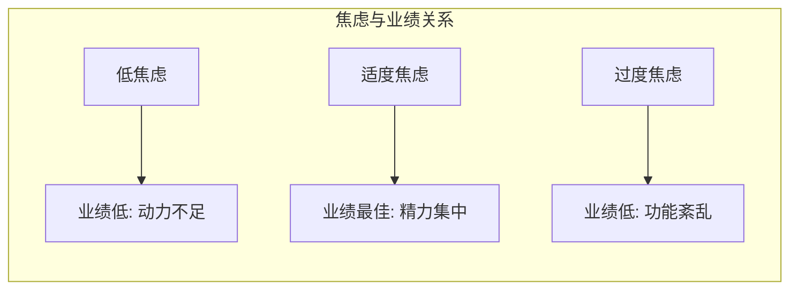
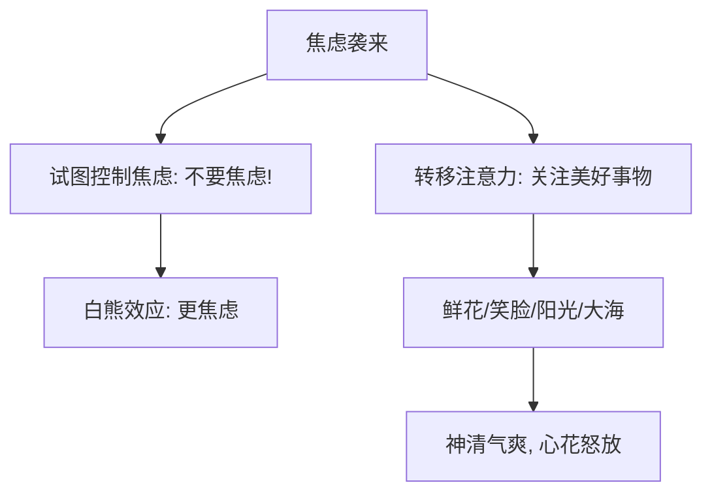

# 第05课：焦虑：如何摆脱中国式焦虑？

## 开头引入：为什么书名里有"焦虑"的书卖不出去？

我有一个学生，毕业之后从事出版工作。去年他出了一本关于焦虑的书，在策划阶段，所有人都建议在书名中突出"焦虑"两个字，让读者一眼就能看见。团队做了大量工作，万事俱备。

结果，这本书上市之后销量很差。

编辑们不理解——内容过硬，宣传也到位了。我这位学生不服输，一条一条翻看评论，终于发现一条评论：

> "看到书名中的'焦虑'两个字，我更焦虑了。我怎么会买一本让我更焦虑的书呢？"

这条评论的点赞量高达**2.4万人**。

他恍然大悟——原来带有"焦虑"两个字的书名，无意中激发了人们心目中关于焦虑的痛苦体验。他马上改了书名，书的销量果然大涨。

## 核心概念：无处不在的焦虑

焦虑是我们非常熟悉的情绪——熟悉到哪怕只是看到这两个字，我们都会心生不灵、坐立不安。

### "中国式焦虑"有多普遍？

调查显示：**96%的人心中都有焦虑的事**。在中国文化环境下，焦虑的来源更加广泛：

| 人生阶段 | 焦虑来源 |
|---------|---------|
| 学生时代 | 每一次考试、毕业、出国、找工作 |
| 工作中 | 业绩考核、个人升迁 |
| 成家后 | 买房、房贷 |
| 有孩子后 | 健康、教育、成长 |
| 人际关系 | 婆媳矛盾、家庭矛盾 |
| 泛在压力 | 工作压力、生活节奏、社会竞争 |

焦虑很多时候是**期望与现实之间的落差**造成的。任何有追求、有责任、有担当的人都会或多或少有些焦虑——因为我们想让自己更优秀，想让家人过上更好的生活。

## 核心理论：耶克斯-多德森定律

1908年，哈佛大学心理学家罗伯特·耶克斯和约翰·多德森提出了**耶克斯-多德森曲线**，揭示了焦虑水平与工作业绩的关系。

| 焦虑水平 | 状态 | 业绩表现 |
|---------|------|---------|
| **过低** | 缺乏动力，松懈 | 差 |
| **适度** | 精力集中，潜能激发 | **最佳** |
| **过高** | 功能紊乱，颤抖不安 | 差 |

### 李广射石的故事

《史记》中记载了李广射石的故事，充分说明了适度焦虑对成功的重要性。

大将军李广去打猎，看到草丛中有黑影绰绰，以为是老虎，很是紧张，立刻张弓而射。天亮后仔细一看，原来是一块大石头——但箭已经深深射入石头中。放松了之后，再试着射箭，就怎么也射不进石头里去了。

诗人卢纶用诗句记载了这个奇妙的故事：

> 林暗草惊风，将军夜引弓。
> 平民寻白羽，没在石棱中。

李广的故事告诉我们：**恰当程度的焦虑，会激发我们内心的潜在力量**。

> [!tip]
> 适度的焦虑不是敌人，它是你专注力和创造力的催化剂。

### 过度焦虑的代价

密歇根州立大学的心理学家杰森·莫泽发现，太高的焦虑水平甚至会让一些简单的任务变得难以完成。

他们的研究让学生完成一个辨别字母的任务，同时在过程中监测大脑活动。结果发现，那些认为自己高度焦虑的学生，大脑中的前扣带皮层（控制焦虑的中枢）表现得比其他学生活跃很多——说明他们需要用更多力量去控制自己的焦虑，才能完成任务。

过度焦虑时的身体反应：
- 颤抖不止
- 坐立不安
- 注意力不集中
- 肠胃功能紊乱

如果长期处于高度焦虑状态，可能会患上**焦虑症**。患者长期出现：躁动不安、有种急迫感、无法控制的担忧、容易愤怒、很难集中注意、睡眠困难。研究发现，女性患焦虑症的比例几乎是男性的两倍以上，这可能与生理原因有关——女性大脑对血清素的处理更慢。

> [!warning]
> 焦虑症会严重影响到生活，也是引发抑郁的一大诱因。如果怀疑自己患上了焦虑症，需要尽早寻找专业机构的帮助，千万不能讳疾忌医。

## 关键方法：缓解焦虑的两大工具

### 工具一：利用"白熊效应"转移注意力

美国社会心理学家丹尼尔·瓦格纳提出了**白熊效应**。他做了一个实验：让参与者"不要想象一只白色的熊"。结果发现，人们出现了强烈的反弹——脑海中浮现出白熊的形象。

> 越想忘掉的事，反而越忘不掉。

这解释了为什么那些被焦虑困扰的人，越想控制焦虑，反而越焦虑。瓦格纳还做了很多类似实验——比如手里拿着怀表，越提醒自己手不要抖，反而抖得越厉害。

**高明的射击运动员怎么做？** 在准备时，他不去提醒自己手不要抖，而是用**呼吸转移的方式**让自己注意到呼吸——结果手反而不抖了，成绩更优秀。

**核心建议**：不要刻意控制和抑制焦虑，转而去把注意力放在鲜花、笑脸、阳光、大海这些美好事物的想象上。

### 工具二：积极暗示——文字和颜色的心理能量

#### 积极文字的力量

文字和语言是有心理能量的。约翰·巴奇教授做过一个研究：让纽约大学的学生聊一聊"青春之美"——年轻人多么好——结果发现这些年轻人开始手舞足蹈、意气风发、越聊越开心。但当要求他们聊一聊"老年的痛苦"时，想到老了之后没有力气、无人照顾的场面，整体的氛围很快沉重了下来，每个人脸上愁云满布。

> 读积极的书、看积极的文字，可以产生积极感受。读消极的书、看消极的文字，也会产生痛苦感受。

#### 黄色的力量——生态效价理论

二十多年前，彭凯平教授和同事提出了**生态效价理论**。

在人类进化之初，没有任何语言和文字，只能根据物体的颜色产生联想。蓝天的颜色让人感觉舒服，火的颜色让人感觉危险。颜色与先祖的生存环境（生态）有直接关系，这种关系作为遗传基因代代相传。

太阳温暖，太阳的颜色——黄色——就会让我们产生幸福愉悦的感觉。德国哲学家康德说过：**"黄色是幸福的颜色"**。

著名披头士乐队有一首很受欢迎的歌《Yellow Submarine》（黄色的潜水艇），传递的就是爱与和平的信息，让人听了充满愉悦的感觉。

> [!tip]
> 灿烂的黄色让我们不焦虑，让我们感觉愉悦。彭凯平教授主办的国际积极心理大会的徽标，选用的就是橘黄色——因为这是幸福的颜色。

| 应对方式 | 错误做法 | 正确做法 |
|---------|---------|---------|
| 面对焦虑 | 刻意抑制"不要焦虑" | 转移注意力到美好事物 |
| 阅读内容 | 焦虑的、负面的文字 | 积极的、向上的文字 |
| 颜色环境 | 灰暗、冷色调 | 明亮、黄色等暖色调 |
| 身体动作 | 紧张僵持 | 舒展开放的动作 |

## 案例：一本书名引发的焦虑

这堂课开头提到的出书案例说明了一个重要道理：

焦虑是**可以被文字激发**的，也可以被文字缓解。书名中"焦虑"两个字就能让潜在的2.4万人感到更加焦虑——这提醒我们要注意**日常接触的信息环境**。如果你发现自己经常焦虑，不妨审视一下：你每天读什么、看什么、聊什么？

## 自检练习

> [!question]
> 1. 你现在的生活中有哪些焦虑来源？评估一下它们处在耶克斯-多德森曲线的什么位置——是过低、适度还是过度？
> 2. 尝试"白熊效应"的反向应用：今天特意花5分钟想象一件让你感到愉悦和放松的事情（大海、阳光、某次美好的旅行），记录你的感受变化。

思考提示

**关于问题1**：适度的焦虑有助于提高专注力和业绩。如果你发现自己的焦虑水平过高，尝试不要对抗它——用[[reference/emotion-strategies|情绪调节策略速查]]中提到的"正念呼吸"工具，专注当下呼吸，缓解杏仁核反应。

**关于问题2**：丹尼尔·瓦格纳的实验告诉我们，大脑不能"不"做什么，但可以做另一件事。把注意力从焦虑源转移到积极想象上，是一种有效的情绪调节方法。参见[[reference/glossary|术语表]]中的"二手焦虑"——远离焦虑源，靠近积极源。

## 科学依据速览

| 理论/研究 | 核心发现 |
|-----------|---------|
| **耶克斯-多德森定律**（1908） | 焦虑与业绩呈倒U型关系，适度焦虑最佳 |
| **莫泽研究**（密歇根州立大学） | 高度焦虑者需要更多大脑资源控制焦虑 |
| **白熊效应**（瓦格纳） | 越想控制焦虑越焦虑，转移注意力才是出路 |
| **生态效价理论**（彭凯平等） | 颜色与进化记忆相关，黄色激发幸福愉悦 |
| **巴奇实验**（纽约大学） | 积极语言激发积极身体状态 |

## 小结

- **耶克斯-多德森定律**：焦虑和工作业绩呈倒U型关系，适度焦虑激发潜能，过度焦虑功能紊乱
- **白熊效应**：越想控制焦虑，反而越焦虑——正确做法是**转移注意力**
- **积极暗示的力量**：积极的文字和语言可以改变心理状态
- **生态效价理论**：黄色等明亮颜色可以让人产生幸福愉悦感
- 焦虑不是敌人，学会与焦虑共处、善用焦虑的正面能量，才是情绪管理的关键

下一课[[0006-gu-du|孤独]]，我们来探讨：即使独处，也可以不孤吗？