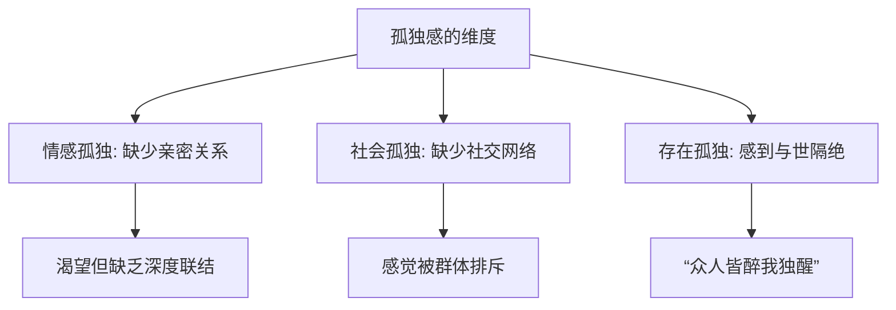
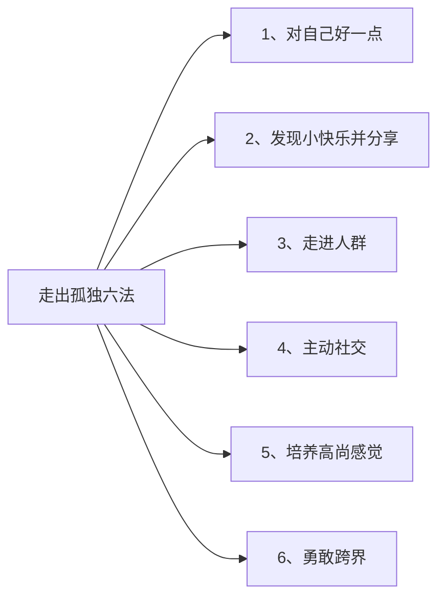
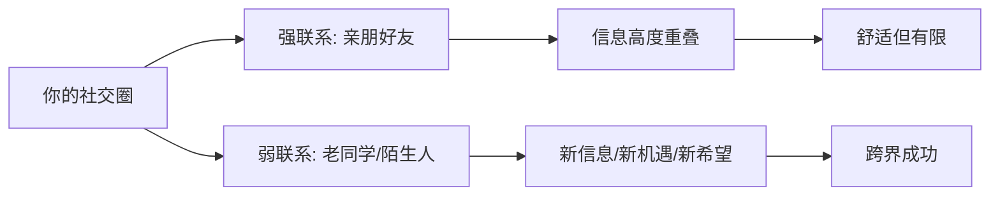

# 第06课：孤独：即使独处，也可以不孤吗？

## 开头引入：人群中，你感到过孤独吗？

你有没有过这样的经历——

夜深人静的时候，看到熟睡的伴侣和孩子，仍然感到孤单？

忙了一天，拖看疲惫的身体回到家里，没有觉得放松，反而感到空虚和寂寞？

明明和一群人在一嘻笑怒骂，还是隐隐约约感到孤独——觉得这样的交流很肤浅，人群中其实没有真正了解自己的人？

如果有，那你体验到的，就是**心灵的孤独**，而不是物理的孤独。

很多人把这两种孤独搞混在一起，其实二者完全不一样。

## 核心概念：孤独 vs 独处

这是本课最关键的一个区分：

| 维度 | 心灵的孤独 | 物理的独处 |
|------|-----------|-----------|
| **本质** | 情感联结的缺失 | 物理空间的独一人 |
| **感受** | 忧伤、不适、空虚 | 内心充实有力 |
| **人群状态** | 身在人群中仍感到孤 | 一人时并不孤 |
| **心理影响** | 负面，损伤心理健康 | 正面，智慧的体现 |
| **功能** | 需要被疗愈 | 在给内心充电 |

> [!quote] 哲学家叔本华
> 没有相当程度的独处，就不可能有内心的平和。

物理空间的孤独不是问题。独处的时候，你可以读书、工作，此时内心充实有力，并不孤单。独处是智慧的体现，是能力的体现。

彭凯平教授分享了自己的亲身经历：“疫情隔离期，反而是我内心觉得最自由的时候。我有更多时间得以闲看庭前的花开花落，品电影看人生百态。傍晚时分透过窗口看到空气里安安静静的散落，极出晚霞余晖，别有一番风味。让我欣喜的是，这段独处的时间，我沉下心来完成了三本书、六十多万字的写作任务——在以前是不敢想象的。这就是独处的魅力。”

### 什么是孤独？

美国心理学会的一项调查显示，在400多名受访者中，**90%的人自称常常感到孤独**。

这种感觉往往在人们渴望与其他人产生联系，但实际上又感觉距离很远的时候产生。它是一种忧伤或不适的情绪状态。

如果你经常体验到：
- 缺乏陪伴
- 感觉被冷落
- 跟周围的人格格不入
- 有需要的时候，没有人可以让你寻求帮助

那么说明你有较高程度的孤独感。

## 孤独的危害

短暂的轻度孤独不会造成心理问题。但长期的严重的孤独感，会引发某些情绪障碍，降低人的心理健康水平。

| 影响层面 | 具体危害 |
|---------|---------|
| **心理** | 情绪低落、萎靡不振、觉得前途渺茫、扭曲认知、诱发抑郁症 |
| **生理** | 增加皮脂醇释放、影响睡眠、降低免疫力 |
| **疾病风险** | 提高心脏病、二型糖尿病、关节炎等生理疾病风险 |

### 孤独感是会传染的

孤独心理研究专家对5000多人长达10年的社会网络数据研究发现：那些感到孤独的人，通常会在离开一个群体之前，把自己的孤独感**传染**给群体里面的人。

### 孤独的伤痛堪比物理伤害

情感神经科学家艾森伯格做了一个研究：让参与者在网上跟另外几名玩家玩一个传球游戏，并观测他们大脑反应。实际上，其他玩家都是虚拟的。当其他玩家都不传球给参与者（即排挤参与者）的时候，参与者大脑的活动区域——和身体感受到痛苦时的活动区域——是**重叠的**。

> 用针刺手掌心产生疼痛感的大脑区域，与被群体排挤产生疼痛感的大脑区域，是同一个区域。

### 为什么我们感到孤独？

与周围环境的不匹配造成的落差，会带来孤独感。

高处不胜寒的时候、众人皆醉我独醒的时候、一枝独秀的时候，往往就是孤独感来袭的时候。纵观古今中外，先知先觉的人、卓越优秀的人、超凡脱俗的人、与众不同的人，都会或多或少地感到孤独。

> [!warning]
> 孤独感是带有忧伤的负面情绪。如果你很优秀，只是觉得自己跟别人不一样，甚至会因为自己的优秀感到开心自豪——那不是孤独感。相反，如果你很优秀，但觉得不合适、不太好、很别扭——这种不舒服的感觉才叫孤独感。

## 孤独感的测量：UCLA孤独感量表

心理学有一个重要的**UCLA孤独感量表**（加州大学洛杉矶分校的心理学家发明的孤独感鉴定量表），可以帮助我们分析自己的孤独感水平。

（该量表的详细内容位于本期内容的文案区，你可以自行测评。）

## 关键方法：走出孤独的6种策略

著名心理学家弗洛姆曾说：“人也许能够忍受饥饿和压迫的痛苦，但却很难忍受所有痛苦中最痛苦的一种——那就是全然的孤独。”

那么，有什么办法可以从这种全然孤独中突围呢？

### 方法一：对自己好一点

感到孤独的时候，第一件事就是——**不要责备自己**，不要去分析“我为什么总是这样”。

给自己找个事情做做：出去散散步、听听音乐、读读书、听听课。做让自己开心的事，是走出孤独最简单的第一步。

### 方法二：发现生活中的小快乐并分享

生活中有很多快乐的瞬间值得去发现和欣赏。与他人分享这样的快乐，不仅可以让快乐加倍，还可以让我们与他人的关系更加紧密。

**彭老师的亲身经历**：前些天，小儿子发来视频分享他生活中的小快乐——他第一次做鱼香茄子，取得了成功，眉飞色舞地晒成果。彭老师心中的幸福感油然而生——感觉和孩子虽远隔千里，但仍然心心相依。

当你发现生活中有让你感到快乐的瞬间时，记得和朋友、家人分享——打电话、发微信都行。很快你就会发现和他们的关系更紧密了，快乐也多了一些，孤独感自然而然就少了不少。

### 方法三：走进人群

不要老想着如何回避他人、躲起来、藏起来、宰起来，而应该多去参加体育活动、社交活动、集体活动，大胆地走向人群。

> [!tip]
> 心理学研究发现，即使和陌生人打个招呼——比如说和售货员、外卖小哥、保安说说话——都会让我们感到社会关系的存在。

### 方法四：主动社交，建立支持网络

不要总是被动地等着别人来找你。试着主动加入一些社交活动、认识一些朋友：

- 主动参与别人的游戏
- 参与同事的讨论
- 主动帮助别人
- 主动表达对他人的欣赏和支持
- 参加公益活动
- 参加兴趣小组，和那些有共同爱好、经历或志向的人在一起

如此以来，你身边就会聚集一些志同道合、喜爱你的朋友。

### 方法五：培养高尚的感觉

所谓“高尚的感觉”，就像觉得自己很渺小的一种感受，或者是一种从未体验过的新鲜感觉。

例如：
- 看到美丽的自然奇观——大海、高山、星空、宇宙
- 欣赏他人的崇高道德行为

这些都会让我们产生**超越自我、敬畏之心、心想往之**的感受。

高尚的感觉可以帮助我们战胜孤独。

### 方法六：勇敢跨界——弱关系的强势效应

那些认为自己在事业上孤独无缘的朋友，我建议你大胆尝试跨出自己原有的圈子，扩充社会资本。

著名社会学家马克·格兰诺维特发现：**真正有用的关系，不是亲朋好友这种经常见面的强联系，反而是那些弱联系**。

| 关系类型 | 特点 | 优缺点 |
|---------|------|-------|
| **强联系** | 亲朋好友、经常见面 | 相似度高，信息重叠，你不知道的他们也不知道 |
| **弱联系** | 不常联系的老同学、记不起名字的老同事、陌生人 | 知识信息差异大，可能带来新机遇 |

为什么弱联系更有效？人以群分、物以聚类，强关系的组织掌握的知识信息重叠程度很高——你不知道的信息他们其实也不知道，你知道的他们早就知道。那些弱联系的人，他们知道的你可能并不知道，他更有可能告诉你一些你不知道的事情。

中国人讲“兼听则明”——来自不同圈子的信息，往往可以让我们少走弯路，或者有机会建立新的联系。

> [!tip]
> 越是能够跨界的人，越是能够接触到不同圈层的人，反而越容易成功。这就是格兰诺维特提出的"弱关系的强势效应"。

你敢这么做，你就可以跨越孤独感带来的痛苦。如果没有这种勇敢超越自我的精神，也许你永远会被原有的生活方式、生活习惯和生活圈子所禁锢。

## 自检练习

> [!question]
> 1. 你现在感到的是“孤独”还是“独处”？用本课的区分标准给自己做一个判断。
> 2. 你的社交网络里，“弱联系”多吗？最近一个月，你有没有和“弱联系”的人交谈过？

思考提示

**关于问题1**：核心判别标准是内心的感受——感到忧伤、不适、空虚就是孤独；感到充识有力、享受当下就是独处。参见[[reference/glossary|术语表]]中的“孤独”相关条目。

**关于问题2**：如果你发现自己主要和同样的人反复交流，信息圈窄，可以尝试“跨界”——参加一个从未去过的活动、加入一个新兴趣小组、和老同学联系一下。弱联系的强势效应也许能给你带来新机遇。更多方法参见[[reference/emotion-strategies|情绪调节策略速查]]。

## 小结

- **孤独 ≠ 独处**：孤独是情感联结的缺失（即使身在人群中），独处是物理空间的独一人（内心充实有力）
- 美国心理学会调查显示**90%的人常常感到孤独**
- 孤独的危害包括心理（抑郁症）、生理（免疫力下降）和疾病风险（心脏病等）
- **孤独感的伤痛和物理伤痛的脑区是重叠的**
- **走出孤独6法**：
1. 对自己好一点，做开心的事
2. 发现小快乐并分享
3. 走进人群（和陌生人打招呼就有用）
4. 主动社交，建立支持网络
5. 培养高尚的感觉（敬畏之心）
6. **勇敢跨界**——利用弱联系的强势效应

> 孤独不是一件容易面对的问题，没有适用于每个人的固定答案。但是最好的答案，一定是你自己的**行动和决心**。

至此，我们已经完成了《情绪管理：心理学家的30个锦囊》前7课的学习。从[[0000-fa-kan-ci|发刊词]]到本课，我们从愤怒、自卑、焦虑到孤独，完成了对四种常见消极情绪的深入探索。下一阶段，我们将继续探讨更多的情绪话题。