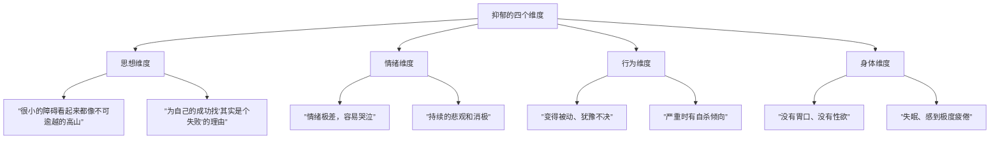

# 第07课：抑郁（上）：如何判断自己是不是抑郁了？

## 开头引入

> "我甚至时常感到自己很无能，什么都不会做好，害怕在人际关系中受伤，害怕做错事情，害怕被别人讨厌……看见窗户就想跳下去。"

你是否也曾经历过这样的心境？愁苦、烦闷，感觉自己身处阳光照射不到的角落，生活在常人无法理解的世界中。

抑郁，被称为"心灵的感冒"，是全球范围内导致身心失能的首要元凶。世界卫生组织2017年的调查报告显示，全球有超过**三亿人**患有抑郁症。然而，大多数人并不真正了解抑郁——抑郁情绪不等于抑郁症，悲伤也不等于抑郁。这一课，我们将帮你厘清这些概念，学会判断自己或身边的人是否真正陷入了抑郁的泥潭。

---

## 核心概念

### 什么是抑郁？

积极心理学之父**塞利格曼**指出，抑郁的人会在**思想、情绪、行为和身体**四个方面发生消极变化：

### 抑郁 ≠ 抑郁症

这是本课最重要的区分。很多人出于对抑郁症的恐惧，一出现心情低落就开始怀疑自己患上了抑郁症，实际上很可能只是正常的**抑郁情绪波动**。

| 特征 | 抑郁情绪 | 抑郁症 |
|------|---------|--------|
| 持续时间 | 短暂，随事件消逝而缓解 | 持续**两周以上** |
| 诱因 | 通常有明确原因 | 可能无明显诱因 |
| 核心感受 | 悲伤中带有正面回忆，波浪式起伏 | 稳定不愉快的体验，常怀愧疚 |
| 自杀倾向 | 一般没有 | 有明显自杀倾向或尝试 |
| 睡眠障碍 | 偶尔失眠 | 长期睡眠障碍 |
| 对生活的看法 | 仍怀有希望 | 感到绝望、无价值 |

### 抑郁症的九个标志性症状

1. **心情持续不愉快**
2. **对任何事情都提不起兴趣**
3. **胃口不佳或暴饮暴食**
4. **做事没劲，特别容易疲劳**
5. **不愿参加任何社交和体育活动**
6. **经常感到无由来地愧疚**
7. **难以集中注意力**
8. **睡眠障碍**（这是特别重要的体现）
9. **考虑过或尝试过自杀**

> [!warning] 关键提醒
> 如果以上症状中有五项以上同时出现，且持续超过两周，建议及时寻求专业心理医生的帮助。

---

## 抑郁的积极面

抑郁让我们痛苦难受，但它也有**积极的一面**：

- **批判性思维加强**：抑郁时，人更容易发现人世间阴暗虚伪的一面
- **看问题更现实**：情绪低落时，对人性的判断可能更加准确
- **激发创作灵感**：古代郁郁不得志的诗人在抑郁时写下了许多反映社会现实的名句

> [!quote] 历史中的抑郁与创作
> 杜甫面对国家衰亡，写出了"感时花溅泪，恨别鸟惊心"；李商隐被贬，有了"夕阳无限好，只是近黄昏"的感叹；辛弃疾壮志难酬，写下了"了却君王天下事，赢得生前身后名，可怜白发生"的悲凉境界。

---

## 为什么我们会抑郁？

### 季节与生理因素

心理学家史蒂芬·伯雷奇研究了20世纪70年代至90年代的自杀率数据，发现：

- 自杀率的高峰在**春末夏初**（4月和5月），而非大多数人以为的冬天
- 冬天反而是自杀率最低的季节

这与人体内**血清素**的分泌密切相关。血清素是一种能让人产生愉悦情绪的神经化学递质。冬天日照少，体内的血清素一直在消耗；春天青黄不接，人容易困倦疲惫；夏天日照增加，血清素水平补充回来，人才会神采奕奕。

此外，**减肥**导致的碳水与糖分摄入减少，会降低**多巴胺**水平，也容易诱发抑郁情绪。日本每年五月抑郁症患者突然增多，被称为"五月病"，与新年度的职场压力密切相关。

### 完美主义与抑郁

佛罗里达大学的**肯尼斯·赖斯教授**在《心理咨询杂志》上发表的研究发现：

> 无法接受不完美事物的完美主义倾向，是一种十分稳定的人格特质。完美主义者经常感到难以达到内心标准的倾向，是诱发抑郁症的危险因素。

赖斯和他的同事对84名在校大学生进行了为期15周的追踪研究，发现**不正常的完美主义特质**与抑郁症表现之间存在**高度相关**；而适度的、不含自我批评的完美主义倾向，则与抑郁症没有关系。

完美主义者总是对自己的现实不满意，认为自己不够好。在别人眼里他们已经足够优秀，但在他们自己眼里却千疮百孔。长期处于这种心理环境，就很容易诱发抑郁。

---

## 案例故事

### 张纯如的悲剧

2004年11月9日，曾以《南京大屠杀》震撼全球的华裔女作家**张纯如**，在反复的精神崩溃后选择自杀，年仅36岁。

在写作过程中，她每天接触到大量日军暴行的历史文档，精神上受到极大创伤——失眠、噩梦、体重减轻、掉发。她曾说："气得发抖，失眠，噩梦，体重减轻。"正是长期的精神抑郁压垮了她。

张纯如出身优渥，父母都是名校教授，她本可以选择不碰这个沉重的题材。但作为一个历史学者的良心与责任感，推动她完成了这部书稿，让全世界看到了南京大屠杀的真相——而她自己，却没能走出抑郁的阴影。

---

## 抑郁是一种孤独的痛苦

> [!quote] 彭凯平教授
> 抑郁是一种孤独的痛苦。很多时候我们身处人群中，欢声笑语，但此时此刻，好像我一点都不抑郁了——但这并不表示你不抑郁，只是周围的环境让你没有表现出来。

我们每个人都要遵守社会规则，扮演不同的社会角色。上班时要朝气蓬勃，喜剧演员在舞台上必须让观众开心，但真正感到抑郁的时候，一定是孤独的时候。

---

## 自检练习

> [!question] 自检一：抑郁情绪还是抑郁症？
> 最近两周，你（或你关心的亲友）是否出现了以下情况？
> - 持续的心情低落，对什么都提不起兴趣？
> - 睡眠质量明显变差（失眠或嗜睡）？
> - 食欲显著下降或暴增？
> - 难以集中注意力，做事的效率明显下降？
> - 经常无由来地感到愧疚，甚至觉得活着没有意义？
>
> 请评估自己是否需要进行专业咨询。

参考建议

**判断标准**：如果上述症状中出现 **5项以上**，且持续时间**超过两周**，建议去专业心理机构或精神科做进一步评估。如果仅有短暂的情绪波动且能自行恢复，则可能只是正常的抑郁情绪，不必过度焦虑。

**特别警示**：如果出现自杀念头或计划，请立即拨打心理危机干预热线，或前往医院寻求帮助。

> [!question] 自检二：你的"完美主义指数"有多高？
> 回想一下，你是否经常有这样的想法——
> - "做得最好永远都是不够的"
> - "我的表现很少能达到自己的标准"
> - "如果我不能完美地完成这件事，那我就是失败的"
>
> 这些想法出现的频率有多高？

解读

赖斯教授的研究表明，**带有自我批评色彩的完美主义**与抑郁高度相关。如果你频繁出现上述想法，建议：
1. 尝试接纳"足够好"的标准，而非事事追求完美
2. 学会区分"高标准"和"自我苛责"
3. 当达不到目标时，用自我同情替代自我批评

记住：**适度的完美主义是动力，过度的完美主义是毒药**。

---

## 小结

| 核心要点 | 关键信息 |
|---------|---------|
| 抑郁的四个维度 | 思想、情绪、行为、身体 |
| 抑郁 ≠ 抑郁症 | 情绪是短暂的，症是持续两周以上的疾病 |
| 九个标志症状 | 心情低落、兴趣丧失、食欲变化、疲劳、社交回避、愧疚、注意力差、睡眠障碍、自杀倾向 |
| 抑郁有积极面 | 增强批判性思维、激发创作、促使现实判断 |
| 季节与血清素 | 春末夏初是高发期，与血清素分泌有关 |
| 完美主义风险 | 不正常的完美主义特质是抑郁症的危险因素 |

> [!tip] 下一课预告
> 了解了如何判断抑郁之后，下一课我们将探讨**走出抑郁阴影的具体方法**——从亲密关系到冥想运动，从哭泣疗愈到写作反思，找到让你重获光明的法宝。

[[reference/glossary]] | [[reference/emotion-strategies]]