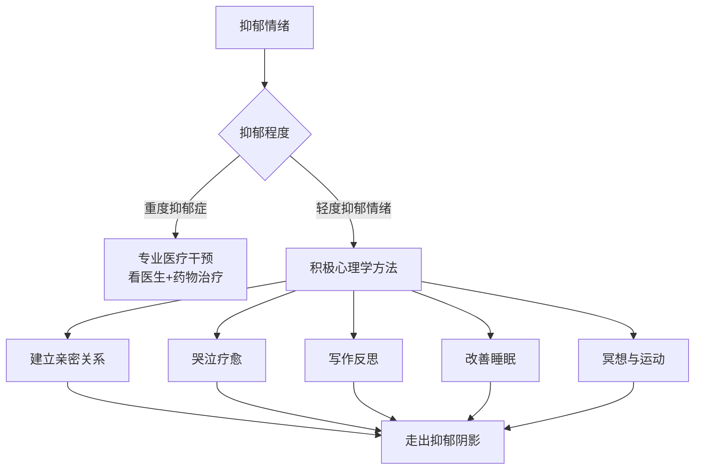

# 第08课：抑郁（下）：走出抑郁阴影的法宝是什么？

## 开头引入

上节课我们了解到，全球有超过三亿人饱受抑郁困扰。面对抑郁，不同的人有不同的排解方式——而不同的方式，往往会带来截然不同的命运。

当一个人身处谷底时，**想要治疗的动力**本身，就能为谷底带来光亮。

对于**重度抑郁症**患者，一定要去看医生、遵医嘱、吃药。而对于**轻度的抑郁情绪**——也就是我们通常说的"心情不好"——积极心理学提供了许多行之有效的方法。

这一课，我们将介绍走出抑郁阴影的六大法宝。

---

## 核心概念：积极心理学应对抑郁的策略

积极心理学认为，应对抑郁情绪的方法，就是**激起心理的调整方法**——用激起的策略来引导我们的抑郁情绪，通过**转移、替代、升华**消极情绪，产生积极的情绪体验。

---

## 法宝一：建立亲密关系 —— 远端防御机制

### 恐惧管理理论的启示

美国堪萨斯大学的三位心理学教授在1984年共同提出了**恐惧管理理论**。该理论认为，每个人都有对死亡的恐惧心理。为了缓解这种恐惧，人们创立了文化世界观，使自己感觉象征性地超越死亡。

抑郁情绪也有类似的**近端防御**和**远端防御**机制：

| 防御类型 | 定义 | 例子 |
|---------|------|------|
| 近端防御 | 自我暗示、自我激励，找到心理调节的技巧 | 深呼吸、打坐、冥想、运动、倾诉 |
| 远端防御 | 一生逐渐形成的积极人生态度 | 建立亲密关系、培养积极价值观 |

### 亲密关系的力量

亲密的人际关系能刺激**催产素**的分泌。瑞士苏黎世大学的**安德斯菲尔教授**第一个发现，爱的催产素对情绪有振奋作用——无论是母爱、父爱，还是兄弟姐妹之间的支持和关爱，都可以让人产生积极的情绪体验。

> [!quote] 哈佛大学70年追踪研究
> 哈佛大学的研究团队完成了一项长达**70多年**的追踪研究，想看看哈佛的毕业生中谁能成为人生赢家。追踪结果发现：
>
> **真正决定一个人成功的，不是大学专业，也不是学习成绩，而是美好的人际关系**——包括稳定的家庭关系、亲密的朋友关系等。
>
> 关系，不仅仅是事业成功的法宝，也是我们人生幸福的密码。

---

## 法宝二：哭 —— 被低估的疗愈方式

### 为什么哭有疗愈作用？

哭除了能释放让人心情振奋的**催产素**，还能产生**内啡肽**——一种能提高心情的神经化学物质。

这就好比吃辣椒：辣椒在舌头上制造痛苦的感觉，为了平衡这种痛苦，人体会分泌内啡肽，消除痛苦的同时在体内制造类似快乐的感觉。哭也可以让人分泌内啡肽。

> [!tip] 彭凯平教授的"哭一哭"建议
> 最好一个月能哭个三五次——哭一哭，更健康。如果不想让别人看见你的眼泪，就找一个没人的地方偷偷抹眼泪。你会发现，哭过之后，世界海阔天空。

| 性别 | 每月平均哭泣次数（美国心理学会2020年数据） |
|------|------------------------------------------|
| 男性 | 约2次 |
| 女性 | 约4次 |

这种性别差异其实是**后天文化**造成的。"男儿有泪不轻弹"——男孩从小被教育不能哭，这种误区在全球或多或少都存在。长期以来，人们对哭有偏见，特别是对男人的哭，往往认为是一种软弱。其实，在心情抑郁的时候哭一哭，对内心情绪的释放有重要意义。

---

## 法宝三：写作 —— 自我沟通与反思

抑郁的时候，人们感觉很多事情失去了**控制**。但当我们开始写作时，不自觉就会谋篇布局——这种谋篇布局增加了我们的**控制感**，而控制感可以刺激**血清素**的分泌，让我们身心愉悦、心情振奋。

写作还可以改变抑郁者看问题的角度。我们常说"当局者迷，旁观者清"。写作时，你会从旁观者的角度，以中立的态度分析事件，找到困扰你的症结所在。

### 写作的三点建议

1. **多写**：写作是一种倾诉，不是评判，不是比较。把烦恼写出来，就像和朋友倾诉，烦恼就可以得到消解
2. **坚持写**：每天写**二十分钟**刚刚好。尝试用积极正面的语言鼓励自己，给予自己肯定
3. **别把写作当大事**：写作是一种放松，不是折磨，不是工作，不是挑战。写不下去就放弃、休息

---

## 法宝四：睡眠 —— 一半的烦恼可以睡过去

抑郁一个很重要的副作用就是**失眠**。睡眠问题几乎是困扰所有抑郁者的一大难题。

### "数水"法（中国版数羊）

很多人用"数羊"来减轻失眠，但彭凯平教授指出：**数羊并不适合中国人**。

- 羊的英文 "sheep" 和睡觉 "sleep" 发音非常接近，所以对说英文的人来说，数羊就像是在说"让自己睡觉"
- 而中国人数羊发的是"咩——"的声音，高亢向上，越数越兴奋

> [!tip] 中国人数"水"法
> 中文里和"睡"发音接近的是"水"。所以数一数"水水水"，就像说"睡睡睡"一样，可以帮助我们很快入睡。不妨试试这种中国特色的助眠方法。

### 正念入睡法

想象自己睡在一棵非常漂亮的树下，或草地上，想象自己带着快乐的念头入睡——这也是常用的入睡技巧。

---

## 核心案例：一根木头拯救的生命

### 背景

彭凯平教授的一位朋友，用15年时间积累起上亿财富，衣着光鲜、事业有成。然而一场金融风暴席卷全球，42岁的他一夜之间回到赤贫——豪车、别墅被拍卖。他抑郁了。

他能清楚地感觉到自己的生命力在一点一点地流失和衰败，但他不敢去看医生——一方面害怕被确诊，另一方面害怕被熟人知道。他宁愿在痛苦中硬撑。

### 干预

有一次他来上彭凯平教授的课，寻求帮助。彭教授没有引导他回忆陷入抑郁的过往场景，也没有帮他探究原生家庭的罪过，而是反问他：

> "你看你都活不下去了，都想自杀了，难道不应该回家去看一看父母亲最后一面吗？"

他说对呀，确实应该回去和父母告个别。彭教授得知距离他家两公里处有一座林场，林场里有很多锯下来的粗树干，就建议他：

> "回到家给你一个任务：请你妈妈帮你将**30根粗树干**从林场搬到院子里。什么理由都可以。做完这个任务，你和父母的缘分就尽了。"

他飞回老家照做了。

### 转变

一年后，当彭教授再次见到他，他已是脱胎换骨、神采飞扬。以下是他的回忆：

> "我回到家，步履沉重，只想着赶紧完成任务，和妈妈早点告别。母亲看我回来特别高兴，她的白头发比去年又多了，步履也有些不便。我编了一个合理的谎话：'妈，帮我买三十根大木头吧，我想做点木工活。'母亲高兴得像孩子一样。"
>
> "那天我一觉睡到下午三点。睁开眼，心情依然沉重。突然，透过窗纱，我看到一个瘦弱的身影抱着一根比腰还粗的木头，艰难地挪动着——那是我的母亲，她已经七十岁了，还不知道她唯一的儿子已经打算离开人世。"
>
> "那一刻我泪如雨下，不能动弹。我只是提了一个要求，七十岁的母亲竟然真的努力帮我实现。我站在窗户边，终于抑制不住，趴在床上嚎啕大哭。"

### 启示

这位男士走出抑郁的法宝，首先是**建立亲密的关系**——这是让自己开心的远端防御机制。母亲的行动让他重新意识到了爱与被爱的连接。

---

## 法宝五与六：冥想与运动

**冥想/禅修**和**运动**对调节抑郁情绪都有显著作用。但要瞬间从抑郁状态调整到积极心态不太容易，也不太现实。重要的是：

> **意识到自己需要调整心态，并学会观察与反思自己内心的真实体验。**

---

## 自检练习

> [!question] 自检：设计你的"走出抑郁"行动清单
> 如果你正在经历轻度抑郁情绪，请根据本课学到的内容，为自己设计一个包含以下要素的行动清单：
> 1. 你可以建立或修复哪一段亲密关系？
> 2. 你有多久没有痛快地哭一场了？
> 3. 你是否愿意尝试每天写20分钟的心情日记？
> 4. 你今晚打算用什么方法改善睡眠？
> 5. 你每周能安排几次运动或冥想？

参考模板

**示例行动清单：**
1. **关系修复**：这周末给父母打一个电话，或约一位老朋友吃饭
2. **允许哭泣**：找一部感人的电影，让自己痛快地哭一场
3. **写作计划**：每天晚上睡前写20分钟"三件好事"（今天发生的三件让你感到温暖的事）
4. **睡眠改善**：今晚试试"数水"法，或做5分钟正念呼吸
5. **运动安排**：每周三次，每次30分钟的户外快走

记住：**做了，就能逐渐往上走。** 这就是积极心理学的含义。

---

## 小结

| 法宝 | 核心机制 | 操作方法 |
|------|---------|---------|
| 亲密关系 | 刺激催产素分泌 | 与家人、朋友建立深度连接 |
| 哭泣 | 释放催产素和内啡肽 | 允许自己哭，每月3-5次 |
| 写作 | 增加控制感，刺激血清素 | 每天20分钟，用积极语言 |
| 睡眠 | 恢复身心能量 | 数水法、正念入睡 |
| 冥想/禅修 | 放松身心、专注当下 | 每日5-10分钟 |
| 运动 | 释放多巴胺和内啡肽 | 每周3次以上 |

> [!quote] 结束语
> 人生的过程，每个人都会遭遇或轻或重的抑郁。但如何去对待，确实可以影响到我们的生活、工作和健康，甚至会影响到我们的一生。**既然已经是抑郁的低谷，无论怎么走，只要我们做，都可以逐渐往上走。** 这就是积极心理学的含义。

[[reference/glossary]] | [[reference/emotion-strategies]]