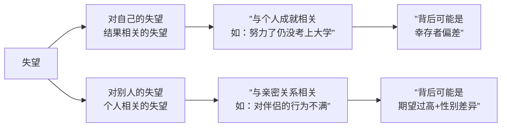

# 第09课：失望：如何让失望变成希望？

## 开头引入

"我好心好意对待你，你却无动于衷、毫不领情。自己的真心付出，没有得到应有的回报和尊重。"

这大概是每个人在生活中都有过的体验。这种感受，叫做**失望**。

荷兰心理学家**马修·查兰伯格**在研究失望时，让人回忆一件令他们非常失望的事情，结果发现：失望的时候，人们会感到**无奈、无助**，什么也不想做，想逃避现实。

心理学家研究了人们负面情绪的频率后发现：**失望是人们在日常生活中最频繁出现的负面情绪**，仅次于焦虑和愤怒，位居第三位。

---

## 核心概念：两种失望

### 对自己的失望：幸存者偏差

对自己的失望往往和个人成就息息相关。表面看是无法接受自己的不完美，实际上可能是走进了**幸存者偏差**的误区。

> [!quote] 幸存者偏差的由来
> 二战时期，哥伦比亚大学统计学的**沃德教授**应美国军方要求，研究如何加强飞机防护才能降低被炮火击落的概率。他研究了返航的轰炸机后发现：机翼是最容易被击中的位置，机尾是最少被击中的位置。
>
> 军方指挥官认为应该加强机翼防护，但沃德教授坚持应该加强**机尾**防护。事实证明他是正确的——**不是机尾不易被击中，而是机尾被击中的飞机早已无法返航**。看不见弹痕，却最致命。

在日常生活中的**幸存者偏差**：我们更容易看到成功，看不到失败，因此会系统性地高估成功的希望，陷入过度自信。率先发现这一现象的**马克·阿尔佩特**和**赫华·德兰法**认为，过度自信会令我们忽视"真正知道的东西"与"已知的东西"之间的区别。

> [!warning] 应对策略
> 在筹划任何事情时，从**悲观的角度出发，做最坏的打算**。只有这样才能更现实地判断形势，更有机会获得成功，重新焕发信心。

---

## 对别人的失望：亲密关系中的"我很失望"

相比对自己的失望，我们更容易对别人失望。心理学称之为**个人相关的失望**。

当我们说出"我对你太失望了"这句话时，实际是把**情绪的掌控权交给了别人**。在亲密关系中，我们最不幸地最容易说出这样的话。

### 一个常见的家庭困境

小王嫁给了与自己两情相悦的老公，但生活中总有摩擦。每当她感到委屈时，总喜欢给老公转发一些关于经营家庭、处理婆媳关系的文章。老公刚开始还会回应一两个字，后来直接忽视。小王干脆当面念给他听，换来的却是一脸嫌弃——老公躲在卫生间两三个小时不出来。

> 明明我学的是科学的心理学方法，告诉老公应该怎么做，为什么他会抵触？

### 男性与女性的心理差异

| 维度 | 男性 | 女性 |
|------|------|------|
| 每日语言量 | 约7000字 | 约20000字 |
| 压力反应 | 逃跑、独处、跑步发泄 | 聊天、倾诉、慰藉心灵 |
| 大脑激活区域 | 杏仁核右侧活性更强 | 杏仁核左侧活性更强 |

> [!quote] 彭凯平教授的观点
> 不对另一半有过高的要求，其实是对他的一种尊重。尊重他就是接受他。婚姻与爱情是一种互相修炼的过程，让双方关系不断成熟、不断成长。
>
> 这种成长应当是**主动的、积极的**，不该是简单的、被动的改变。**改变别人注定会失败，并且让你失望甚至痛苦。**

---

## 科学依据：我们高估了失望的危害

美国哈佛大学著名心理学家**丹尼尔·吉尔伯特**做过一项研究：

- 他们询问大学教授：如果没有评上终身教授，会有什么感觉？
- 大多数人的回答是：**非常失望**
- 但当评选结果出来后，那些没有如愿评上终身教授的教授们报告的感受却是——**并没有自己先前预期的那么失望**

> [!tip] 关键发现
> 人们往往**过高地预估了失望的危害**，忽略了自己内心的坚强和心理的弹性和韧性。

---

## 关键方法：如何把失望变成希望

### 第一步：积极看待失望

没有期望就不会有失望。所有的失望都建立在**在乎**的基础之上——如果你对一段关系毫不在乎，你不会失望。

> "我对你太失望了"的潜台词其实是：**"我希望你可以变得更好，我们还可以变得更好。"**

如果一个人连这句话都不愿意说了，那就说明——他已经对你**绝望**了。

### 第二步：使用"合理的埋怨方法"

老公做错事让你失望，你忍着不表达其实是有伤害的——他不知道你的底线，不知道你的真实感受，行为就不会有任何改变。

| 无效的表达 | 有效的表达 |
|-----------|-----------|
| "我对你很失望！" | "你做XX这件事让我感到失望，因为……" |
| 冷暴力、沉默 | "我希望我们能坦诚地讨论这个问题" |
| 强迫对方改变 | "我们可以一起探讨如何做得更好" |

### 第三步：自我审视

如果发现自己总是遭遇令人失望的事情，可能是时候审视一下自己的**行为模式**了：

1. 在沟通过程中，自己是否**清楚明确**地向他人表达过自己的预期？
2. 自己是否**听清楚**了对方的反馈？
3. 自己实现预期的方法是否过于局限？条条大路通罗马，是否探索了所有可能性？

---

## 案例：失望背后的期望错位

一位妻子在婚后发现丈夫越来越敷衍——婚前百般讨好，婚后话都不想多说。她认为丈夫变了、不爱了，越想越失望。

但如果她了解男女之间的心理差异，就会发现：丈夫的"冷淡"可能只是因为压力增大时选择了独处解压的方式，而不是不爱了。两个人的大脑回路实在不一样——不是不爱，而是爱的表达方式不同。

---

## 自检练习

> [!question] 自检一：审视你的"我很失望"
> 回想最近一次你对某人说"我很失望"（或在心里这样想）的场景：
> - 你的失望究竟来自对方的"不好"，还是来自你的**预期**没有被满足？
> - 你是否曾明确、清晰地表达过你的预期？
> - 如果换一种表达方式，是否会有不同的结果？

思考方向

失望往往是"期望与现实之间的落差"造成的。在亲密关系中，很多时候我们以为对方"应该懂"，但事实是——**没有表达出来的期望，往往是不公平的期望**。

尝试用"我观察到……我感到……我希望……"的句式代替"我很失望"，看看关系会发生什么变化。

> [!question] 自检二：幸存者偏差测试
> 你在做重要决定时，是否容易只看到"别人成功的例子"，而忽略了大量失败的案例？
> - 我可以从哪里看到那些"看不见的失败数据"？
> - 我是否做了最坏的打算？

调整建议

在做决策前，主动搜索失败案例，问自己三个问题：
1. "如果这个计划失败，最可能的原因是什么？"
2. "失败的概率有多高？我能否承受？"
3. "如果预见到最坏的情况，我现在可以做什么来预防？"

这种**防御性悲观**的思维方式，反而能让你更理性地判断形势，提高成功率。

---

## 小结

| 核心要点 | 关键信息 |
|---------|---------|
| 失望的普遍性 | 日常生活中第三常见的负面情绪 |
| 两种失望 | 对自己的失望（幸存者偏差）vs 对别人的失望（期望错位） |
| 高估危害 | 人们实际体验到的失望感远低于预期 |
| 积极面 | 失望代表在乎，潜台词是"希望更好" |
| 合理表达 | 用"具体行为+感受"代替"我很失望" |
| 改变 vs 接受 | 改变自己而非强迫改变他人 |

> [!tip] 行动建议
> 从今天起，每当感到失望时，先问自己一个问题：**"我的失望是否来自一个从未说出口的期望？"** 如果答案是肯定的，请尝试把它说出来——用清晰、温和的方式。沟通本身就是希望的起点。

[[reference/glossary]] | [[reference/emotion-strategies]]