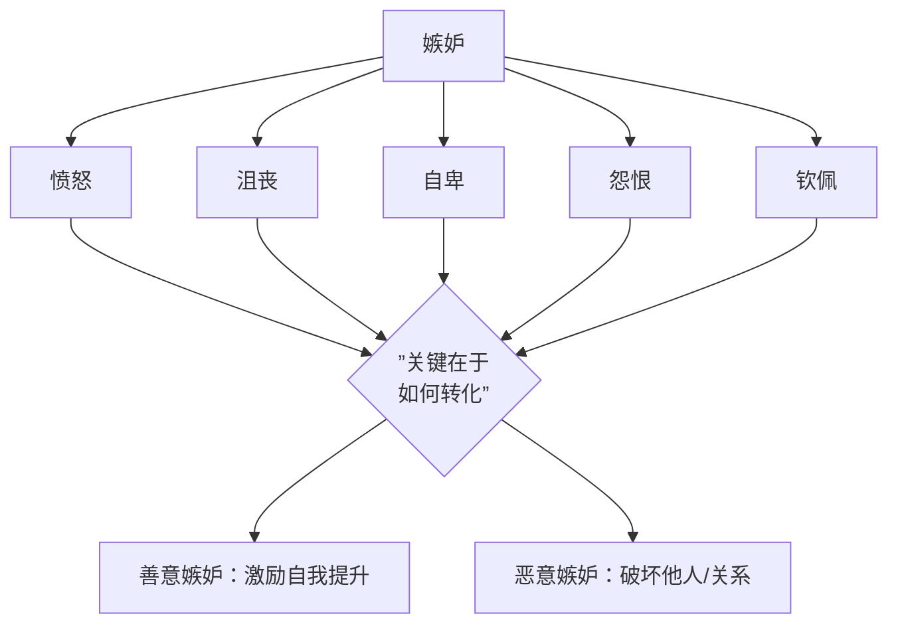

# 第10课：嫉妒：如何让嫉妒产生爱而不是恨

## 开头引入

莎士比亚在著作《奥赛罗》中，把嫉妒形容为**"绿色眼睛的猫"**——它惯于玩弄爪下的猎物。剧中，邪恶的伊阿古怀疑奥赛罗和自己妻子出轨，又认为奥赛罗把原本属于他的晋升机会给了他人，便产生了爱恨交加的嫉妒心理，设计制造了奥赛罗妻子不忠的假象。最后，奥赛罗被嫉妒蒙蔽了双眼，杀死了自己的妻子。

**奥赛罗的情杀是嫉妒造成的。** 这让人不禁思考：嫉妒究竟是保护爱情的卫士，还是摧毁关系的恶魔？

---

## 核心概念：嫉妒是什么？

### 嫉妒不是单一情绪，而是一种复杂的混合体

当人感到嫉妒时，他会同时体验到多种强烈的情感：

### 善意的嫉妒 vs 恶意的嫉妒

| 维度 | 善意嫉妒 | 恶意嫉妒 |
|------|---------|---------|
| 核心心态 | 希望自己变得和对方一样好 | 希望把对方的优势去掉 |
| 行为倾向 | 自我提升、学习改进 | 破坏、贬低、损人不利己 |
| 对关系的影响 | 促进关系发展 | 摧毁关系 |
| 情感底色 | 羡慕 + 动力 | 怨恨 + 敌意 |

---

## 嫉妒的进化心理学

### 男女嫉妒的差异

进化心理学家**David Buss**和他的同事在顶尖的《心理科学》期刊上发表论文指出：

> 嫉妒作为一种古老的进化心理机制，功能在于促进人们采取措施**看好自己的另一半**——否则就有可能造成巨大损失和后悔不已。

研究发现：

- **男性**最嫉妒的是**女性肉体的出轨**——这与父权确认的进化压力有关
- **女性**更容易因为伴侣的**精神出轨**而产生嫉妒——这与资源保障的进化压力有关

> [!quote] 进化视角
> 一项有趣的研究发现：男性在伴侣接近排卵期时，似乎更容易做出一些配偶的呵护行为（如细心照料）。这些行为与嫉妒感相关联——或许这是从进化的角度验证了嫉妒心对人际关系的积极意义。

### 嫉妒的性别差异数据

- 因嫉妒而杀人的案件中，**男性至少是女性的三倍以上**
- 男性对嫉妒情绪的反应最为强烈

---

## 嫉妒在亲密关系中的双面性

### 破坏性的一面

嫉妒能引发猜忌、不确定感和背叛感，让人感到痛苦和担忧。一个容易嫉妒的伴侣，会对关系中的对方产生更强的**控制欲**，希望通过控制降低不确定性。

> [!warning] 非理性嫉妒的三种思维模式
> 1. "在一段关系里，我一定得获得忠诚，对方只能爱我一个人"
> 2. "如果我不是爱人的唯一，我就糟糕透顶，这件事我绝对无法忍受"
> 3. "如果爱人对别人动了心，那就说明我不好"
>
> 这些"绝对化"的思维模式，是产生非理性嫉妒的根源。

**病理性嫉妒综合征**（又称奥赛罗综合征）——总是怀疑伴侣不忠，反复产生伴侣不忠的幻觉，出现跟踪、窃听等行为，严重的会导致杀害配偶。

### 建设性的一面

适度的嫉妒感可以有效**维持感情、促进关系**：

- 看到丈夫很喜欢某位女明星，暗暗学习打扮和穿搭，提升自己的魅力
- 男性看到妻子对闺蜜的男友大加赞赏，偷偷学习浪漫技巧，对巩固关系更加用心

> [!tip] 关键洞见
> 在感情中，"吃醋"是普遍的一种嫉妒感受。**理性的嫉妒**不会让人采取极端手法——在遇到情感问题时，人们会用**爱**来应对。也就是说，反思自己的不足，用更加美好温暖的爱去牢牢拴住对方。

---

## 嫉妒研究的重要发现

### 九年追踪研究

澳大利亚的心理学家做了一个长期实验：在**九年**期间采访了**18000个成年人**，采用严格的心理健康测试量表，研究嫉妒情绪的影响。

研究发现：
- 嫉妒心理**大大影响一个人未来的心理健康**和对生活的满意程度
- 带来更多的**焦虑和愤怒**情绪
- 承载越多嫉妒心理的成年人，在**三年后**的心理健康测试中表现出更多的心理问题

### 什么类型的人更容易嫉妒？

心理学家发现，**低自尊、高权力欲、高竞争性、高神经质**的人更容易对他人产生嫉妒之心。

### 文化差异

| 文化 | 对待嫉妒的态度 |
|------|--------------|
| 美国文化 | 认为是要被**隐藏**的情绪 |
| 中国文化 | 被认定为负面体验，很少公开讨论，往往与**心胸狭窄、缺乏涵养**相关 |

---

## 关键方法：如何让嫉妒产生爱而不是恨

### 方法一：接纳自我，发现自己的优势

积极心理学倡导用**积极的行动**——运动、转移、替代、升华——来化解嫉妒。改变自己的看法很难，但我们可以改变自己的行动，用自己的优势消除嫉妒之心。

### 方法二：帮助那个你嫉妒的人

> 俗话说"没有对比就没有伤害"。如果你真的嫉妒一个人，很好的策略其实是——**去帮助他**。

这个策略背后的心理学原理：**我们往往会喜欢我们帮过的人**。当我们帮助别人的时候，内心会产生一种**优越感**和**自信**，而这种优越和自信恰恰是对方没有的。

帮他的小忙——帮与你嫉妒的事情无关的忙——在这个过程中你会发现，你对他的嫉妒之心悄然不见，取而代之的，反而是好感。

### 案例：林肯的智慧

一位参议员很嫉妒林肯，经常对他无理谩骂。林肯想了好多办法和解都没成功。有一天，林肯对这位参议员说：

> "我想借你的一本书看看。"

参议员很高兴，把书借给了林肯。从此，他再也没有骂过林肯。

这位参议员本来是把林肯当作假想敌，但因为林肯让他帮了自己一个小忙，参议员的**优越感**被激发出来，嫉妒之心随之消散。

---

## 自检练习

> [!question] 自检：你的嫉妒是善意还是恶意？
> 回想最近一次你对他人产生嫉妒的经历，回答以下问题：
> 1. 当你看到对方的优势时，你的第一反应是"我也想要"还是"他凭什么"？
> 2. 你是否在嫉妒的同时，对对方产生了敌意或贬低？
> 3. 这种嫉妒最终是激励了你采取行动提升自己，还是让你陷入内耗和怨恨？

解读与建议

**判断标准**：
- 如果你的答案是"我也想要" + 采取了行动提升自己 → **善意嫉妒**，这是成长的动力
- 如果你的答案是"他凭什么" + 产生了敌意 → **恶意嫉妒**，需要警惕

**转化方法**：
1. 把嫉妒对象当作**学习榜样**而非竞争对手
2. 问自己：对方身上哪一点让我嫉妒？我可以通过什么具体行动靠近这一点？
3. 尝试帮对方一个小忙——这会打破嫉妒的恶性循环
4. 记录自己的进步，而非只关注与别人的差距

记住：**嫉妒本身有一定的进化价值，它是一种保护机制，让我们打起精神来重新夺回我们爱的人。关键在于——是用爱来应对，还是用恨来应对。**

> [!question] 自检二：亲密关系中的"吃醋"边界
> 在亲密关系中，你认为以下哪些行为是合理的嫉妒表达，哪些已经越界？
> - 查看伴侣的手机
> - 要求伴侣报告行踪
> - 和伴侣坦诚沟通自己的不安
> - 禁止伴侣和异性单独接触

参考讨论

**合理的嫉妒表达**：
- 坦诚沟通自己的不安（这是最健康的做法）
- 和伴侣一起商定双方都能接受的交往边界

**越界的行为**：
- 查看伴侣手机、跟踪行踪（侵犯隐私和信任）
- 禁止伴侣与异性接触（过度控制）

关键原则：**爱并不是婚姻的全部，婚姻是一种生活方式。很难说一个人会一生一世只能爱着你。用语言和情绪去交换彼此的忠诚，是没有实际效用的。真正有效的是——全心全意努力和伴侣创造一个亲密的关系，并将这个关系经营得非常好。**

---

## 小结

| 核心要点 | 关键信息 |
|---------|---------|
| 嫉妒的本质 | 多种强烈情绪的混合体（愤怒、沮丧、自卑、怨恨、钦佩） |
| 进化功能 | 保护伴侣关系、激励自我提升 |
| 性别差异 | 男性更在意肉体出轨，女性更在意精神出轨|
| 两种嫉妒 | 善意嫉妒（激励提升）vs 恶意嫉妒（破坏行为）|
| 转化方法 | 接纳自我、帮助所嫉妒的人（林肯策略）、用爱替代恨 |
| 九年追踪 | 嫉妒心重的人三年后心理健康水平显著下降 |

> [!tip] 一句话总结
> **嫉妒是信号，不是判决。** 它告诉你什么对你重要，但不决定你如何回应。用善意嫉妒激励自己成长，用爱替代恨意——这才是嫉妒进化意义的最终归宿。

[[reference/glossary]] | [[reference/emotion-strategies]]