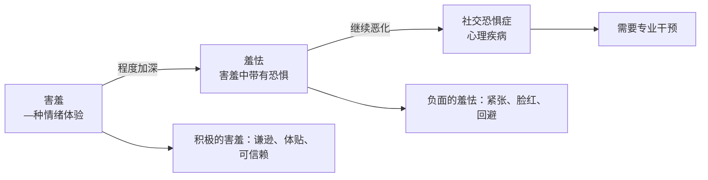
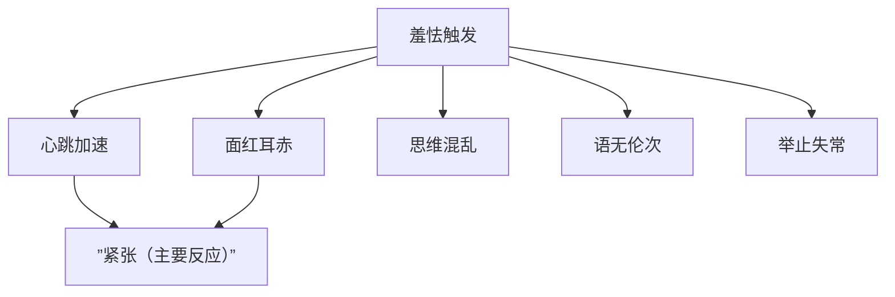

# 第11课：羞怯：为什么害羞的人反而容易成功

## 开头引入

在一般人看来，害羞似乎是一种"弱点"——不敢说话、容易脸红、不擅社交。然而，美国《人格与社会心理学杂志》最近刊登的一项研究报告发现：**害羞的人更可靠、更慷慨，对伴侣和朋友也更忠诚。**

德国著名现象学哲学家**马克思·塞勒**在《害羞及羞感》的论文中指出：

> **羞涩是爱的良心，是人性中最高尚和最有价值力量的内在感情。**

这一课，我们将重新认识害羞的真相——它可能不是你想象的弱点，而是一种被严重低估的优势。

---

## 核心概念：害羞 ≠ 羞怯

| 层次 | 特征 | 表现 |
|------|------|------|
| **害羞** | 一种情绪体验，天然的情感反应 | 含蓄、脸红、谦逊 |
| **羞怯** | 害羞中带有**恐惧**成分 | 心跳加速、面红耳赤、思维混乱、语无伦次 |
| **社交恐惧症** | 达到临床诊断标准的心理疾病 | 严重回避社交、影响正常生活 |

---

## 为什么中国人更容易害羞？

美国著名心理学家**菲利普·金巴多教授**从1972年开始研究害羞。他的研究小组发现：

- 在人类所有族群中，害羞的情绪体验在**亚裔美国人**中尤为普遍
- 一项研究认为**60%的中国人和日本人**认为自己经常有害羞的体验

原因在于**亚洲文化**中，害羞往往被当作一种**美德**：

> 晚辈对长辈的尊敬，谦逊和低调的举止，体现的是人们更愿意成为团体中的一员的倾向性，而不是追求与众不同的倾向性。

孟子曾经提出：**"羞恶之心，义之端也"**——也就是说，一个人懂得不好意思、懂得害羞，就是实行仁义的开始。

> [!tip] 害羞的文化价值
> 一个害羞的人，不会随地吐痰、不会乱扔垃圾、不会随意违反交通规则——因为他在意别人的感受，在意别人的看法。

---

## 害羞的积极力量

### 1. 让人怜爱——示弱的魅力

彭凯平教授在伯克利加州大学的同事**卡特勒教授**发现：

- **脸红的男性**更容易被讨论、喜欢——特别是能够引起女性的喜爱
- **害羞的女性**更容易让人怜爱

> [!quote] 黑奴贸易中的意外发现
> 始于15世纪的黑奴贸易是人类历史上四大至暗时刻之一。学者们在研究这段历史时意外发现，犹太商人记录黑奴交易的账本显示：**那些害羞脸红、不好意思的黑奴，价格明显要高于别的奴隶。**
>
> 从这个意义上说，"最是你一低头的温柔"还真的有些科学道理——核心就是**害羞显得柔弱，能唤起人们的怜爱之心**。人类本能就不太喜欢太强势的人。

### 2. 更容易成为行业佼佼者

斯坦福大学的心理学教授**泰勒**发现：

> 爱害羞的人对社交有一种恐惧感，他们自然而然喜欢脱离大众，或自身缺乏社会的存在感——但这些缺点，其实也可能是一种优势。

害羞者的优势：
- **更容易投入到自己感兴趣的事物中**
- **更加坚定自己的选择**
- **更不容易被外界干扰**
- **更有同理心**——开朗的人关注点容易聚焦在自我身上，而害羞的人容易顾及他人的感受
- **更加兼顾整体和大局**——开朗的人习惯于以自我为中心

### 3. 孔子的例子

孔子的学生遍布天下，但他最喜欢的反而是**害羞的颜回**。并不是因为颜回害羞才喜欢他，而是因为颜回羞涩腼腆的性格使他显得特别**虚心、刻苦、努力**，还能够**安贫乐道**。

---

## 羞怯的负面影响

### 羞怯的生理反应

羞怯者能感受到明显的生理变化：

### 羞怯的恶性循环

金巴多教授的研究表明，大多数受访者希望自己不要那么害羞——因为爱害羞的人往往会压抑自己的想法、感觉和行动。

> 在公众面前，爱害羞的人可能看上去十分镇定——但在他们的内心世界，就像一条复杂的高速公路，拥挤混乱，到处充满着情感碰撞和被压抑的欲望。

羞怯会让人们陷入社交失败的恶性循环：

1. 害怕外界不好的评价 → 回避社交
2. 一开始觉得松了一口气 → 反复如此
3. 陷入羞愧和自责 → 演变成对他人的愤怒和责备
4. 更加回避他人 → 情绪和社交问题逐渐加重

---

## 关键方法：如何克服羞怯

### 方法一：识别内心的自我批判

羞怯的人往往对自己相当严格，经常质疑、批判自己。一个小小的失误，他们会在内心"复盘"好几遍。

> 同事和自己打招呼时自己没好意思回应，事后就在内心不断复盘："我为什么不能很自然地打个招呼？同事肯定会认为我特别没有礼貌……"

**改变方法**：当内心的声音又开始批判自己时，试着为自己辩护——"一次小小的失误并不是什么大事，我依旧是一个有价值的、值得被大家喜爱的人。"

### 方法二：承认自己是害羞的人

加利福尼亚大学心理学家**苏尼亚·纽布明斯基**做过一项前所未有的研究：如果让一个十分内向害羞的人去假装外向开朗，会带来**情绪衰竭**的感觉。

> **掩藏问题往往适得其反。承认自己是个害羞的人，并尝试理解自己的一些羞怯的行为，可以帮助我们减少对自己的批评和不自信。**

### 方法三：环境和训练可以改变性格

很多人把羞怯等同于性格上的问题——认为是内向造成的，无法改变。彭凯平教授对此持完全相反的态度：

> **人是可以终身成长的，性格是可以塑造的，情绪管理是可以做到的。**

推销员、人力资源经理、演员、老师——这些人们普遍认为外向的人才能胜任的职业，实际上很多从业者是**内向的人**。为什么能胜任？因为**职业训练的作用**。

> [!warning] 彭凯平教授的亲身经历
> 我自己就是一个内向的人。我喜欢一个人看书，喜欢独处。但我的职业要求我必须见很多人、做很多事、说很多话，不能让自己被害羞困扰。长期的职业训练让我看起来游刃有余——我不是掩饰自己的羞涩，而是习惯成自然，已经不让自己在工作中感受到害羞的情绪体验了。**环境塑造人。**

---

## 自检练习

> [!question] 自检一：你的害羞属于哪个层次？
> 回想一下你在社交场合中的表现，看看自己处于哪个层次：
> 1. **健康害羞**：在陌生人面前会有些不自在，但很快能调整过来
> 2. **明显羞怯**：经常心跳加速、脸红、思维混乱，想要逃离社交场合
> 3. **社交恐惧**：严重回避社交，已经影响到正常的工作和生活

改善建议

- 如果处于**层次1**：恭喜你，你的害羞是一种魅力——保持就好
- 如果处于**层次2**：建议逐步暴露法——从低压力社交开始，逐步增加社交频率，允许自己有"不完美"的表现
- 如果处于**层次3**：建议寻求专业心理咨询的帮助

记住：**性格不能决定你的命运，你的学习、你的成长、你的奋斗，才是决定你命运的因素。努力决定命运。**

> [!question] 自检二：尝试"承认练习"
> 下次在社交场合感到害羞时，试着在心里对自己说：
> "我是有一点害羞，但这没关系。我不需要假装外向。我只需要做好我自己。"
>
> 观察这样做之后，你的焦虑水平有什么变化？

背后的心理学原理

当我们**压抑**自己的真实感受时，需要消耗大量的心理能量——这就是为什么假装外向会让人情绪衰竭。而当我们**承认并接纳**自己的害羞时，反而释放了这股被消耗的能量，让我们更从容地应对社交场合。

研究也证实，害羞的人的专业能力、忠诚度和同理心往往更高——这些品质在长期关系中比"外向"更有价值。

---

## 小结

| 核心要点 | 关键信息 |
|---------|---------|
| 害羞 ≠ 羞怯 | 害羞是情绪体验，羞怯是害羞+恐惧 |
| 文化差异 | 亚洲文化中害羞被视为美德，60%中日人有害羞体验 |
| 害羞的优势 | 让人怜爱、更专注、更坚定、更有同理心 |
| 羞怯的恶性循环 | 回避社交 → 自责 → 进一步回避 |
| 克服方法 | 停止自我批判、承认害羞、职业训练可以改变 |
| 终极信念 | **性格不决定命运，努力决定命运** |

> [!tip] 告别偏见
> 最优秀的人，一定是能够改变自己的人。克服羞怯，拿出勇气去积极改变，比一味寻求改变的具体方法可能更有意义。**害羞不是缺陷，而是被人低估的优势。**

[[reference/glossary]] | [[reference/emotion-strategies]]