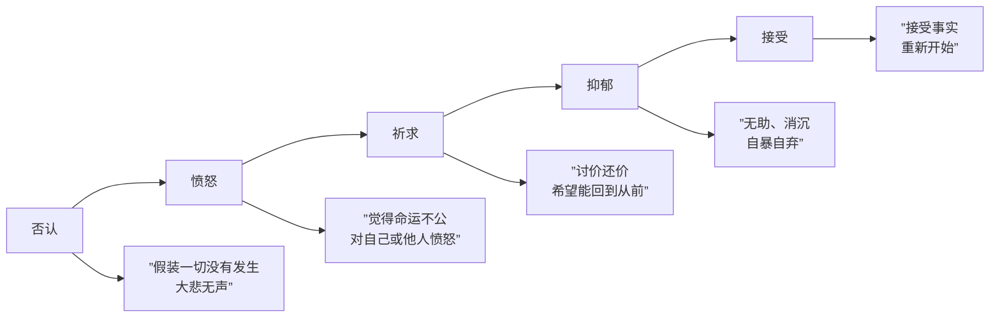

# 第12课：悲伤：为什么表达悲伤反而容易获得他人帮助

## 开头引入

一位网友分享了自己的经历：在至亲离世时，她不哭也不悲，表现得异常平静。没想到，这引起了很多网友的共鸣——很多人都有类似的经历。

这是怎么回事？这其实是将自己的悲伤**隐藏**起来了。

心理学家把悲伤定义为一种**情绪上的苦痛**。造成悲伤的原因多种多样——最常见的就是失去我们重视的人和物：被朋友和爱人拒绝、生离死别、事情没有达到预期效果。所谓"人生不如意，十有八九"，说的就是人类的这种普遍状况。

但悲伤真的只有负面作用吗？为什么伤感的音乐会如此受欢迎？为什么表达悲伤反而能获得他人的帮助？这一课将带你发现悲伤被低估的积极价值。

---

## 核心概念：悲伤的五个阶段

20世纪全球百大思想家之一、美国心理学家**伊丽莎白·库伯勒·罗斯**将悲伤分为五个阶段：

> [!warning] 重要说明
> 这五个阶段**不一定按特定顺序发生**，我们也不一定会经历其中所有阶段——但每个人至少会经历其中两个阶段。

### 各阶段详解

#### 第一阶段：否认
因为无法接受甚至意识到失去，人们会逃避现实，假装那个人还在。在中国文化里，葬礼上的大哭已经成为生者对死者尊敬的最低标准——如果一个人在父母葬礼上没有一滴眼泪，就会被认为不孝顺。

但心理学研究发现：**一个人没有表现出悲伤的情绪，并不能说明他对死者不敬。** 实际上这是一种**心理自我防御机制**——在最痛苦的时候，机体会自动启动一种保护机制，把极端痛苦的情绪隐藏起来，以免因承担不了这种痛苦而崩溃。

> 中国人常说的"大悲无声"就是这个道理。

#### 第二阶段：愤怒
现实的痛苦慢慢浮现。人们可能会觉得命运不公平，也可能会对他们感到愤怒，甚至对自己感到愤怒，恨自己无能为力。

#### 第三阶段：祈求
人们会想方设法，努力挽救，希望一切如旧。"如果能回到从前该有多好……"人们希望通过某种协议去换回离去的爱人，回到悲剧发生以前。

#### 第四阶段：抑郁
这是最难的一关。人们知道做什么都无力回天，痛苦加倍袭来，再也没有任何理由逃避——变得非常脆弱、消沉、自暴自弃，像所有的希望和憧憬全部毁灭了。

#### 第五阶段：接受
终于接受丧失的事实，学会放下，重新开始新的生活。

---

## 悲伤 vs 抑郁

| 维度 | 悲伤 | 抑郁 |
|------|------|------|
| 原因 | 通常有明确的原因 | 常常不知道为什么 |
| 对未来的态度 | 怀有希望，会想方设法走出来 | 心理绝望，走不出心灵的黑暗 |
| 情绪波动 | 波浪式起伏，有正面回忆 | 恒定不愉快的体验 |
| 回忆性质 | 含有正面回忆——亲人去世虽悲伤，但会想起甜蜜的往事 | 缺乏这种正面回忆的缓冲 |

---

## 科学依据：悲伤的积极价值

### 1. 负面情绪可以改善判断力

斯坦福大学心理学家**Janny Scheid**提出的**情绪价值理论**认为，悲伤具有很多积极的价值。

澳大利亚新南威尔士大学的研究小组进行了多次试验：先让人通过看电影和回忆事件来产生积极或悲伤的情绪，然后要求他们判断谣言的真实性。结果：

> **带有负面情绪的人，更不容易相信流言蜚语。悲伤的人更善于审视自己的情况。**

这意味着温和的负面情绪实际上可能会带来更随和、更成功的交流方式，提高判断力和记忆力，使人更不容易上当。

### 2. 流泪是社会沟通的有效信号

以色列特拉维夫大学进化心理学家**艾伦·哈森**的研究发表在《进化心理学》杂志上：

> 人流泪的时候，其实是向他人宣布自己**降低了防御水平**。泪眼朦胧可以阻碍他人针对自己发起攻击的行为——人落泪可以表现出自己的脆弱，而这种脆弱的信息往往让别人产生信任，成为拉近自己和他人距离的**情感战略**。

| 流泪的功能 | 效果 |
|-----------|------|
| 降低防御信号 | 让他人觉得你无害，激发保护欲 |
| 脆弱展示 | 引发同情心、信任感 |
| 情感连接 | 拉近人与人之间的距离 |

> 想象一下，当一个异性在你面前悲伤哭泣，你会忍不住释放自己柔软的一面，甚至想要亲身安慰对方。对男人来说，这是典型的个人英雄主义；对女性来说，男人的哭泣更容易激发他们展现母性的光辉。

### 3. 悲伤音乐的治愈力量

2014年《网络科学杂志》PLOS ONE发表了**哥洛夫**和**凯尔奇**的研究《伤感音乐的矛盾效应》：

- 他们调查了772名来自不同文化、不同年龄、不同社会阶层的参与者
- 参与者总结了76条听伤感音乐的体验
- 结果发现：听伤感音乐时最频繁出现的情绪**不是悲伤或抑郁，而是怀旧**

> 伤感音乐触发的是**同情心、同理心、以及关心他人和理解他人的社会冲动**。

| 旧的认知 | 新的研究发现 |
|---------|-------------|
| 伤感音乐让人更悲伤 | 伤感音乐激发的是**怀旧**情绪 |
| 伤感音乐让人独自承受痛苦 | 伤感音乐让人**分担**共同的情感 |
| 伤感音乐加深抑郁 | 伤感音乐触发**同理心和社会连接** |

这就是为什么埃尔顿·约翰的《风中之烛》在戴安娜王妃去世后能够传遍世界——它让全球的粉丝共同分担这份痛苦，而不是一个人独自承受。

---

## 关键方法：如何调节悲伤

### 听伤感音乐——一个推荐的方法

对于时运不济、人生坎坷甚至有些悲伤的人，听一些伤感的音乐反而有**正面的情绪调节作用**。它能帮你连接到他人类似的感受，产生一种"我不是唯一的伤心人"的安慰感。

当然，对于生活基本快乐的人，还是建议多听一些欢快的音乐。

### 表达悲伤——而非隐藏

基于上述科学研究，适当的表达悲伤可以：
- 获得他人的同情、关怀和帮助
- 产生亲近的感受
- 释放被压抑的情绪

> [!warning] 注意适度
> **过度的悲伤表现容易让人退避三舍**。悲伤的情绪需要调节和控制，长期处于悲伤状态可能会对身心造成创伤，其中一个可能的后果就是抑郁症。

---

## 自检练习

> [!question] 自检一：你在悲伤的哪个阶段？
> 回想最近一次让你感到悲伤的失去（可能是亲人的离世、一段关系的结束、或一个重要机会的丧失），你现在处于库伯勒·罗斯五阶段模型中的哪一阶段？
> - 否认？愤怒？祈求？抑郁？还是已经接受？

解读

无论你处在哪个阶段，都是正常的。每个人的经历不同，**不要轻易批评或指责一个人面对悲伤的方式**——包括你自己。

如果你发现自己在某个阶段"卡住"了（特别是长时间停留在抑郁阶段），可能需要寻求专业帮助。了解这五个阶段的目的，是帮助你了解自己目前所处的处境，以便更好地帮助自己和亲友处理悲伤。

> [!question] 自检二：你有多久没有释放悲伤了？
> 回想一下：
> 1. 你上一次让自己痛快地哭一场是什么时候？
> 2. 你是否曾在他人面前隐藏悲伤，表现得"没事"？
> 3. 你有自己的"悲伤仪式"吗——比如听一首特定的歌、看一部电影、或找个地方独处？

建议

在安全的环境中允许自己表达悲伤，是一种健康的情绪管理方式。你可以：

1. **建立一个"悲伤容器"**：设定一个安全的时间和空间（比如周末晚上，在自己的房间），允许自己完全释放情绪
2. **选择合适的音乐**：伤感音乐可以帮你连接情感，促进释放
3. **信任的人倾诉**：表达悲伤能拉近你和他人的距离
4. **写下来**：把悲伤写出来，能让你从旁观者角度审视自己的情绪

记住斯坦福大学的研究：**允许自己悲伤，反而会提升你的判断力和思考质量**——悲伤不是软弱，而是一种智慧的情感信号。

---

## 小结

| 核心要点 | 关键信息 |
|---------|---------|
| 悲伤的五阶段 | 否认 → 愤怒 → 祈求 → 抑郁 → 接受 |
| 悲伤 vs 抑郁 | 悲伤有明确原因、有正面回忆、有希望；抑郁是无望的恒定状态 |
| 悲伤的积极价值 | 提升判断力、防止上当、促进社会连接 |
| 流泪的功能 | 降低防御信号、引发同情、拉近距离 |
| 伤感音乐的效用 | 激发怀旧和同理心，而非加深悲伤 |
| 调节原则 | 适当表达可获得帮助，过度表达会让人退避 |

> [!tip] 一句话总结
**悲伤不是弱点，而是一种社会沟通的有效信号。** 适当地表达悲伤可以帮助我们获得同情、关怀和帮助——这不仅不可耻，反而是一种保护自己的智慧。

[[reference/glossary]] | [[reference/emotion-strategies]]