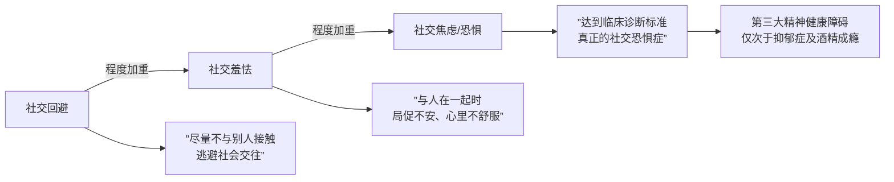
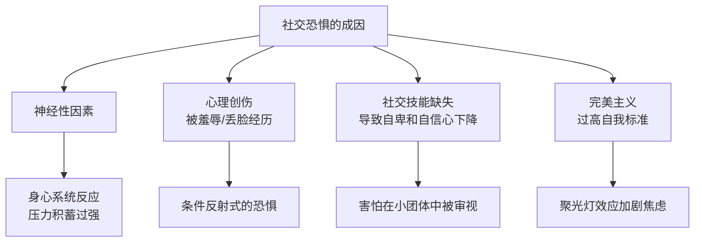

# 第13课：社恐：为什么说是完美主义在作祟

## 开头引入

参加聚会的时候，如果你感觉心跳加速，像是有只怪兽在你身边——那么你就有一定程度的**社交恐惧**。

彭凯平教授的一个学生曾这样描述自己的社交恐惧症状：

> 在学校的时候，特别害怕老师问我回答问题——即使我知道答案，我也害怕。我怕别人觉得我很傻，或者说的话无聊、无趣。我甚至心跳会加快，头晕恶心。工作之后，我特别害怕见领导，朋友聚会也不敢发言，甚至都不想参加好朋友的婚礼，因为害怕见到陌生人。

这种现象不光中国人有，其他国家人也——日本心理学家将这种社交恐惧称为**"恐人症"**。

---

## 核心概念：社交恐惧的三个层次

**社交恐惧的表现形式，完全体现在回避社会接触的程度。**

值得注意的是：**社交恐惧和羞怯不完全一样**。羞怯的极端才是社交恐惧——社交恐惧在某种程度上是羞怯不断恶化的结果。

---

## 社交恐惧的典型症状

| 维度 | 具体表现 |
|------|---------|
| 情绪 | 与别人接触时感到手足无措、面红耳赤、担心大脑一片空白 |
| 生理 | 全身出汗、发抖、心跳加快、恶心、肚子疼 |
| 行为 | 身体僵硬、避免眼神接触、说话断断续续、对人群感到厌烦 |
| 认知 | 经常担心别人会评价自己，渴望躲在自己的小空间里 |

### 社交回避 ≠ 社交恐惧

彭凯平教授指出，很多时候我们并不是真的恐惧，而是一种**理智的回避**：

- "有时候我在街上看见个熟人，内心觉得和他没什么要谈的，宁愿慢走几步避免碰面"
- "等电梯时如果遇到领导，宁可多等一会儿等下趟电梯，也不愿意和领导一起上楼"

这类行为**并不是真正的社交恐惧，只是社交回避的一个借口**。

| 社交回避 | 社交恐惧症 |
|---------|-----------|
| 理性选择，不想在无效社交上浪费时间 | 无法控制的强烈焦虑 |
| 是一种自我保护和价值选择 | 是一种心理疾病 |
| 想做时仍可以做 | 想做但做不到，内心极为痛苦 |

### "宅" ≠ 社交恐惧

还有一种行为常被误解为社交恐惧——**宅**。这类人不太愿意见人，不太愿意参加聚会，更不愿意发言讲话。但这类行为的原因可能是喜欢独处，或是没有见人的欲望。如果你把他带出去见人，他并不需要克服种种困难就能与人建立友谊——这并不存在所谓的社交障碍。

> **"宅"只是低欲望造成的，或者是在另外一个地方找到了更高的欲望和激情。**

---

## 核心成因：完美主义 + 聚光灯效应

### 为什么说完美主义在作祟？

社会心理学认为，**社交恐惧的核心成因是过高的自我标准——也就是追求完美。**

社恐的人总是担心自己会在他人面前出丑，对社交情境感到极度焦虑。他们总是想表现得很好，认为这样才是"理想的我"该有的样子——**不能出错，出错了就会破坏这个形象。**

> 就好像有一只聚光灯照在他们头上，所有的眼睛都在盯着他们。

### 聚光灯效应

1999年，美国康奈尔大学的心理学教授**汤姆·吉勒维奇**、**肯尼斯·萨瓦斯基**和**维多利亚·麦维奇**发现了**聚光灯效应**——人总有一个误解，总觉得自己是万众瞩目的焦点，别人一定会关注自己的一举一动。

**实验设计：**
1. 让康奈尔大学的学生穿上印有歌手Barry Manilow头像的T恤
2. 走进有其他学生的教室
3. 询问他们："你觉得刚才大家都注意到你了没有？"

**结果：**
- 学生回答："肯定注意到了啊，这件衣服这么难看！至少有一半的学生会注意到"
- 实际上，**全班只有23%的同学注意到了**

彭凯平教授在课堂上做过类似的实验：
> 第一堂课我戴了一副眼镜，第二堂课换了一副。课程结束时问学生——"刚才两节课，我的眼镜换了没有？"绝大多数学生都说没注意到。明明盯着我的脸听了三个小时的课，却没注意到我换了眼镜——**因为学生关注的是我讲的内容对TA有没有意义、有没有价值、有没有触动，而不是我戴什么眼镜。**

这就是聚光灯效应：**我们总以为别人关注我们，其实别人更关注的是他自己的体验和收获。**

---

## 社交恐惧的多重成因

心理学界对社恐的成因有各种解读：

### 长期社交回避的恶性循环

麻省理工学院的心理学家通过设计精巧的实验和脑部成像技术发现：

> 当人们长时间缺乏跟其他人进行社交时，会在大脑引起跟**饥饿**非常相似的反应——焦虑、不安、恐慌。久而久之，可能会导致中脑多巴胺神经元的失调，更难产生足够的多巴胺，更需要外在刺激和反馈（如打游戏、刷剧等短期刺激娱乐）。

麻省理工学院的社会学教授在《群体性孤独》中指出：数字化技术为人们提供了陪伴——但这只是一种**虚幻的陪伴**，沉浸其中越多，在现实中越找不到亲密的感受。

长期躲避社交的人，大脑中分泌的神经化学物质会有所改变，导致性格变得**敏感多疑**、**越来越胆小**、**也越来越暴躁**。

---

## 关键方法：从社交恐惧到社交舒适

### 方法一：瞬间缓解法

在社交场合感到强烈焦虑时，可以尝试以下方法：

| 方法 | 具体操作 | 原理 |
|------|---------|------|
| 深呼吸 | 猛吸一口凉气，缓慢呼出 | 激活副交感神经，降低心率 |
| 抚摸身体 | 轻轻抚摸胸口或手臂 | 触觉安抚，缓解紧张 |
| 正念冥想 | 专注当下的呼吸和感受 | 打断焦虑的思维循环 |

### 方法二：建立良好的社会关系

社会心理学几十年的科学结论是：**我们每个人和其他人建立关系的能力，其实比我们想象的要强烈一些。因为人类的社交天性，是我们的本能。**

如何发现那些容易让我们建立社会关系的人？

1. **从身边开始**：从亲人开始，从熟悉的人开始
2. **增加相似性、熟悉性**："不是一家人，不进一家门"——我们喜欢和我们相似的人
3. **增加曝光度**：经常和别人在一起，让对方熟悉你
4. **让自己变得有帮助**：对别人有意义、有帮助，是建立关系的简单技巧

> **无论是价值观念、幽默风格、为人处事的技巧，还是共同的家庭背景、生活习惯——都可以让我们成为彼此喜欢的人。**

---

## 自检练习

> [!question] 自检一：你的"社交恐惧"是哪种？
> 以下描述中，哪一条最符合你？
> - A. 我只是不想参加无意义的社交，但如果我愿意，我可以做得很好
> - B. 我有点害羞，在陌生人面前会紧张，但能克服
> - C. 我害怕社交，在人群中会心跳加速、出汗、想逃——我知道这不合理，但我控制不了

解读

- 选**A**：你这是**社交回避**，是理性选择，不是社恐
- 选**B**：你这是**害羞或轻度的羞怯**，可以通过增加社交频率来改善
- 选**C**：可能接近**社交恐惧症**，建议寻求专业心理咨询

**关键区分**：真正的社恐是"想做但做不到，内心极为痛苦"。如果你只是不想做，那完全正常。

> [!question] 自检二：聚光灯效应挑战
> 回忆一次你在社交场合中"出丑"的经历（说错话、做错事、脸红等）。请如实回答：
> 1. 当时你感觉有多少人注意到了你的"出丑"？
> 2. 一周后，还有多少人记得这个"出丑"事件？
> 3. 一个月后呢？

答案揭示

如果你诚实回答，你会发现一个残酷又令人释怀的真相：**你所谓的"出丑"，其实根本没有几个人注意到——即使注意到了，也很快就忘记了。**

因为别人的注意力，一直都在他们自己身上。这就是**聚光灯效应**的魔力——它让我们高估了自己在别人眼中的重要性。

所以，下次在社交场合感到紧张时，请提醒自己：
- **没有人拿着放大镜看你**
- **别人更关心的是自己的事情**
- **即使出了点小错，世界也不会因此而崩塌**

这就是缓解社交恐惧最简单、也最有力的认知武器。

---

## 小结

| 核心要点 | 关键信息 |
|---------|---------|
| 社恐的三个层次 | 社交回避 → 社交羞怯 → 社交恐惧症 |
| 社交回避 ≠ 社恐 | 理性回避是有价值的自我选择 |
| "宅" ≠ 社恐 | 宅可能是低欲望，不是障碍 |
| 核心成因 | 完美主义 + 聚光灯效应 |
| 聚光灯效应 | 我们高估了他人对自己的关注（实际仅23%）| 
| 长期回避的后果 | 大脑化学物质改变，变得更敏感、更退缩 |
| 克服方法 | 深呼吸/冥想缓解焦虑 + 逐步建立关系 |

> [!tip] 最后一句话
**社交恐惧不可怕，它是有办法去战胜和克服的。** 关键在于认识到：你的观众没有你想的那么多，你的"出丑"没有你想的那么重要——放下完美主义的包袱，你才能在社交中真正做自己。

[[reference/glossary]] | [[reference/emotion-strategies]]