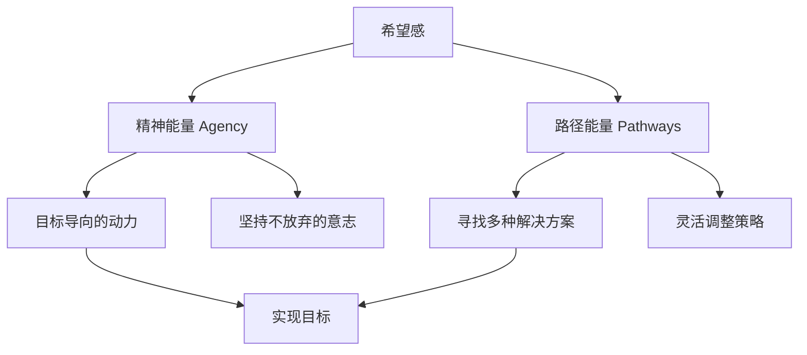

# 第14课：希望：为什么希望能治疗心病？

## 开头引入

你有没有过这样的时刻：觉得生活暗淡无光，做什么都提不起劲，好像所有的努力都是徒劳？有一位富豪，家财万贯，在心理学的问卷上却只写了一句话："我没有任何希望，除了长生不老之外，我所有的希望都已经满足了。"调查发现，这位富豪其实患有严重的抑郁症。

这个案例揭示了一个深刻的心理学真相：**希望感不是奢侈品，而是心理健康的必需品。** 无论拥有多少财富，一旦失去希望，心灵就会生病。那么，希望到底是什么？它为什么拥有治愈人心的力量？

## 核心概念：希望感理论

心理学家史奈德（C. R. Snyder）提出了著名的**希望感理论**。他认为，希望不是一种被动的、静态的期待，而是一种**动态的认知动机系统**。他将希望定义为：

> [!quote] 史奈德的定义
> 希望是个体追求目标时拥有的**精神能量**与**路径能量**的总和。

- **精神能量（Agency）**：也称为"意志力"，是推动个体实现目标的情绪动力。它回答的是"我有没有动力去追求？"
- **路径能量（Pathways）**：代表实现目标的思维计划和路线图。它回答的是"我有没有办法达成？"

这两者缺一不可。只有动力没有方法，是盲目的热情；只有方法没有动力，是空想。

### 希望 vs 乐观

希望和乐观虽然相似，但有着本质区别：

| 维度 | 希望 | 乐观 |
|------|------|------|
| 核心 | 个人对结果的控制与行动 | 对未来的积极预期 |
| 主动性 | 强调主观能动性 | 偏向被动期待 |
| 预测力 | 更能预测学业/工作成就 | 一般性积极心态 |
| 理论来源 | 史奈德认知动机理论 | 普遍期待理论 |

心理学家凯文·伦道夫发现，希望感比乐观更能预测学生的学业成绩，甚至比法学入学考试的成绩更能预测学生在法学院的最终学习成果。

## 关键方法：培养希望感的四步行动方案

史奈德教授给出了一个可操作的实施方案：

### 第一步：培养目标导向思维——SMART原则

目标要遵循SMART原则：

| 字母 | 含义 | 示例 |
|------|------|------|
| S - Specific | 具体 | 不是"我要减肥"，而是"我要减重5公斤" |
| M - Measurable | 可测量 | 有明确的量化标准 |
| A - Achievable | 可实现 | 有挑战但不至于遥不可及 |
| R - Relevant | 相关 | 与个人价值观一致 |
| T - Time-bound | 有时效 | 设定明确的截止日期 |

最好的目标，是那些"可以实现，但又不是那么容易实现"的目标。

### 第二步：找到成功的方法

相信自己一定能找到实现目标的路径。创造力强的人往往更有希望感，因为他们的发散性思维更强，能够找到多种解决方案。设定了目标之后，不妨问自己：**我能想到几种实现目标的路径？** 然后选择最可能成功的那一条去执行。

### 第三步：落实具体行动

心动不如行动。希望感理论特别强调**主观能动性**，任何希望都必须通过具体的行动来体现。

### 第四步：做好时间管理

对希望感影响最大的因素通常是时间不够。养成习惯是节省时间精力的好方法——当行为变成习惯，既省时又省力，还能节省心力。学会对不重要的事情说"不"，把精力集中在真正重要的目标上。

## 经典效应：罗森塔尔效应

1968年，哈佛大学心理学教授罗森塔尔在美国一所普通小学进行了一项影响全球的实验。他先对全校学生进行"智力测试"，然后随机抽取了一些学生的名单，郑重地告诉老师们：**这些学生是最有发展潜力的。**

一个学期后，罗森塔尔回到学校，惊喜地发现名单上的学生不仅在成绩和智力上进步明显，在各个方面都有了显著提升。

> [!tip] 期望的力量
> 老师因为相信名单上的学生"出类拔萃"，在日常教学中无意识地对这些学生报以更高的期望——通过语气、提问方式、肢体语言等传递了积极的信号。学生接收到这些信息后，朝着老师期望的方向重塑自我，产生了神奇的**希望效应**。

这个效应告诉我们：**别人对我们的期望会影响我们的行为，而我们对自己的期望同样会产生巨大的积极作用。**

## 科学依据：希望感的研究证据

心理学家对希望感进行了广泛的研究，让被试回答"你的希望有哪些"，结果发现：

- **希望种类越多的人**：更加自信、关注生活乐趣、精力充沛
- **没有或很少希望的人**：冷漠、悲观、消极，容易陷入**习得性无助**

研究还发现，希望感强的人：

1. **学业成绩更好**，获得的学位更高
2. **智商更高**，发散性思维更强
3. **记忆力更积极**——更多记住正面评论和正面事件
4. **自尊水平更高**，对目标充满激情而非恐惧
5. **健康水平更高**——对痛苦有更高的容忍度
   - 脊髓受伤或烧伤的青少年，希望感强者康复更快
   - 癌症患者希望感强，更愿意主动寻找治疗知识

## 自检练习

> [!question] 反思练习
> 回想一下，你目前生活中最重要的三个目标是什么？请用SMART原则重新审视它们——它们够具体吗？可测量吗？有没有明确的截止日期？除此之外，针对每个目标，你能列出至少三条不同的实现路径吗？

思考提示

SMART原则的应用示例：
- 如果你的目标是"学好英语"，可以具体化为"在三个月内通过雅思6.5分，每天背50个单词，每周完成一套真题"
- 实现路径可以是：报培训班、找语伴、使用App自学、看英文原版电影等

记住：关键在于同时拥有"动力"和"路径"——缺一不可。

> [!question] 深度反思
> 你最近是否因为某个挫折而产生了"习得性无助"的感觉？你觉得自己在"精神能量"和"路径能量"上，哪个方面更需要加强？

自我诊断

- 如果你**有目标但不知如何下手**：你可能需要加强"路径能量"——多收集信息、请教他人、探索不同方法
- 如果你**知道方法但缺乏动力**：你可能需要加强"精神能量"——回想这个目标对你的意义，从小的进步中获得激励
- 如果两者都缺乏：从最小的、最容易实现的目标开始，先建立"希望的微习惯"

## 小结

希望不是虚无缥缈的心灵鸡汤，而是一个**可测量、可培养的认知动机系统**。它包含精神能量与路径能量两大要素，缺一不可。通过罗森塔尔效应我们看到，期望不仅能改变他人，更能改变自己。从今天开始，设定一个具体的、可实现的SMART目标，找到多条实现路径，立即行动，并做好时间管理——你会发现，希望感本身就是一剂治愈心病的良药。