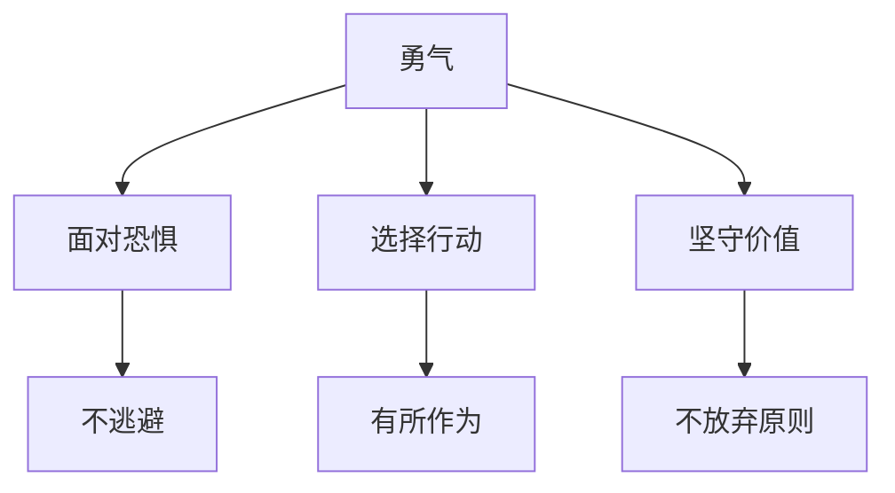

# 第16课：勇气：如何让自己勇敢些？

## 开头引入

你有过这样的经历吗？在会议上想发表不同意见，但话到嘴边又咽了回去；看到不公平的事情，心里愤怒却不敢站出来；想换一份更有挑战的工作，却因为害怕失败而退缩。

我们常常以为，"勇敢"就是天不怕地不怕。但心理学告诉我们：**真正的勇气不是没有恐惧，而是面对恐惧时依然选择行动。** 诚如英国前首相丘吉尔所说："勇气是人类最重要的一种特质，倘若有了勇气，人类其他的特质自然也就具备了。"

## 核心概念：大勇与小勇

### 中国古代的智慧

孟子提出了著名的大勇与小勇之说：

| 类型 | 含义 | 特征 |
|------|------|------|
| **小勇（匹夫之勇）** | 血气的冲动 | 逞强好胜、得理不饶人、冲动易怒 |
| **大勇（君子之勇）** | 心怀天下的气度 | 气度大、胸襟广、浩然正气、从善如流 |

心学宗师王阳明认为，真正的勇敢不是胜过他人，而是战胜自己的私欲："凡人言语正到快意时，便截然能忍默得；意气正到发扬时，便翕然能收敛得；愤怒私欲最沸腾时，便廓然能消化得——此非天下之大勇者不能也。"

### 心理学的定义

积极心理学将勇气定义为：**人们在面对困难时，表现出来的以坚守、进取、突破等为特点的积极心理品质。**



#### 三种勇气类型

美国威斯康辛大学的普特曼教授把勇气分为三类：

| 类型 | 克服的恐惧 | 表现 |
|------|-----------|------|
| **生理勇气** | 对生理死亡的恐惧（身体痛苦） | 面对危险挺身而出 |
| **道义勇气** | 对社会死亡的恐惧（被群体抛弃） | 遭受非议时坚守道义 |
| **心理勇气** | 对心理死亡的恐惧（失去稳定感、控制感） | 面对否定时坚持己见 |

在现实生活中，这三种勇气往往是相互交织的。

## 勇气的六大美德优势

塞利格曼团队从全球哲学、宗教和文化体系中分析出六大美德，其中与勇气相关的优势包括：

| 优势 | 描述 |
|------|------|
| **勇敢** | 面对强烈反对时捍卫立场，据理力争 |
| **坚韧** | 坚持完成任务，不轻言放弃 |
| **正直** | 获得别人信任，值得托付秘密 |
| **活力** | 热情洋溢、活力四射，感染身边的人 |

## 关键方法：勇气是可以后天习得的

塞利格曼教授在1967年做了著名的**习得性无助实验**。他把狗关在笼子里，每次蜂鸣器一响就给予电击。多次实验后，即使笼门已经打开，狗也不再逃跑，而是倒在地上呻吟颤抖——它"学会"了无助。

> [!quote] 重要的发现
> 但塞利格曼和他的团队发现，**并非所有的狗都陷入了习得性无助**——将近三分之一的狗在困境中依然积极尝试逃生，即使改变实验环境，这些狗仍然坚持不懈。这说明：**摆脱习得性无助是可以后天学习的。**

塞利格曼本人正是通过不断的尝试和练习，逐渐让自己变得积极、乐观、大方。勇气不是天生的人格特质，而是一种可以被培养的能力。

### 三个"I"策略——抗逆力训练法

国际抗逆力研究最常用的培训方法，被称为"三个I策略"：

```mermaid
graph LR
    subgraph ”三个I策略”
        A[I Have 我有] --> D[外在支持与资源]
        B[I Am 我是] --> E[内在力量与信念]
        C[I Can 我能] --> F[人际与解决问题能力]
    end
    D --> G[勇气]
    E --> G
    F --> G
```

| 维度 | 含义 | 具体做法 |
|------|------|----------|
| **I Have（我有）** | 外在支持与资源 | 主动挖掘朋友、家人、师长的支持；提升安全感和受保护感 |
| **I Am（我是）** | 内在感觉与信念 | 发现自己的态度、信念等内在力量，建立积极的自我观念 |
| **I Can（我能）** | 人际与解决问题能力 | 培养创造力、恒心、幽默感、沟通能力等 |

当一个人拥有足够的自信、较高的自尊水平、积极的自我观念时，他就能更好地应对生活中的逆境。**当内部资源不够时，就会感到痛苦，让人觉得"没有勇气"。**

## 真实案例：彭凯平教授的至暗时刻

彭凯平教授分享了自己在美国求学时的亲身经历：

> [!quote] 彭凯平的故事
> 我当年申请到美国密歇根大学的offer，但对方表示没有经费，需要自己筹学费。我当时是公派留学生、访问学者，法律上不能打工，存款有限，感觉自己生活在黑暗之中。

他是如何度过这个至暗时刻的？

1. **找到"我有"**：给太太打电话，她说"你应该去追求自己的梦想"——一句话让他获得了极大勇气
2. **寻找支持**：找同学帮忙，他们想办法让他可以兼职
3. **咨询导师**：导师尼斯贝特教授了解情况后，介绍他认识了一位需要统计学帮助的法国教授
4. **发挥"我能"**：他和法国教授聊了几个统计学概念，教授当场决定聘用他

这段经历告诉我们：**每个人都有困难的时候，只要敢于迎接挑战、着手解决问题，我们是可以达到自己要追求的目标的。**

## 自检练习

> [!question] 勇气自检
> 想一想：你在生活中面临的选择，是选择"成长"还是停留在"安全区域"？如果你现在有一件一直想做但不敢做的事情，你缺失的是哪种"I"——I Have（支持不够）、I Am（信心不足）还是I Can（能力欠缺）？

<details>
<summary>分析框架</summary>

针对你想做但不敢做的事情，填写三个I：
1. **I Have**：列出你身边可以支持你的人——家人、朋友、导师、同事，想想谁能给你帮助
2. **I Am**：列出你身上已有的品质和优势——你曾经克服过哪些困难？你有什么别人没有的特质？
3. **I Can**：列出你已经具备的相关能力——并思考还缺什么，如何补上

很多时候，把这三个问题想清楚，勇气就自然产生了。
</details>

> [!question] 故事反思
> 彭凯平教授的故事中，他通过主动寻求支持最终渡过了难关。你是否也曾有过"至暗时刻"？当时是什么力量让你坚持了下来？如果现在再遇到类似困境，你会有哪些不同的应对方式？

## 小结

真正的勇气不是没有恐惧，而是面对恐惧时依然选择行动。**世界上只有一种真正的英雄主义，就是认清了生活的真相之后，依然热爱它。**（罗曼·罗兰）

勇气可以通过后天培养——运用三个I策略，挖掘外在支持（我有）、巩固内在信念（我是）、提升解决问题的能力（我能）。每个人都可以从"小勇"走向"大勇"，成为生活的英雄。